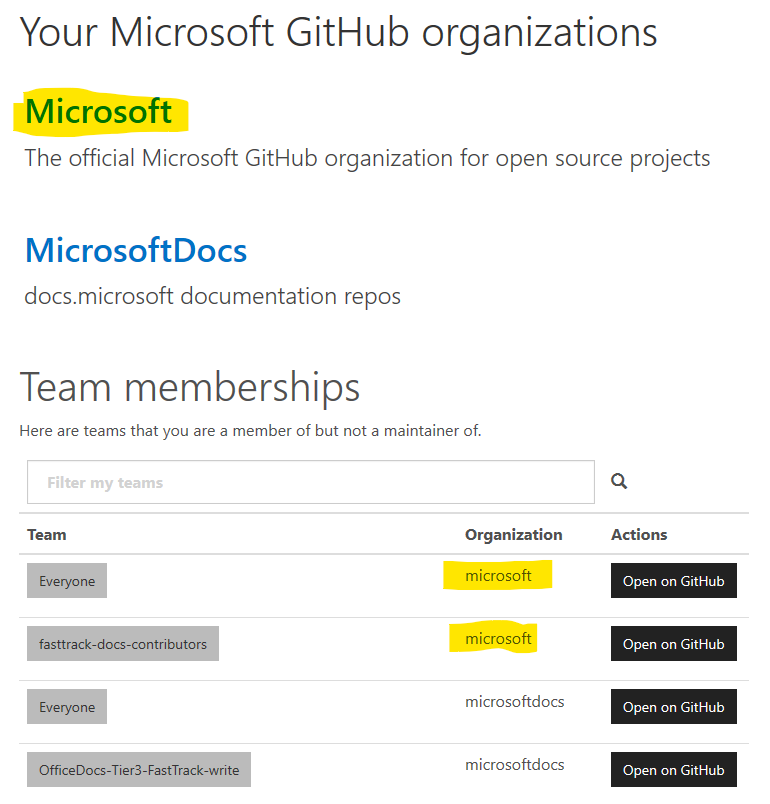

---
# required metadata
title: FastTrack Docs Contributor Guide - Get Started - Set up your accounts
description: The guide for FastTrack content contributors on FastTrack Docs.
author: Jayme Bowers
ms.author: jaymeb
manager: jwilkes
ms.date: 11/08/2018
ms.topic: contributor-guide
ms.prod: non-product-specific
ms.custom: internal-contributor-guide
ft.audience: internal
ft.owner: jaymeb
---

# Set up your accounts

The following steps **are required** for Microsoft employees and vendors to contribute to and manage articles on the FastTrack Docs site. 

## Sign up for GitHub

[Sign up for a GitHub account](https://github.com/join). You can pick the user name you want, but that name is public and used frequently when working with GitHub. It's convenient to have your GitHub ID be the same as your Microsoft alias, if possible. When asked, choose the free plan and do **not** select the **Help me set up an organization** check box. After signing up for GitHub, set up your profile as follows so that you're clearly identified as a Microsoft employee or vendor and you receive notications about your articles:

 - Profile picture: a picture of you (required)
 - Name: your first and last name (required)
 - Email: your Microsoft email address (required. Replace the email address that GitHub automatically generates for you with your Microsoft email address. Later, you need to ensure that your email address is marked public in the email section of the profile settings.)
 - Company: "Microsoft Corporation" (required)
 - Location: list your location (optional)

## Link your GitHub and Microsoft accounts

Sign in to [https://opensource.microsoft.com/link](https://opensource.microsoft.com/link) and complete the steps to link your Github account with your Microsoft account. If your accounts are already linked, you'll see a green **Link OK** graphic. 

## Enable two-factor authentication

To create and manage content on the FastTrack Docs site, you must enable two-factor authentication (2FA) for your GitHub account. To enable 2FA, see the standard GitHub instructions at [Securing your account with two-factor authentication (2FA)](https://help.github.com/articles/securing-your-account-with-two-factor-authentication-2fa/). We recommend using an authenticator app. For those steps, see [Configuring two-factor authentication via a TOTP mobile app](https://help.github.com/articles/configuring-two-factor-authentication-via-a-totp-mobile-app/).
 
## Join the Microsoft organization on GitHub

To submit content to the FastTrack Docs site, you need to join the Microsoft organization. 

On the [https://repos.opensource.microsoft.com/](https://repos.opensource.microsoft.com/) page, join the **Microsoft** organization.

> [!IMPORTANT]
> Be sure that you join the **Microsoft** organization. You may also belong to another like-named organization (for example, **MicrosoftDocs**). If you don't join the the **Microsoft** organization, you won't be able to [Set up your local repository](contribute-get-started-setup-local.md#set-up-your-local-repository).

## Next steps
To install the tools needed to facilitate editing and submission of your content updates, see [Install and configure your tools](contribute-get-started-setup-tools.md).
