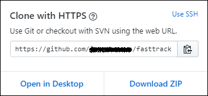

# Set up your local Git repository for documentation
Here is an edit.
This article describes the steps to set up a Git repository (*repo*) on your computer so you can contribute to FastTrack documentation. Contributors use a locally-cloned repo to add new articles, perform major edits on existing articles, and change artwork. **This is required so you can get started contributing**.

## Prerequisites
1. [Set up your GitHub account](contribute-get-started-setup-github.md) to create a profile, join the organization, and set up two-factor authentication (2FA).
2. [Install content authoring tools](contribute-get-started-setup-tools.md) on your computer, including GitHub Desktop, Git command-line tools, and Visual Studio Code (VS Code).

## Set up your local repository

Please read the following insructions carefully. To set up your new local repository:

1. Navigate to the [Microsoft/fasttrack-docs](https://github.com/Microsoft/fasttrack-docs) page on GitHub.com.
2. Select **Fork**.
3. In the dialog box, select your GitHub user name.
4. Select **Clone or download**.
5. In the dialog box, select **Open in Desktop**.
> [!NOTE]
> If you are asked to open GitHub Desktop, select **Yes**. 

6. In GitHub Desktop, verify that the **Local path** is where you want to create your local repo.
7. Select **Clone**. GitHub downloads your fork to your local path. For example, **Documents > GitHub > fasttrack-docs**.

> [!NOTE]
> If GitHub Desktop can’t find the local directory, select it in the dialog box and then select **Select Folder**.

### Optional Command-line Procedure
The procedure outlined in this section can be used as an **alternative** to using the graphical user interface (GUI) tools, such as the GitHub Desktop app. You do **not** have to use this procedure if you've already peformed the steps using the desktop app.

To set up your new local repository:
1. Navigate to the [Microsoft/fasttrack-docs](https://github.com/Microsoft/fasttrack-docs) page on GitHub.com.
2. Select **Fork**.
3. In the dialog box, select your GitHub user name.
4. Select **Clone or download**.
5. In the Clone with HTTPs section, click  to copy the clone URL for the repository.

6. In **File Explorer**, navigate to the parent folder that will contain your local content repo.

    This is the folder that contains your other local repos. If you don't have any other local repos, you can create a new parent folder anywhere in your local file system.

7. **Right-click** in the margin and select **Git Bash Here**.
8. Type ```git clone```, and then paste the URL you copied earlier. It will look like this, with your GitHub username instead of ```YOUR-USERNAME```:
    ```git
    git clone https://github.com/YOUR-USERNAME/fasttrack-docs
    ```
9. Press **Enter**. Your local clone will be created.

## Next steps
Set up your computer to [view content changes locally](contribute-get-started-setup-view-content-changes-locally.md).

