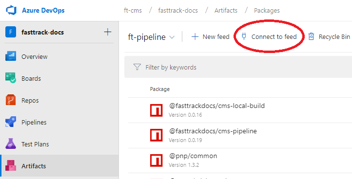
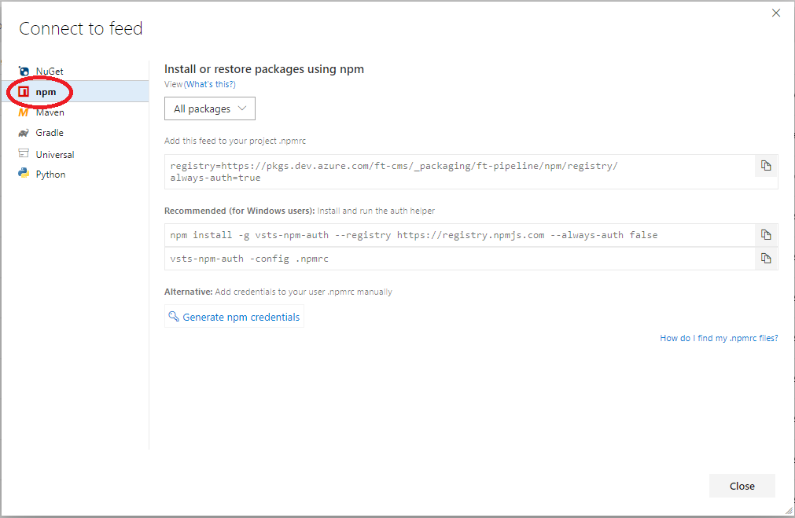
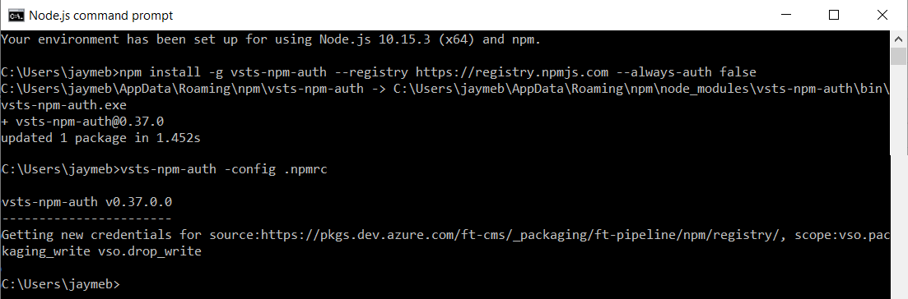
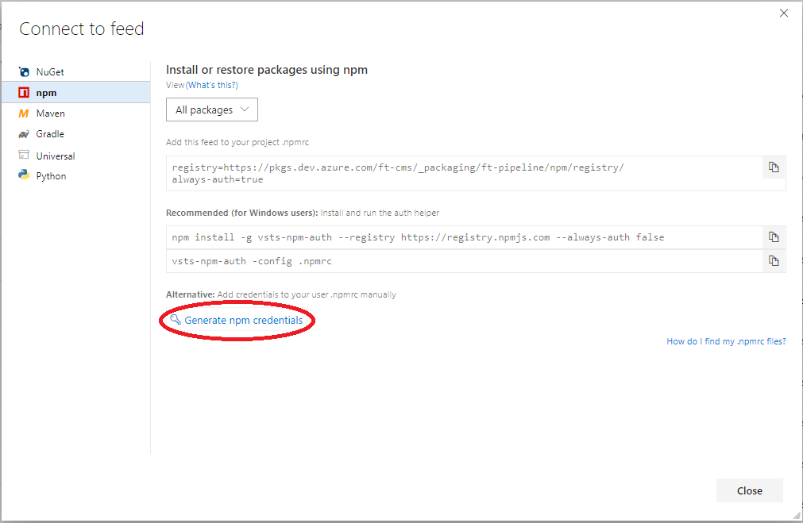
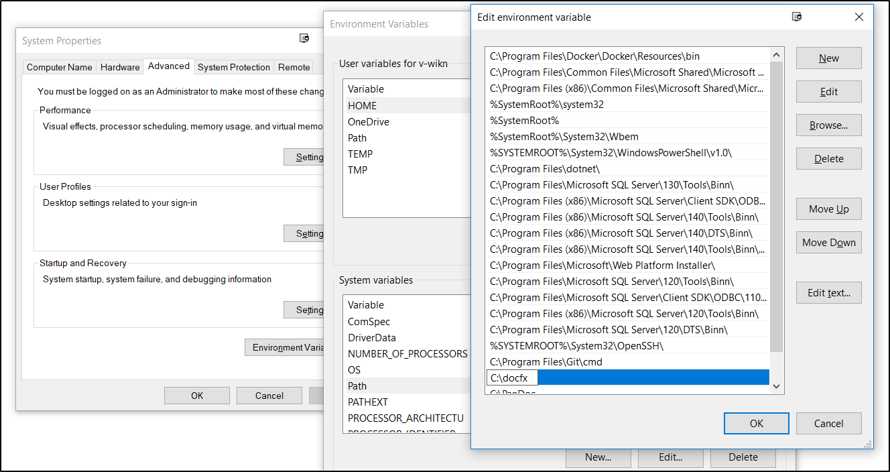

# Set up to view content changes locally

To ensure documentation changes appear as expected, we **strongly recommend** that you view your updates locally, that is, in a website built on your local machine before submitting them to be published on the production site(s).

With a local copy of both the documentation and template files, DocFx can be used to generate the entire site on your own computer. A custom package hosted in Azure Artifacts (run using node.js) assembles all the necessary components.

## Prerequisites
* You must be a member of the **ft-bcm-readwrite** security group. Select [this link](https://idwebelements/GroupManagement.aspx?Group=ft-bcm-readwrite&Operation=join) to submit your request to join (membership requires business justification).
* Install [Git tools](#how-to-install-git).
* Install [DocFx](#how-to-install-docfx).
* Install [node.js with npm](https://nodejs.org/). The Node.js package manager (**npm**) is installed with Node.js.
* Create an account at [NPM](https://www.npmjs.com/).
* A local, up-to-date clone of [Microsoft/fasttrack-docs](#how-to-clone-the-fastrack-docs-repository).
* A local, up-to-date clone of [Microsoft/fasttrack-docs-template](#how-to-clone-the-fastrack-docs-template-repository).

> [!NOTE]
> See [Set up your local repository](contribute-get-started-setup-local.md) for a refresher on how to create a local clone.

## Installation and setup
### Connect to feed
Packages hosted in Azure Artifacts are stored in a feed. Follow these steps to set up your computer to connect to the feed.

1. Initialize npm.
    If you've never run node.js on your computer, initialize npm by launching **Node.js command prompt** as administrator and entering the following command:
    ```node
    npm login
    ```
    Enter your npm credentials **alias**, **password**, and **email address** when prompted.

> [!NOTE]
> When entering your password, no hashmarks, asterisks, or other characters appear in the command prompt. The field will seem empty. Be sure to correcty enter your password and then press **Enter** to cue the **email address** value.

2. In your browser, select [**this link**](https://dev.azure.com/ft-cms/fasttrack-docs/_packaging?_a=feed&feed=ft-pipeline) to open the fasttrack-docs project Artifacts in Azure DevOps. Enter your Microsoft corpnet credentials if prompted.

3. Select **Connect to feed**.



4. Select **npm** and keep this window open for reference.



5. Edit the **.npmrc** file in Notepad or your text editor of choice. .npmrc is located in your home folder (for example, **c:\users\[your-alias]**). This file contains node.js configuration information.
6. Add the following lines to your **.npmrc** file:
    ```node
    @fasttrackdocs:registry=https://pkgs.dev.azure.com/ft-cms/_packaging/ft-pipeline/npm/registry/
    always-auth=true
    ```
7. Save and close the **.npmrc** file.
8. Store your credentials for authentication. These steps make further updates to the .npmrc file.

    **For Windows users**: Install and run the authentication helper by running the following commands in the **Node.js command prompt**:
    ```node
    npm install -g vsts-npm-auth --registry https://registry.npmjs.com --always-auth false
    vsts-npm-auth -config .npmrc
    ```

    

    Enter or select your Microsoft corpnet credentials when prompted.

    **For Mac or Linux users**, you can add credentials to your .npmrc file manually. Select **Generate npm credentials**.

    

    Copy the resulting creds into your **.npmrc** file.

### Install the latest local build package
Installing the latest local build package is only required for setup, but we recommend you perform this step periodically to get the latest updates.

In **Node.js command prompt**, enter the following command:
```node
npm install -g @fasttrackdocs/cms-local-build
```

> [!NOTE]
> For guidance on testing the installation, see [View content changes locally](contribute-how-to-view-content-changes-locally.md).


### Build the local site
#### To build the **internal** site:
In **Node.js command prompt**, enter the following command:
```node
ftbuild internal
```

#### To build the **partner** site:
In **Node.js command prompt**, enter the following command:
```node
ftbuild partner
```

## Additional Information
### Recurring task: view content changes locally
The article [View Content Changes Locally](contribute-how-to-view-content-changes-locally.md) contains additional information, including parameter descriptions, troubleshooting steps, and other information to help you view your content updates locally before publishing to the production websites. 

### How to install Git
For information on how to install Git tools used for contributing to the FastTrack Content Management System, see [Install and configure your tools](contribute-get-started-setup-tools.md).

For more detailed information about Git use and installation, see the official [Git for Windows documentation](https://gitforwindows.org/).

### How to install DocFx
For detailed information about DocFx use and installation, see the official [DocFx documentation](https://dotnet.github.io/docfx/tutorial/docfx_getting_started.html).

Download and unzip *docfx.zip* from https://github.com/dotnet/docfx/releases. Extract the file to a local folder (for example, **c:\docfx**).

Add DocFx to your path so it can be easily run from anywhere:

1. Open the **Run** command window by pressing **Windows-Key + R**.
2. Type `sysdm.cpl` and select **OK** to open **System Properties**.
3. Select the **Advanced** tab and then select **Environment Variables**.
4. In the **System variables** list, double-click **Path**.
5. Select **New** and type the full path to where you extracted the DocFx files.
6. Select **OK** to save the change, and then **OK** again to close the environment variables window. You may also need to restart your computer.




### How to clone the fastrack-docs repository
To get a local clone of the fasttrack-docs repository:
1. Launch the Git command line app, **Git Bash**.
2. Use the **cd** command to change directories to the **Content repository local location**. For example, 

    cd c:/users/alias/repos (notice Git Bash uses forward slashes '/' ).

3. Run the following command:

```markdown
    git clone https://github.com/Microsoft/fasttrack-docs
```

### How to clone the fastrack-docs-template repository
To get a local clone of the fasttrack-docs-template repository:
1. Launch the Git command line app, **Git Bash**.
2. Use the **cd** command to change directories to the **Content repository local location**. For example, 

    cd c:/users/alias/repos (notice Git Bash uses forward slashes '/' ).

3. Run the following command:

```markdown
    git clone https://dev.azure.com/ft-cms/fasttrack-docs/_git/fasttrack-docs-template
```

## Next steps
You are now ready to create a branch and begin editing content. See [Create a branch](contribute-get-started-create-branch.md).
