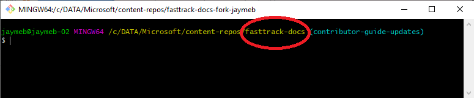
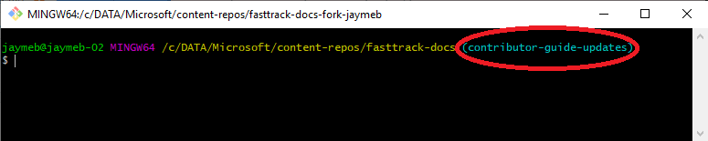

---
# required metadata
title: FastTrack Docs Contributor Guide - Submit content changes
description: The guide for FastTrack content contributors on FastTrack Docs.
author: Jayme Bowers
ms.author: jaymeb
manager: jwilkes
ms.date: 7/15/2019
ms.topic: contributor-guide
ms.prod: non-product-specific
ms.custom: internal-contributor-guide
ft.audience: internal
ft.owner: jaymeb
---
# Submit your content changes
This article describes how to submit your content changes for approval and publishing to the production sites.

## Prerequisites
1. [Set up your GitHub account](contribute-get-started-setup-github.md) to create a profile, join the organization, and establish two-factor authentication (2FA).
2. [Install content authoring tools](contribute-get-started-setup-tools.md) locally on your computer, including GitHub Desktop, Git command-line tools, and Visual Studio Code (*VS Code*).
3. [Set up your local repository](contribute-get-started-setup-local.md) to enable editing of your local content. 
4. [Create a branch](contribute-get-started-create-branch.md).

To verify your content will appear on the website the way you intend, we **strongly recommend** viewing your changes locally before submitting them for approval. See the article [View content changes locally](contribute-how-to-view-content-changes-locally.md) for more information.

## Submit a pull request
Follow these steps to submit your changes for approval:
1. To avoid file save conflicts as a result of changes made by other contributors, make sure your local repo is kept up to date with the upstream staging repo.  
    1. In GitHub Desktop, verify the following settings:  
        1. **Current repository** = your fork.
        2. **Current branch** = the branch you created.  
    2. Select **Fetch origin**.
    3. Select **Branch** > **Merge into current branch** > **upstream/staging** > select the **blue *Merge* button**: Merge upsream/staging into [the branch you created]

        The blue *Merge* button is disabled if your branch is already up to date with upstream/staging. In this case, it is safe to move to the next step.

> [!IMPORTANT] 
> Perform the first step **often** in order to keep your branch up to date with upstream changes and to avoid change conflicts with other contributors.

2. In GitHub Desktop, enter a **Summary** for your change and then select **Commit**.
3. Select **Push origin**. This pushes your local changes to your fork and branch in GitHub online.
4. In the **Branch** menu, select **Create pull request**. This will take you to the GitHub online "Comparing changes" page.
5. Verify the following settings on the "Comparing changes" page:
	1. **base repository** = Microsoft/fasttrack-docs
	2. **base** = staging
	3. **head repository** = \[your-GitHub-account-name]/fasttrack-docs
	4. **compare** = \[the branch containing your changes]
    > [!NOTE]
    > GitHub displays your changes at the bottom of the page.
6. Select **Create pull request**, include any comments pertinent to the change, and select **Create pull request** to submit your changes for review.

### Optional Command-line Procedure
The procedure outlined in this section can be used as an **alternative** to using the graphical user interface (GUI) tools, such as the GitHub Desktop app. You do **not** have to use this procedure if you've already peformed the steps using the desktop app.

Follow these steps to submit your changes for approval:
> [!IMPORTANT] 
> Perform the first step **often** in order to keep your branch up to date with upstream changes and to avoid change conflicts with other contributors.

1. To avoid file save conflicts as a result of changes made by other contributors, make sure your local repo is kept up to date with the upstream staging repo.
    1. In **File Explorer**, navigate to your local content repo.
    2. **Right-click** in the margin and select **Git Bash Here**.
    
    3. Confirm the current folder in Git Bash is the root of your local repo.
    
    4. Confirm the current branch is the one that contains the changes you want to submit.
    
  
  
        > [!NOTE]
        > If you need to switch to another branch, enter the following command:
        > ```git
        > git checkout branch1
        > ```
        >
        > ...where *branch1* is the local branch containing your changes. If you switch branches, be sure to [view your changes locally](contribute-how-to-view-content-changes-locally.md) to ensure documentation changes appear as expected **before** submitting a pull request.

    5. Enter the following command to **pull** (or download) the latest updates from the online/upstream repo:
        ```git
        git fetch upstream
        ```
    6. If the VIM text editor appears asking you to enter a description, enter the following command to exit the VIM editor.
        ```git
        :wq (then press ENTER)
        ```
    7. Enter the following command to **merge** the latest updates from the online/upstream repo (staging branch) into your current branch:
        ```git
        git merge upstream/staging
        ```

2. Enter the following command to mark all your changes for inclusion in the upcoming commit:
    ```git
    git add -A
    ```
3. Enter the following command to add a **commit** object/package to your local repo:
    ```git
    git commit -a -m "summary"
    ```
    ...where *summary* is a brief description of your change.

4. Enter the following command to push your changes to your online fork:
    ```git
    git push origin
    ```
5. At this point, you are ready to create the pull request from your online fork to the upstream repo.
    1. Navigate to the [Microsoft/fasttrack-docs](https://github.com/Microsoft/fasttrack-docs) page on GitHub.com.
    2. Select the green **Compare & pull request** button. If at first this button isn't visible, wait a few minutes and refresh the page (a backend process must complete before this button is visible).
    
    3. Verify the following settings on the "Comparing changes" page:
        1. **base repository** = Microsoft/fasttrack-docs
        2. **base** = staging
        3. **head repository** = \[your-GitHub-account-name]/fasttrack-docs
        4. **compare** = \[the branch containing your changes]
        > [!NOTE]
        > GitHub displays your changes at the bottom of the page.
    4. Select **Create pull request**, include any comments pertinent to the change, and select **Create pull request** to submit your changes for review.
    
## What's next?
So, what happens after you submit a content update/pull request? Your request is triaged, approved, and merged into the main upstream repo and published on the websites, unless there is a conflict (explained below).

View the [Publishing Schedule](contribute-publishing-schedule.md) for more details.

## Resolve Merge Conflicts 

This section describes how to identify and resolve merge conflicts after you submit your content changes for approval and publishing to the production sites.

This content is adapted from the FTC Contributor Guide from [Resolving a merge conflict on GitHub](https://help.github.com/en/articles/resolving-a-merge-conflict-on-github).  

### Finding merge conflicts

If your pull request is subject to a merge conflict, you will recieve an email providing you a link to a Pull Request review, where you will be able to use the conflict editor to resolve conflicts line-by-line. 

Alternatively, follow these steps to find conflicts. 

1. Go to the [fasttrack-docs](https://github.com/microsoft/fasttrack-docs) repository in GitHub and click Pull requests. 

2. In the "Pull Requests" list, click the pull request with a merge conflict that you'd like to resolve.

3. Near the bottom of your pull request, click Resolve conflicts. 

4. Conflict markers will appear outlining the conflicting lines.  <<<<<<< staging, =======, >>>>>>> staging. 

    a. <<<<<<< staging: This indicates changes from your pull request

    b. =======: This is a seperator between each contributor's changes

    c. >>>>>>> staging: This indicates changes from another contributor's conflicting pull request. 