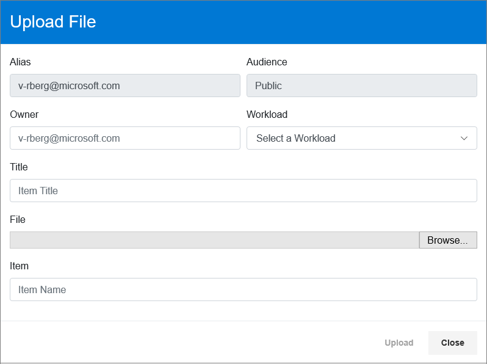

---
# required metadata 
title: FastTrack Docs Contributor Guide - How to Use the FastTrack Binary Content Management Web App
description: This article describes how to use the FastTrack Binary Content Management Web App.
author: Ryan Berg
ms.author: v-rberg; jaymeb
manager: jimmuir; jwilkes
ms.date: 4/10/2019
ms.topic: contributor-guide
ms.prod: non-product-specific
ms.custom: internal-contributor-guide
ft.audience: internal
ft.owner: jaymeb
---
# How to use the FastTrack Binary Content Management (BCM) web app

## Overview
The FastTrack [Binary Content Management \(BCM\)](https://ftdocs-bcm-app.azurewebsites.net/) web app (hosted on Azure) provides a front-end UI to upload and manage binary files (like PowerPoint decks) in Azure storage.

> [!IMPORTANT]
> Access to BCM is limited to content contributors. If you are a content contributor, you must [join this security group](https://idwebelements/GroupManagement.aspx?Group=ft-bcm-readwrite&Operation=join) before using BCM.

## File hygiene

Before uploading a file to BCM, you must meet the following requirements:

- All change logs are removed.
    - For PowerPoint decks, all hidden slides are removed (internal-facing) or made visible (customer-facing).
- All content (including the Notes area of PowerPoint slides) include no presentation suggestions or guidelines for FEs, FMs, MVMs, FTAs, or other FastTrack personnel.
- All Personally Identifiable Information (PII) is scrubbed from the file. This includes:
    - Organization Identifiable Information (OII).
    - End User Identification Information (EUII). 
    - For example, in PowerPoint, you remove this by going to **File > Info > Check for Issues > Inspect Document > Document Properties and Personal Information**.

## Upload a file
Use the following steps to upload a file to BCM.

> [!IMPORTANT]
> Before uploading a file using BCM, ensure the content is customer-ready as all items posted there are accessible to anyone inside and outside of Microsoft. **Customer-ready** means the content is viewable and usable by anyone, anywhere. There should be no restrictions on who can access and use the content for any reason. If you’re unsure whether or not the content is customer-ready, check with your manager.

1. On the BCM header menu, select **Upload**.
2. In the **Upload File** window, specify or change the following:
    - **File**: Select **Browse** and locate the file to upload.
    - **Owner**: The alias of the person who's accountable for the content. Your alias is entered by default. Keep or change as required.
    - **Workload**: Specify the workload or service with which the file is associated.
    - **Title**: The file’s title. *Do not include "FTC" or "FastTrack" in the title.*
    - **Item**: The file’s immutable item name. Enter or change the item name using lowercase letters and hyphens (-). You must use this format or the content won’t upload.
        - Do not include "FTC" or "FastTrack" in the name.
        - When uploading a file for the first time, be sure to include "v1" at the end of the title name. For example, **sample-file-v1**.
        - If you upload a new version of this file, determine if the update is major (content added, changed, or deleted) or minor (corrected typos or changed bullet formatting).
        - If the update is major, use the next number up from the previous version. For example, **sample-file-v2** or **sample-file-v3**.
        - If the update is minor, use v1-1 or the next number up from the previous version. For example, **sample-file-v2-1** or **sample-file-v2-2**.
    - The **Alias** and **Audience** values are fixed and can’t be changed.
        - **Alias**: Your alias.
        - **Audience**: The file's intended audience. Remember, all files uploaded to BCM are customer-ready (public).

        

3. Select **Upload**.

> [!NOTE]
> - Once the file is uploaded, its item name can't be changed.
> - You can cancel out of this at any time by selecting **Close**.
> - Only one file at a time can be uploaded.

> [!IMPORTANT]
> Once you upload a file, it's in the system permanently and can only be removed by (rare) exception. This is why it's important to create an [Aka/Go redirector link](https://sftools.trafficmanager.net/am/redirection/home?options=host:aka.ms) for the file and use that redirector link in all customer-ready references to the file.
> To update content, you must upload a new file and change the target URL in the Aka/Go redirector tool.

To create an Aka redirector link:
1. On the BCM page, find the item’s URL.
2. Select the copy icon .
3. Go to the [Aka link management tool](https://sftools.trafficmanager.net/am/redirection/home?options=host:aka.ms) and create the appropriate link. Specify the following parameters:
    - **Target URL**: The URL to the file created in BCM (copied to the clipboard). Paste the URL here.
    - **Vanity Name**: The short name for the link. You can specify your own or leave the box empty to have the tool create one by default. 
    - **Security Group Alias (as a Link Owner)**: The group members with permissions to view and update the redirector. Specify **ft-bcm-readwrite**.

## View or update a file's properties
To view or update the property values of a file:
1. Highlight a file on the BCM page.
2. Select **Properties** from the header menu.
    - All the same properties appear as when uploading a file, but only the **Owner**, **Workload**, and **Title** are editable.
    - The **URL** is also displayed. You can copy the URL to the clipboard using the copy icon .

## Sync
The list of files displayed on the BCM page are a snapshot of the files in the FastTrack BCM Azure storage container. Use the **Sync** button in the header menu to synchronize the list of files on the BCM page with the files in Azure storage.

## More information
For all columns, sort in ascending or descending order by selecting the arrow control next to the header label. Search for specific content in the field beneath the column header.

> [!NOTE]
> If you have UI suggestions or issues with the BCM page, submit them [here](https://github.com/Microsoft/fasttrack-docs/issues).

