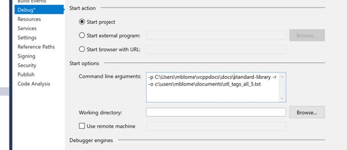

# Metadata Update Tool

Thie Metdata Update Tool was written by Colin Robertson and Michael Blome for doing bulk updates of documentation metadata.

You can run the compiled .exe directly, or you can compile the tool and use additional debug options.

## Download location
Internally, this tool is shared at `\\scratch2\scratch\MUT`.

## MUT documentation 
The documentation for this tool is explained in [this page](https://github.com/mikeblome/Metadata-Update-Tool/blob/master/docs/metadata-update-tool.md).

## Download and build the solution manually
here are some further instructions if you want to run it from VS as opposed to from the command line:

1. Clone the following git repo:
[https://github.com/mikeblome/Metadata-Update-Tool](https://github.com/mikeblome/Metadata-Update-Tool)

2. Open the solution in Visual Studio.

3. Use these steps to extract your metadata to an Excel spreadsheet where you can make your desired changes:
-	Set **mdextract** as startup project.
-	Open **Properties** > **Debug** tab, and enter the command line arguments:
    - Use the -p switch to specify the folder that you want to extract metadata from
    - Use the -o switch to specify the output file path and file name.

   

- Press **Ctrl+F5** to run the program in VS.
- Open the output file in notepad and copy all.
- Open Excel and paste the contents in.
- Filter on the tag column to see only one metadata tag at a time, e.g. ms.topic. 
- Make your changes and set the ACTION column to OVERWRITE (or ADD if you’re adding a new tag).
- Filter on the next tag you want to update until you’re done with all your updates.
- Copy the filtered (changed) rows to a second worksheet.
- Save the second worksheet as a tab-delimited text file – this will be your input to mdapply.

3. Apply metadata changes:
- Set **mdapply** as the startup project in the Visual Studio solution.
- In properties, debug command line args, enter the path to the input text file you just created. 
- Run it (Ctrl+F5).
- Stage and commit your changes to GitHub.
