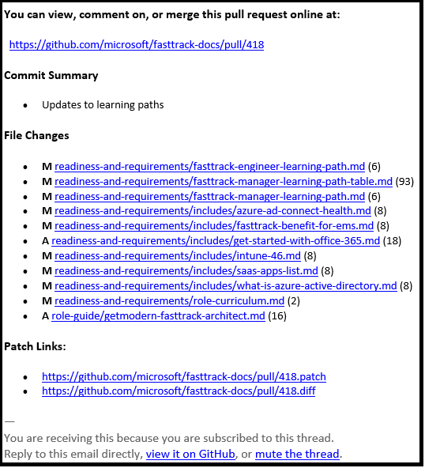

---
# required metadata
title: FastTrack Docs Contributor Guide - Pull Request Interim Approval
description: The guide for FastTrack content contributors on FastTrack Docs.
author: Jayme Bowers
ms.author: jaymeb
manager: jwilkes
ms.date: 8/20/2019
ms.topic: contributor-guide
ms.prod: non-product-specific
ms.custom: internal-contributor-guide
ft.audience: internal
ft.owner: jaymeb
---
# Interim Approval for Pull Requests
For any content set, e.g. FastTrack Playbook, FTOP User Guide, Partner guidance, etc., when a person outside the owning team submits a pull request for content changes, the admin team will add an interim approver from the owning team.

## What to do when you are added as an interim approver
When an interim approver is added to a pull request, GitHub generates an email notification similar to the one illustrated below.

The email contains a link to the pull request and a summary of the requested changes. These changes have already been made by the requester. In most cases, all you have to do is review them for accuracy and approve the pull request.

## Review and approve the pull request
To review a pull request:
1. Open the pull request, either at https://github.com/microsoft/fasttrack-docs/pulls or by selecting the hyperlink contained in the email. The hyperlink should be in a format similar to this: `https://github.com/microsoft/fasttrack-docs/pull/ZZZ`, where `ZZZ` is the pull request ID.

2. Review the changes. Lines shaded in green are added as part of the change. Lines shaded in red are removed as part of the change. 

3. When you're finished reviewing the content, select the `Review changes` button and use the following table for next steps.

| Desired outcome | Action |
| - | - |
| If you would like to publish the changes... | Select the `Approve` option, then select the `Submit review` button. |
| If you would like the requester to make additional changes... | Select the `Request changes` option, include instructions for the requester, and then select the `Submit review` button.  The requester will receive an email notification containing your comments and a link to the pull request. |
| If you would like to decline the request... | Select the `Comment` option and include "`decline request`" in the `Write` section.  The admin team will close the pull request. |

## What's next?
Approved changes are merged into the main upstream repo and published on the websites.

View the [Publishing Schedule](contribute-publishing-schedule.md) for more details.
