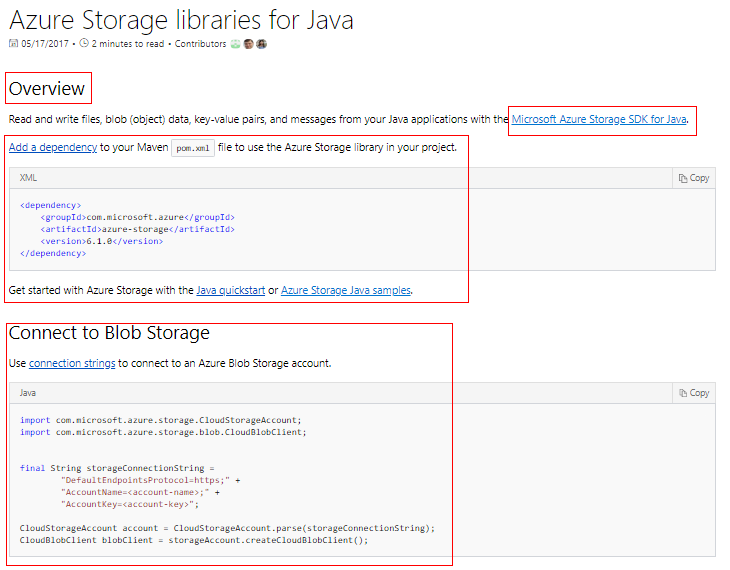
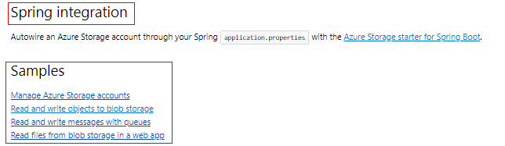

# Writing a reference overview

Developer reference content contains answers to almost every question a developer would have when working with a product's API. It's key that your reference docs are easily found when developers search for them using search engines. However, reference docs are also a poor resource for new developer to get started with your API if they've never worked with it before. 

Reference overview pages provide an SEO-optimized front door to your reference content so that experienced developers who are looking for ref know they've found it and new developers get to the content they need to be successful.

> [!NOTE]
> If your library or API is provided by a third party, such as an open source library, having a reference overview page is still useful- describe how to use the library in the context of your product, then link through from the reference overview to the ref hosted by the third party.

## General format of your reference overview

The reference overview is a handwritten markdown file and should be the only file in your reference content that is not autogenerated from your library's source repository. This markdown file includes the following basic sections:

- Introduction
- Adding the library or module to your project. This is not applicable to REST APIs.
- Common task code snippets, such as authentication and basic module usage.
- Links to more detailed samples and where to report issues and provide feedback.

Here is one implementation of a reference overview page. Take the time to make these pages fit your audience and answer your own specific developer needs in these sections.

## Introduction 

The introduction to your reference overview page should one or two sentences describing the basic tasks you'd use the API for, along with a link to the home for the library (such as a GitHub project).

After the introductory paragraph, provide steps on how to import the library into a project using a native package management tool (such as Maven, NuGet, PyPi, or NPM) for your developer audience.

## Authentication and connection

Authentication is one of the biggest pain points when working with libraries connecting to remote services (such as Azure). 

Include code blocks illustrating authentication and connection to your product. Link out to conceptual content such as Azure AD service principal creation or authentication token creation content as a "learn more" task after the snippet for new developers.

## Present common tasks

Include snippets in your reference overview for common tasks related to the API. These help orient readers to key parts of the API and provide a copy/paste experience with code that is disconnected from your quickstarts.

 It is strongly recommended that these snippets be maintained in the same repo as the API itself and maintained and tested alongside the rest of the API. It is difficult to maintain snippets if they are included in-line in this document.

## Third party integration

If your library has integrations with key parts of your developer ecosystem (such as dominant frameworks like Spring and Java, Django with Python, or Drupal/Wordpress with PHP), consider adding an additional section to your content to cover these integrations, or to link through to other documentation that shows how to you the libraries with these ecosystem standards.

## Link to samples

After the snippets, include an unordered list that links to key samples if available for your API, as well as a link to the appropriate samples gallery filtered for that product/service and language. 

