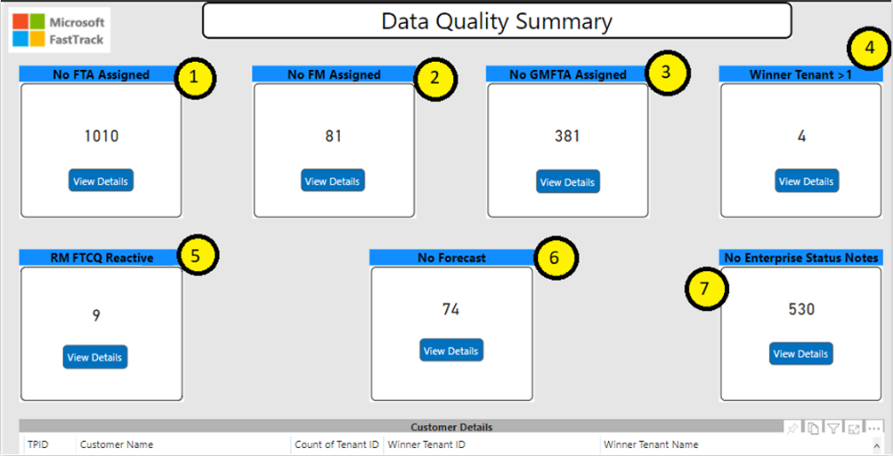
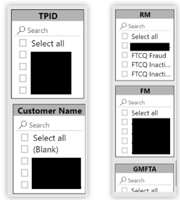
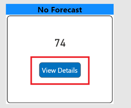

---
# required metadata
title: Customer Health Data Quality Guide
description: Process guidance for internal FTOP users.
author: Connie Brenden
ms.author: v-conbre
manager: jimmuir
ms.date: 4/25/2020
ms.topic: customer-health-data-quality-guide
ms.prod: non-product-specific
ms.custom: customer-health-data-quality-guide
ft.audience: internal
ft.owner: jimmuir
---
# Overview

Managing the data quality of the Customer Health program has largely been manual so far.  We now have a Power BI dashboard to assist with keeping some of this clean going forward.

## Program Expectations

For each of the S1500 customers, there must be:

- A single winner tenant flagged in FTOP

- An FM assigned as primary

- A single forecasting entry

- No winner tenant existing in the FTCQ Reactive queue

- Enterprise Status Notes updated at least quarterly

- For S500 customers, there should be an FTA assigned as primary

## Power BI Dashboard

This dashboard is used for Customer Health Data Quality/Process Adherence

### Link to dashboard

See [Customer Health DQ Summary](https://msit.powerbi.com/groups/217ac1bb-ec5c-40e7-adad-ec8f0287909f/reports/50f0b192-72fd-497a-873c-362929b96c90/ReportSection8e789d70b70666727250)

### Step-by-step actions

The folloiwng table provides intended actions and expectations.

|Step  |Action  |
|---------|---------|
|1     |**Intended Action**: Regional FTA leads; Assign FTA to S500 winner tenant. **The expected number here is 1,000 or less.** At least 500 of the 1,500 should be assigned to an FTA.         |
|2     |**Intended Action**: CSS Managers and Leads; Assign FM to S1500 winner tenant. **The expected number here is zero.** All S1500 winner tenants should have a Primary FM assignment.         |
|3     |This is available for GM FTA leads to manage, but **there is not a set number expectation** that the Customer Health program requires on this point.         |
|4     |**Intended Action**: Motion Program Managers; Remove flag from additional winner tenants. **The expected number here is zero.** No TPID should have more than one winner tenant flagged.         |
|5     |**Intended Action**: Regional FTA leads, CSS Managers and Leads; Change RM from FTCQ Reactive to an individual who would be aligned with the FM. **The expected number of S1500 winner tenants in the FTCQ Reactive queue is zero.** S1500 winner tenants should have an RM value that aligns with the FM assigned as primary.         |
|6     |**Intended Action**: FTAs via Regional FTA leads, FMs via CSS Managers and Leads; Import winner tenant into forecasting tool, enter numerical values for in-scope workloads. **The expected number here is zero.** Each of the S1500 customers should have a forecast entry, matched by TPID and winner tenant combination.         |
|7     |**Intended Action**: FTAs via Regional FTA leads, FMs via CSS Managers and Leads; Enter a detailed Enterprise Status Note in the winner tenant. **The expected number here is zero.** Each of the S1500 customer should have at least one Enterprise Status Note entry at this point, in the winner tenant.         |

## Process Flow

Use the slicers on the side to narrow the scope of the view:

From the section-of-interest, select **View Details**.

Using the detailed information of the data quality discrepancies, follow-up with the assigned FTC resources to remedy the issue(s) as indicated above.
