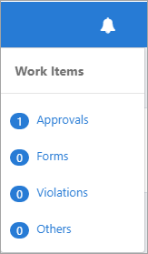
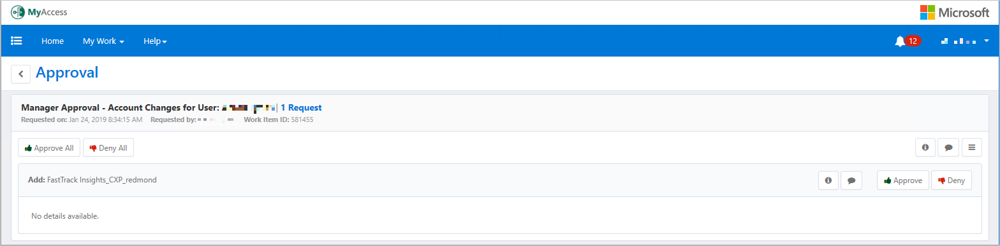
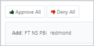
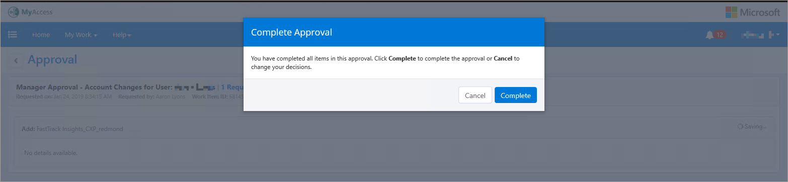

---
# required metadata
title: FastTrack Reporting Power BI Access Guide - Approve Requests
description: Process guidance
author: Reed Lee
ms.author: reedl
manager: Jeff Wilkes
ms.date: 5/31/2019
ms.topic: fasttrack-reporting-guide
ms.prod: non-product-specific
ms.custom: fasttrack-reporting-guide
ft.audience: internal
ft.owner: jwilkes
---

# Approve Requests

## Overview

If you have reports, as shown in the Microsoft Global Address List (GAL), you may receive MyAccess email asking you to approve your own reports access request.

## Levels of access

Prior to May 30th, 2019 you may have approved FastTrack Reporting access requests without much thought because there were only two levels of access to the tenant data -- everything or nothing. Therefore, if your direct report required any access to do their job, you had no choice but to approve them for everything access.

After May 30th, 2019, a third level of access will be available – Assigned tenants only, granted by approving your direct report for membership in the **FT NS PBI Assigned** MyAccess Project. This level of access filters tenant data to only the tenants assigned in FTOP to your direct report.

## Business need

Going forward carefully consider your direct report’s business need to see all data. All data is now granted by approving requests for either **FT NS PBI Privileged** or **FT NS PBI Friends of FT**. If you know your report does not need “everything” access, or if you are unsure, then you should approve only the FT **NS PBI Assigned** level of access.  

## Procedure

### How to approve/deny access requests

1. Navigate to <https://myaccess>.

1. You have two options for reviewing and approving requests. Select the user name in the **Pending Approval** window on the MyAccess home page. Alternatively, you can select the **notification “bell”** as described next.

1. In the upper right-hand corner, you will see a bell with a red number-badge showing the number of PENDING requests that need approval.

4. Select the **bell** and a drop-down will appear.

5. Select **Approvals**. The **Manage Work Items** screen displays showing each pending request waiting for approval.

6. Select **user name**.

The next screen to open is the “Approval” screen.

7. Before approving or denying a request, you should select the green Justification icon, which will render the requestor’s justification, and consider their reason for making the request.

8. Select **Approve** **All** or the **Deny All**.

Once you have completed all Approvals / Denials you will be prompted with the following message below.

9. Select **Complete**. Be patient while the approval processes. It is complete once it returns to the MyAccess Home page.

> [!NOTE]
> All *FT NS PBI Friends of FT requests* require both a manager and an FTC approval. Each approval request is sent in series, meaning first to your manager, then to the FTC once your manager has approved.

## Next steps

See [Extend MyAccess Project Membership](extend-myaccess-project-membership.md)