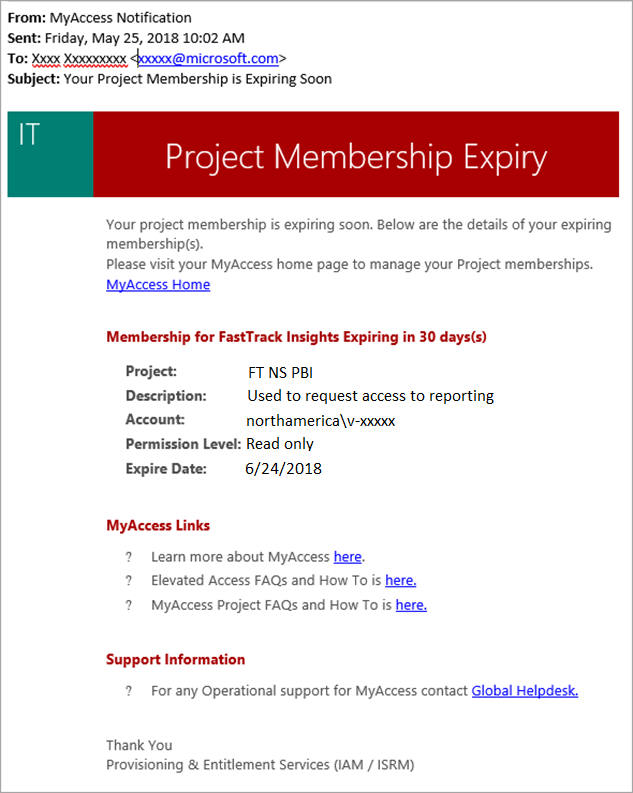
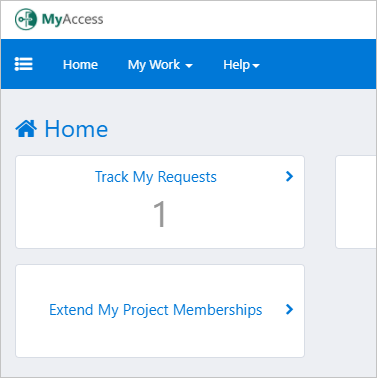
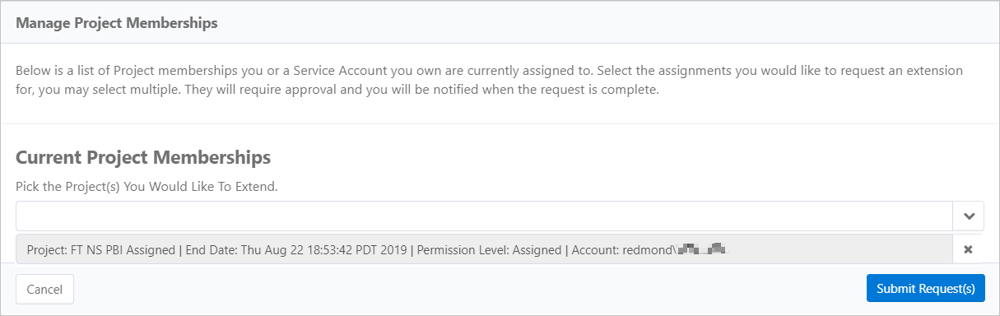

---
# required metadata
title: FastTrack Reporting Power BI Access Guide - Extend MyAccess Project Membership
description: Process guidance
author: Reed Lee
ms.author: reedl
manager: Jeff Wilkes
ms.date: 5/31/2019
ms.topic: fasttrack-reporting-guide
ms.prod: non-product-specific
ms.custom: fasttrack-reporting-guide
ft.audience: internal
ft.owner: jwilkes
---

# Extend MyAccess Project Membership

## Overview

When your project access approaches its expiration date, you will be notified by email that your access is about to expire. The notification shows you the name of the project, the permission level, and when access is scheduled to expire.

> [!NOTE]
> If you do not renew and your access expires, you will need to start the process over.

The following screen shows an example of the expiration notice.

Project access can be renewed at any time, but the extension period is based on the renewal date. For example, if you renew 30 days into your 90-day renewal period your new expiration date will still be 90 days. 

> [!IMPORTANT]
> If you do not renew and your access expires, you will need to start the process over.

## Procedure

The following procedure guides you step-by-step to extend or renew your project access.

### How to extend or renew your project access

1. Navigate to <https://myaccess>.

1. Select **Extend My Project Memberships**.

3. From the drop-down menu, select the project memberships you would like to extend.

4. Select **Submit**.

## Next steps

See [Access FastTrack Power BI Reports](access-fasttrack-power-bi-reports.md)