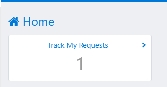
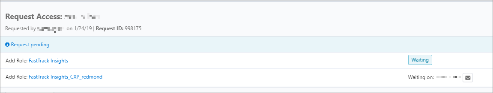
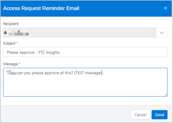

---
# required metadata
title: FastTrack Reporting Power BI Access Guide - Manage My Requests
description: Process guidance
author: Reed Lee
ms.author: reedl
manager: Jeff Wilkes
ms.date: 5/31/2019
ms.topic: fasttrack-reporting-guide
ms.prod: non-product-specific
ms.custom: fasttrack-reporting-guide
ft.audience: internal
ft.owner: jwilkes
---

# Manage My Requests

## Overview

The following procedure provides step-by-step instructions to manage your request.

## Procedure

### How to manage my requests

1. Navigate to <https://myaccess>

1. Select **Track my Requests**.

3. See the status of the request to see who needs to approve.

4. If you are still waiting for approval, you can email the approver with additional comments, select **Send**.

## Next steps

See [Approve Requests](approve-requests.md)