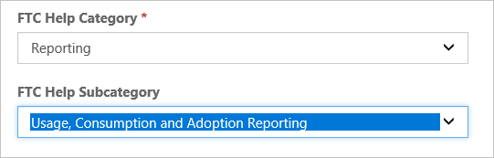
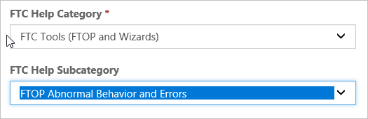
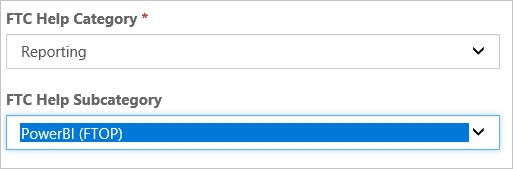
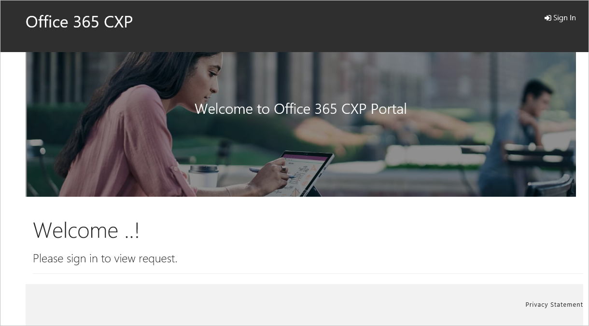
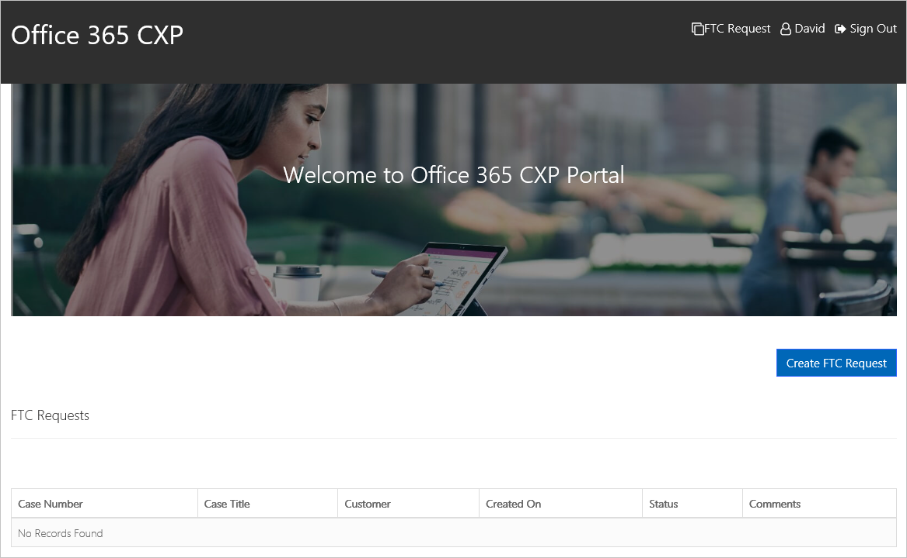
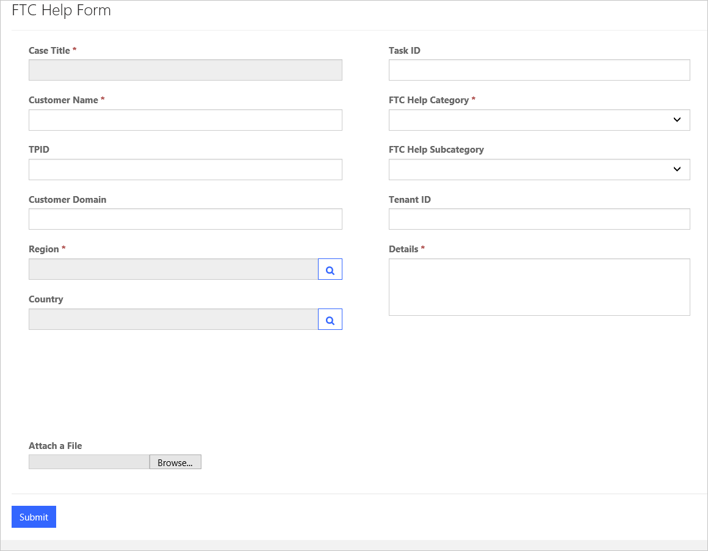
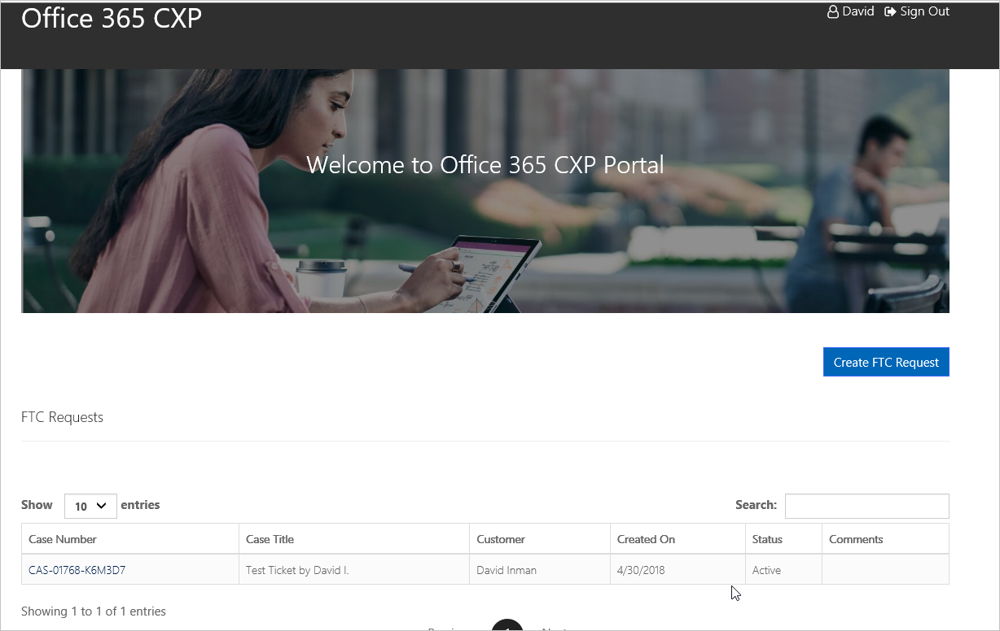

---
# required metadata
title: FTC Help Guide
description: Escalation point process for FMs and FEs to submit tickets for break/fix related issues specific to FastTrack processes and tools.
author: David Inman
ms.author: v-conbre
manager: jimmuir
ms.date: 9/25/2019
ms.topic: ftc-help-guide
ms.prod: non-product-specific
ms.custom: ftc-help-guide
ft.audience: internal
ft.owner: jimmuir
---
# FTC Escalation Process

The FTC escalation process enables FMs and FEs to submit a FTC Help ticket using the web submission form in the Office 365 CXP Portal via [ftchelp](https://aka.ms/ftchelp).

When creating a ticket, please include as much relevant detail as possible. Please take the time to properly categorize your request to ensure expedited ticket routing.

## Common Scenarios

Common FTC Help tickets and how to categorize them:

### Scenario 1: Reporting related issue where usage information is not accurately displayed

When there is a Reporting related issue where usage information is not accurately displayed within FTOP, please select the following FTC Help category and FTC Help sub-category as noted.  Make sure to populate the TenantID (i.e. TenantGUID) field as well.

### Scenario 2: FTOP issue where you are unable to save notes, or the UI is freezing

If you are experiencing a FTOP issue where you are unable to save notes, or the UI is freezing, please select the following FTC Help category and FTC Help sub-category as noted.  Make sure to populate the TenantID field.

### Scenario 3: FTOP Power BI related issues

For FTOP PowerBI related issues, please select the following FTC Help category and FTC Help sub-category as noted.  Make sure to populate the TenantID field.

## Submission Process

1. Go to [FTC Help](http://aka.ms/ftchelp).

 
2. Sign in, select **Create FTC Request**. This is also where you can view any request you have previously submitted.

3. Enter the **Title**, **Customer Name**, **Customer Domain**, **Customer Region**, **FTC Help Category and FTC Help Sub-Category**. These are required fields. Depending on the FTC Help Category selected, the Tenant ID field may be included within the form.  When presented with Tenant ID, please populate it to ensure timely triage of your request. You may also include a Task ID and TPID, if applicable.

4. Use the Details text box to completely describe the issue or request. This is a required field. Please include Microsoft product information, business justification, customer impact, and actions taken to date. Associated Ticket Number and TPID fields may also be used, if applicable.

5. Attach screen shots or files (maximum of 10, total of all files must be under 25 MB) to help explain the issue or request. You may also CC other team members who you think should have visibility into the bug (separate email addresses with commas).

6. When you select Submit you will be notified of the ticket creation over email, and your ticket will be tracked in the [Office 365 CXP Portal](https://aka.ms/ftchelp). You can click on your ticket to see the ticket details. The FTC Triage Help Team responses will be sent to you by email from the Office 365 CXP Portal.  Please watch for this communication to follow the status of your ticket.  Additionally, the submitter can monitor this page for updates as well.

