# FTC Insights submissions 
All Delivery roles in the FTC can participate in FTC Insights. 
1.	Submitter identifies an issue or an improvement and visits the [submission portal](https://aka.ms/ftcinsights)
2.  Submitter checks to see if this or a similar issue was already reported
3.	Submitter either adds a new occurrence (+1) or creates a new item 

## Search for existing FTC Insights
Before submitting a new FTC Insight it is important to spend just a few minutes trying to find out if the same issue has been submitted before. Adding additional customer occurrences to existing items helps communicate to our Feature Engineering Teams that these issues are impacting the onboarding experience for multiple customers. 
- Use the **[submission portal](https://aka.ms/ftcinsights)** to search for existing FTC Insights

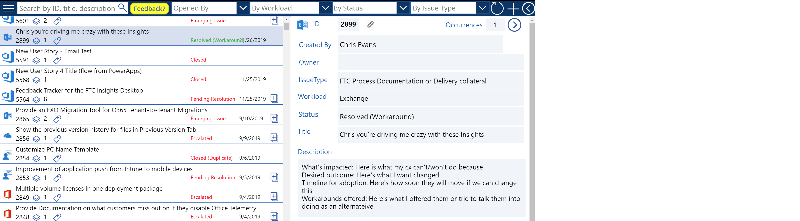

- Use the **[FastTrack – M365](https://teams.microsoft.com/l/channel/19%3a4556519a970d4f27a9e5fba679400424%40thread.skype/FTC%2520Insights?groupId=4be32c1a-84cf-43d6-b8a2-9986a996b0a5&tenantId=72f988bf-86f1-41af-91ab-2d7cd011db47)** Teams site workload channels to search for existing conversations

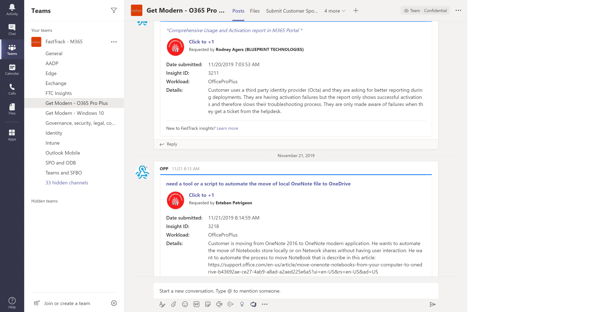

## Add occurrence (+1) for existing FTC Insights
- **Avoid** using customer specifics in the **Title** or **Comments** (i.e. customer names, vanity domains, tenant names)
- Tenant GUID is required for technical FTC Insights (source from FTOP, ViewPoint, RAVE)
- Use the **Click to +1** link from the Teams Message Card 

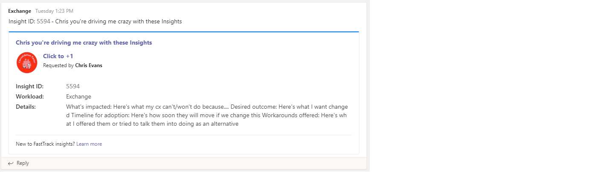

- Use the *Add occurrence* **[+]** from the [submission portal](https://aka.ms/ftcinsights)

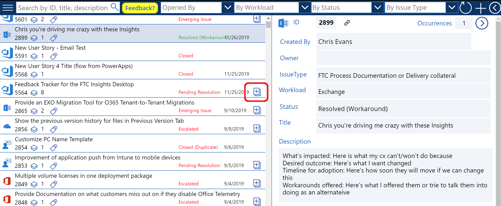

## Creating new FTC Insights submissions
If an existing item cannot be added to, then create a new submission.
- Use [http://aka.ms/ftcinew](http://aka.ms/ftcinew) or the *new item* **+** from the [submission portal](https://aka.ms/ftcinsights)
- *Avoid* using customer specifics in the **Title** or **Description** (i.e. customer names, vanity domains, tenant names)
    - Use the dropdown to set the *Affected Workload* and *Issue Type*
    - Enter a descriptive *Title*
    - Enter a detailed *Description* of the issue being submitted including *Customer problem (what is impacted)* + *Feature or fix requested (desired outcome)* + *Timeline for adoption if unblocked* + *Workarounds proposed*
    - Add other required data (Submitter Region and Role, and initial TenantID)
    - Add attachments if helpful
- Immediately after submitting ‘new’ FTC Insights, please add **+1’s** for any additionally affected customer tenant GUIDs

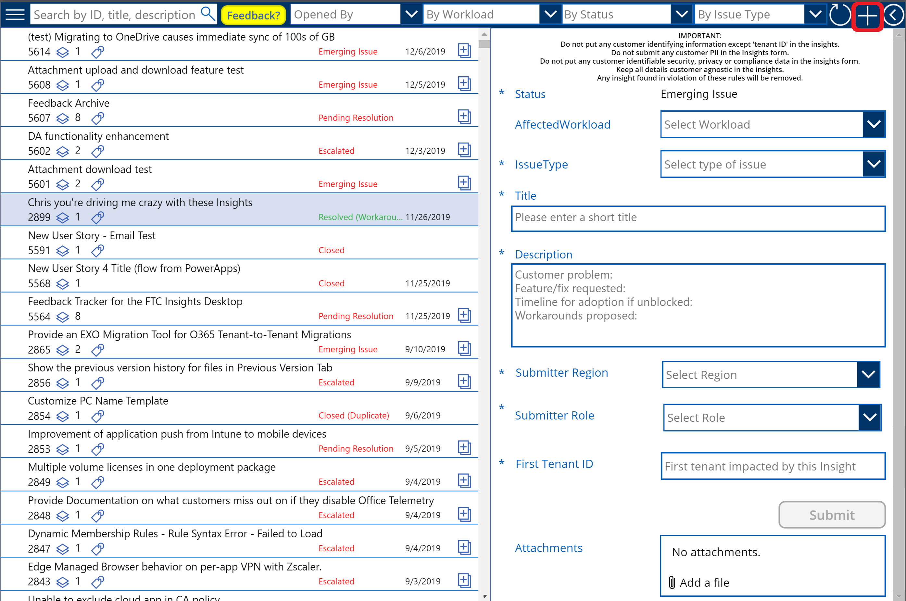

### New FTC Insight E-mail
When a new item is submitted, a notification e-mail will be sent to the FM and FE community regarding the newly created item which supports the ability to **+1**. Subsequent changes to *State* trigger an e-mail to the submitter, the +1 contributors, and subscribers.

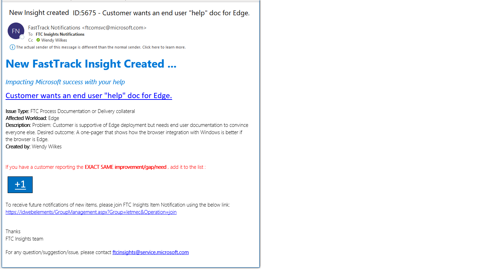

> [!NOTE]
> If you are outside of FastTrack CSS Team and want to receive notification of new items, please join [**FTC Insights New Item Notifications**](https://idwebelements/GroupManagement.aspx?Group=letmec&Operation=join)

## Navigating the FTC Insights submissions portal
The submission portal is designed to support both item search and filtering by attribute. Links to specific items can be copied, and items can be subscribed to in order to receive notifcations when their *State* is changed.

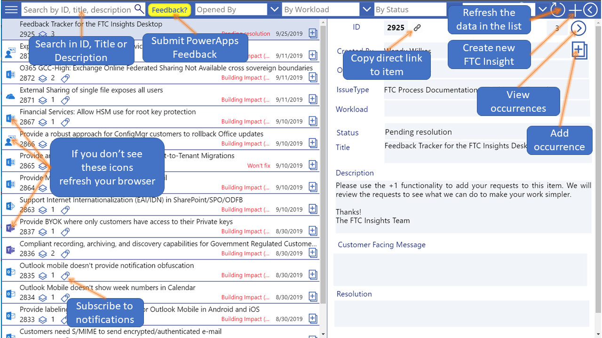

### First-time logon experience
The FTC Insights Desktop PowerApps requires the submitter's permission to use a couple of APIs in order for their account to be granted access to the FTC Insights data. This permission only needs to be established the first time the connection is made.

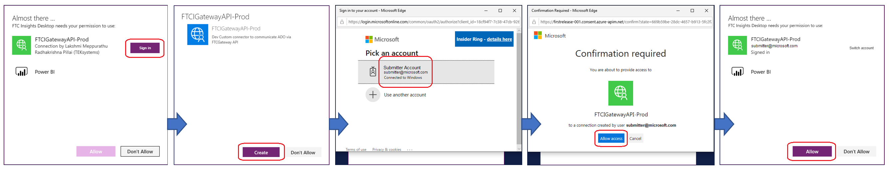

### Filter by Submitter
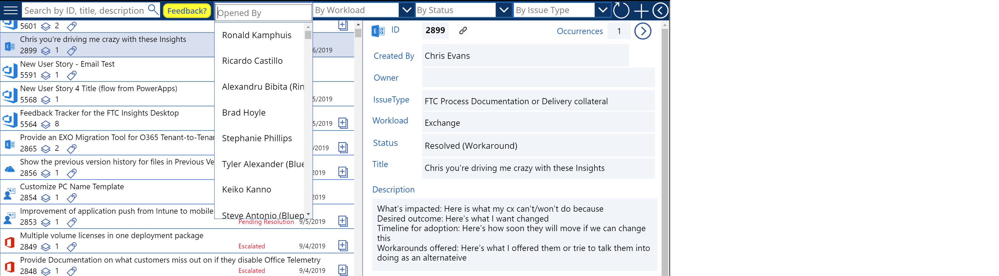

### Filter by Workload
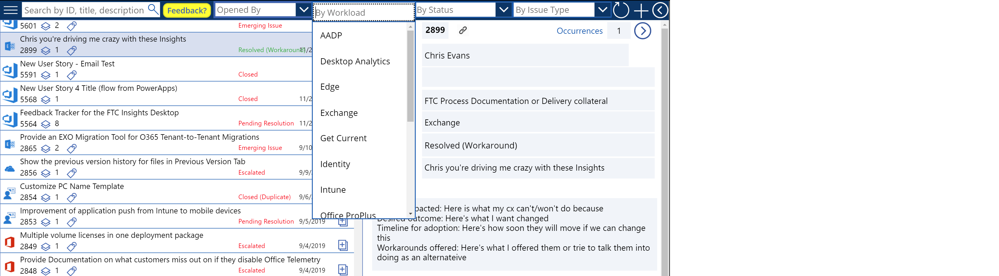

### Filter by Status
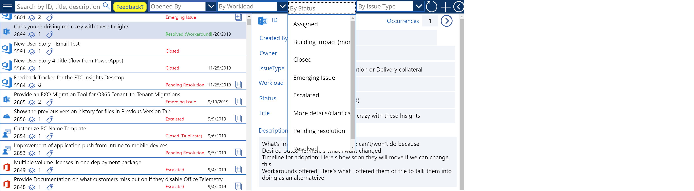
