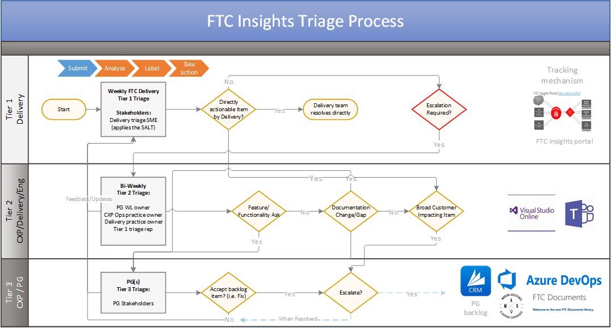

# Tiered Triage Structure

| Team scope | Role action |
| :-------------- | :---------------- |
| **Submitters** FastTrack Managers FastTrack Engineers FastTrack SME, FTA, GM FTA, CSM, PSM, etc. | Create new FTC Insight entry and/or participate by clicking the +1 |
| **Tier 1 Triage Team**  (Delivery SMEs)  *Statuses: Emerging Issues + More details/clarification required* | - Triages the entries based on whether the item is within the scope of the FTC Insights process, occurrences, possible business impact, and/or by importance.  - If description is not clear or the action will be performed by the Tier 1 triage SME, the item will be assigned an owner for the next action or follow up with the submitter and the status of the item will be updated to *More details/clarification required*.  - If the item is not within the scope of FTC Insights, or is a duplicate submission, redirection to the submitter will be provided and the status of the item will be updated to *Closed (Denied)* or *Closed (Duplicate)*.  - If escalation to Tier 2 is confirmed the Triage SME will then qualify the items with appropriate notes for Tier 2 Triage, confirm the correct *Issue Type*, and update the status of the item to *Escalated*. |
| **Tier 2 Triage Team**  (CXP, OPS PMs, SME + PG, other Stakeholders)   *Statuses: Escalated + Assigned + Building Impact* | - Triages the entries based on whether the item is within the scope of the FTC Insights process, has the correct impact for escalation, possible business impact, and/or by importance.  - If the item is a valuable FTC Insight but more detail is required before escalation can take place, the item will be assigned an owner for follow up with the submitter and the status will be updated to *Assigned*.  - If the item is a valuable FTC Insight but the customer impact is below the Feature Engineering Team's escalation threshold the status of the item will be updated to *Building Impact*. If the required escalation threshold has not been met within 6 months the item will be retired and status updated to *Closed (Low Impact)*.  - Once an item is approved for elevation by Tier 2 the status of the item will be updated to *Pending Resolution*. |
| **Tier 3 Resolution Team**   (PG/CXP/PMs)  Driving items forward to resolution  *Status: Pending Resolution* | Overall accountability for tracking *Pending Resolution* is the responsibility of the Workload PM.  Execution of the resolution is the responsibility of each organizational owner:   - Workload Ops PM  = Drive Program and Process items  - Workload Migrations PM = Drive workload specific Migration items  - Workload PM = Drive workload specific content updates  - Workload PM = Engage external teams to address items |
