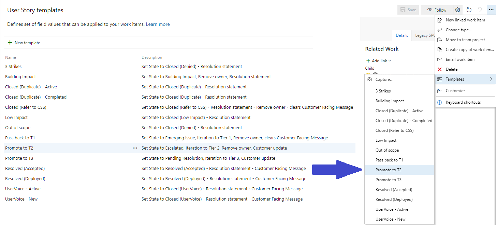
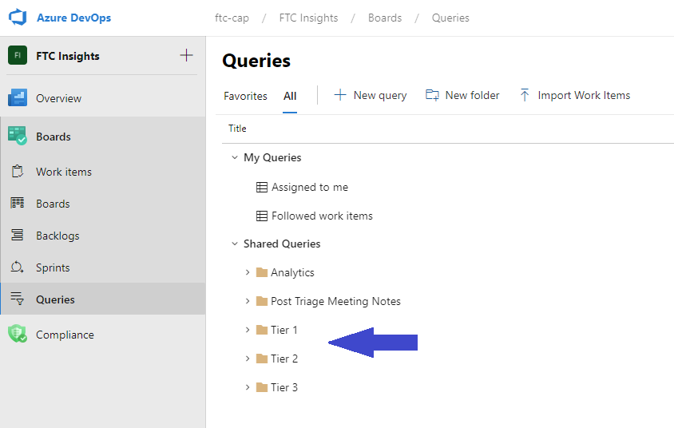

# Using the Azure DevOps interface
FTC Insights uses **Azure DevOps** for managing the items which are submitted.
### Security Groups
Access to the FTC Insights ADO project is managed through Security Groups. In order to provide the highest level of autonomy to the Triage Teams, each has their own group to manage. All of these individual groups are members of a higher-level group which has been added to the *Contributors* group in ADO. 

Ownership and maintenance of each security group is the responsibility of the Triage Meeting Owners. The groups for each triage team can be found [here](logistics.md#azure-devops-triage-team-security-groups). 

### Work Item Construct
New FTC Insights from the submission portal are created in ADO as a **User Story**. Upon submission there will always be an occurrence added for the original TenantID. The occurrences are created as **Tasks** whose *Parent* is the corresponding **User Story**. 

Changes to the *Parent* item do not usually have any impact on the *Child*, but when there is a change that should be reflected in the *Child* it will be managed automatically on the back end. For changes to the *Child*, such as the reassignment of the *Parent*, there is no automation.

### Status is now State
In ADO uses **State** in the place of the historical **Status**. It also contains additional *Resolved* and *Closed* options to make the results of the of the items much more informational and reportable. The *Submission Portal* still displays *Status* for the submitter view, and the filter dropdowns group all of the *Resolved* or *Closed* sub-types within the same filter option.

### SME Notes is now Discussion
In ADO the *SME Notes* are just part of the *Discussion*. The writer and date/time are automatically added as the field is updated. 

### @ Mention other Triage Members for attention
It is possible to @ mention other Triage Members directly within the **Discussion**. This will result in an e-mail notification being sent to the person who was @mentioned. It is also possible to @ mention non-Triage Members; however ***they will not have access to the items***. Conversation with non-Triage Members should be managed outside of ADO. 

### Links to the items
Links to the items are managed differently depending on whether the recipient of the link is a member of one of the Triage Teams with access to ADO, or not.

ADO provides a few different native options for members of the Triage Teams: 
- Open the item and copy the URL from the address bar in the browser
- Copy the **USER STORY xxxxx** active link from above the ID and Title of the item while it is open and paste into IM or e-mail
- Right-click on the list view of an active query, and **Copy link**

For submitters who have no access to ADO, it is a little more complex. The PowerApps does not use the *User Story ID* to find the items. It uses a valued called **InsightId**. For all items which were opened after the move to ADO, the *User Story ID* and the *InsightId* are the same value. But for migrated items, these values are different. This is because there are many systems outside of the Triage Team which are tracking the FTC Insights and using the IDs they were assigned in SharePoint. In order to preserve the ability to find those items without access to ADO, the PowerApps uses *InsightId* to identify the items. 

In order to construct the link for non-Triage Team use it is necessary to locate the **InsightId** of the item. The simplest way to do this is to view the *Legacy SPO* tab of the item. Below the *Insight Details (SPO)* section is the **ID**. This is the **InsightId**. It is also possible to view the *InsightId* from the list view of an active query by exposing the *InsightId* in the *Column options*.

Once the *InsightId* has been identified, place that value at the end of the link below:  
[https://aka.ms/ftcinsights/?insightId=](https://aka.ms/ftcinsights/?insightId=)

For example, using 2925 as the *InsightId*:  
[https://aka.ms/ftcinsights/?insightId=2925](https://aka.ms/ftcinsights/?insightId=2925)

Alternatively, the *InsightId* value can be used to *Search* in the PowerApps Desktop and the link can be copied from the item there.

### Tagging User Stories to add custom categories
Tagging work items helps you quickly filter the items by categories that you define. A tag corresponds to a one or two keyword phrase that you define and that supports your needs to filter or define a query.
- [Add tags to work items](https://docs.microsoft.com/en-us/azure/devops/boards/queries/add-tags-to-work-items?toc=%2Fazure%2Fdevops%2Fboards%2Ftoc.json&bc=%2Fazure%2Fdevops%2Fboards%2Fbreadcrumb%2Ftoc.json&view=azure-devops#add-tags-to-a-work-item)
- [Query for work items based on tags](https://docs.microsoft.com/en-us/azure/devops/boards/queries/add-tags-to-work-items?toc=%2Fazure%2Fdevops%2Fboards%2Ftoc.json&bc=%2Fazure%2Fdevops%2Fboards%2Fbreadcrumb%2Ftoc.json&view=azure-devops#query-for-work-items-based-on-tags)

### Dashboards
The FTC Insights dashboards have been constructed to be functional reporting hubs. Each Tier's dashboard includes links to that Tier's prebuilt Shared Queries.
- [Overview](https://aka.ms/ftci_ADO) aka.ms/ftci_ADO
- [Tier 1](https://aka.ms/ftciT1) aka.ms/ftciT1
- [Tier 2](https://aka.ms/ftciT2) aka.ms/ftciT2
- [Tier 3](https://aka.ms/ftciT3) aka.ms/ftciT3

### Templates
Azure DevOps supports using **Templates** for completing a series of updates. We have constructed a few templates to apply during some common actions and included them in the detailed triage guidance. New templates can be requested via the **Feedback** option in the submission portal. Some of the templates include text for the submitter to view which can be modified prior to saving the item, if desired.

### Shared Queries
There are several shared queries which are intended to simplify the triage meetings. These are organized by type and by workload.

http://aka.ms/ftcisme
- **Analytics**: used to supply information to the dashboard reports
- **Post-Triage Meeting Notes**: used to build the export data set for sending the post-triage meeting notes
- **Tier 1**: constructed to reflect the actual workloads present within the triage meeting
- **Tier 2**: constructed to reflect the actual workloads present within the triage meeting
- **Tier 3**: constructed with options more relevant to T3 investigations

Triage team members cannot save any changes to the shared queries but are able to use **Save as…** to capture any edits and save the query within their own **My Queries** folder.

Choose the *Shared Query* folder for your Tier and expand to find the prebuilt query for your Triage Team.

 
### Tracking hints for Owners
In the *Insights Details* section of the Details tab of an open User Story are a couple of tracking fields which can be used with the ADO queries to help owners keep track of item progress while in an active state. 

**Owner progress tracker** is a drop-down field that can be used to identify the current action the owner has on the item. This field will be cleared by the template when used to update the item state. (When promoting, resolving, or closing an item without using the template it would be helpful to clear this field.)
- Need to reach out
- Awaiting reply
- Being evaluated
- Added to backlog
- Scheduled

**Target resolution date** is a date picker which can be used for tracking the expected release or deployment of a change associated with the item.
