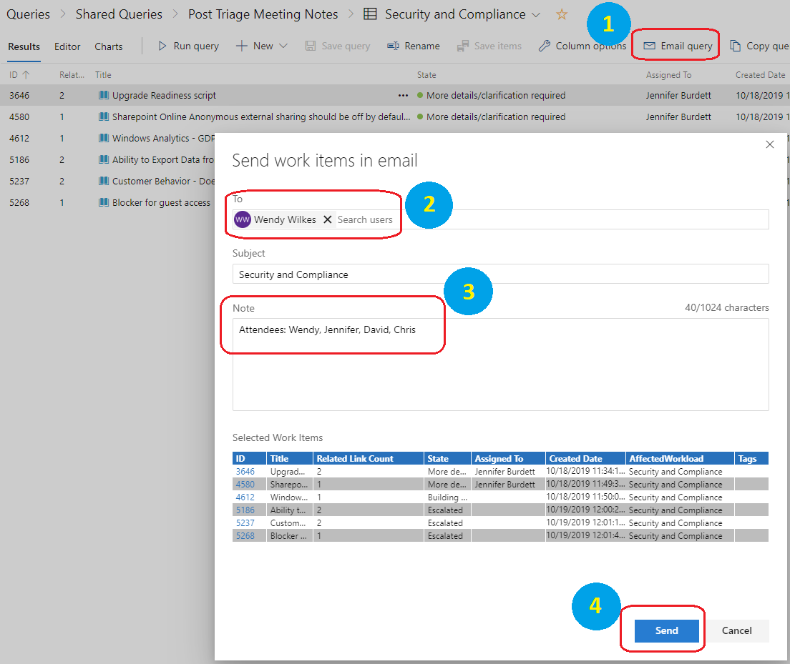
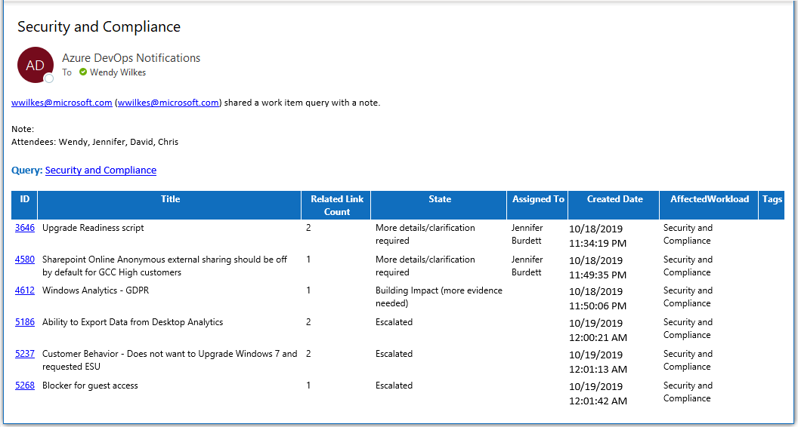
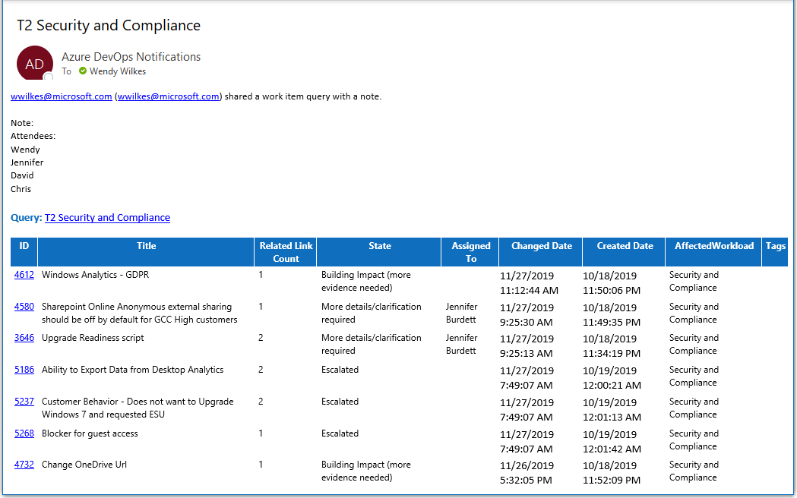

# Sending Post-Triage Meeting Status Notes

It is important that updates are provided to let people know what’s going on during both the ***Tier 1*** and ***Tier 2*** FTC Insights Triage meetings for their workloads. The meeting facilitator is responsible for sending out the meeting notes. When the normal call coordinator has someone hosting for them it is important to ensure that the host understands that they need to send out the meeting notes.

Audience for the meeting notes will vary by workload. 
- The FastTrack Teams Channel for the workload is the preferred location for posting the meeting notes (e-mail addresses for each workload’s Team Channel can be found [here](logistics.md#teams-channels))
- If e-mail to other recipients is required a distribution group should be created or leveraged for the workload triage stakeholders

Recommended minimum information for inclusion in the meeting notes:
- Participants
- Any items or updates that should have a special call out
- List of items triaged
- For Tier 2 the list of items needing +1 (Building Impact)

## List of items triaged
Generate the triage report using the [**Post-Triage Meeting Notes**](https://dev.azure.com/ftc-cap/FTC%20Insights/_queries/folder/06cc4b9f-1721-4abf-af88-0a82015e522d) Shared Query for your team. The queries have been constructed to capture updates made on the day the query is run. 

1. Click on the [***Post-Triage Meeting Notes***](https://dev.azure.com/ftc-cap/FTC%20Insights/_queries/folder/06cc4b9f-1721-4abf-af88-0a82015e522d) query for your workload 
2. Review the items on the **Results** page to confirm that the results are as expected (*the list should contain items which are out of scope for the normal triage meeting query at this point - if everything in the list is still within the scope of the meeting double-check the query*)
3. Send the results to yourself
    1.	Click on the **Email query** option in the control bar
    2.	Add your own alias in the **To Search Users** field
    3.	Enter any *Notes* to be included
    4.	Click on *Send*

        

4. After a few minutes you should receive an e-mail from Azure DevOps Notifications which can be forwarded with any additional notes

    
 
> [!NOTE]
> If there is much delay between the end of the triage meeting and running the query you may find that other items have been updated or added during the interval between. For this reason, it’s a good idea to at least run the query and send the report to yourself quickly once the meeting has wrapped up.

## List of items that need further customer evidences associated in order to move forward

One of the biggest challenges we face is raising visibility for Delivery into the active FTC Insight items which are valid escalations but have not met the bar for moving outside of the FTC to another team for resolution. Whether the item is accepted or ultimately rejected, if we can’t meet the bar then we don’t get to try. The T2 Post-Triage Meeting Notes queries have been constructed to include the list of items which have been updated "today" as well as all Building Impact items. 

Follow the same steps as above on the **T2** query and the results should contain *updated* as well as **Building Impact** items.

