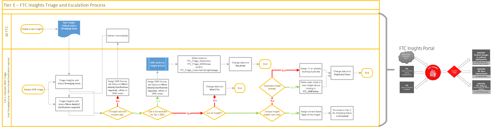
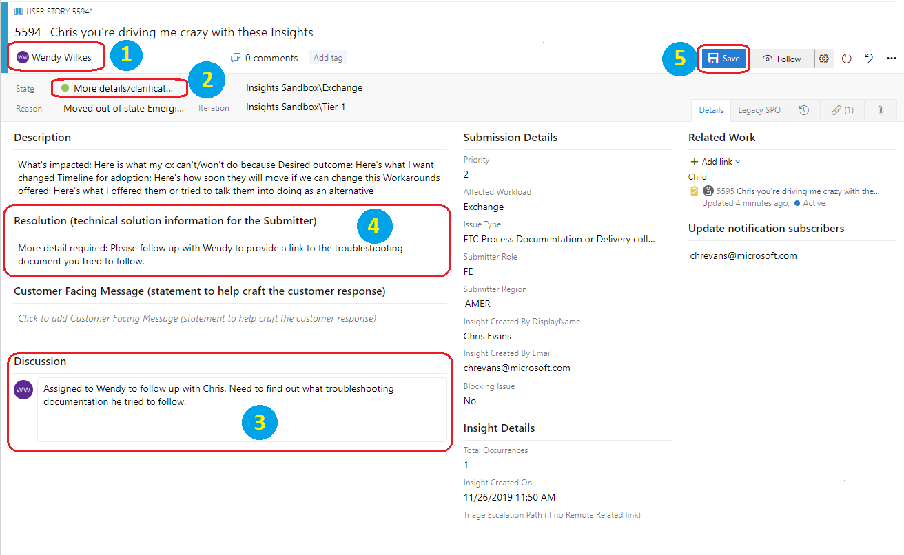
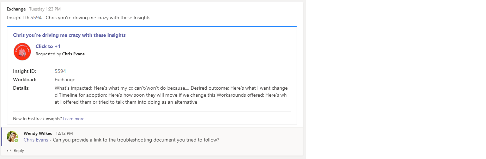
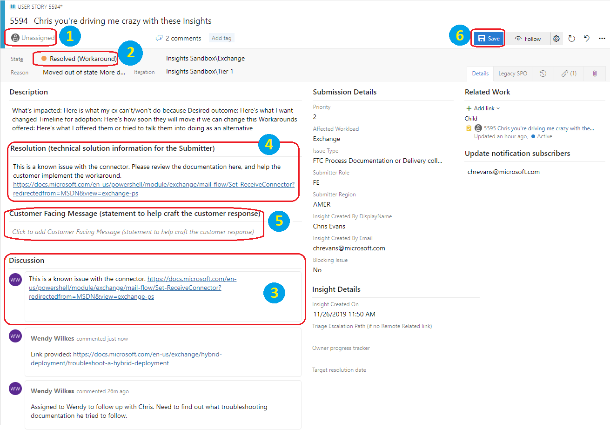
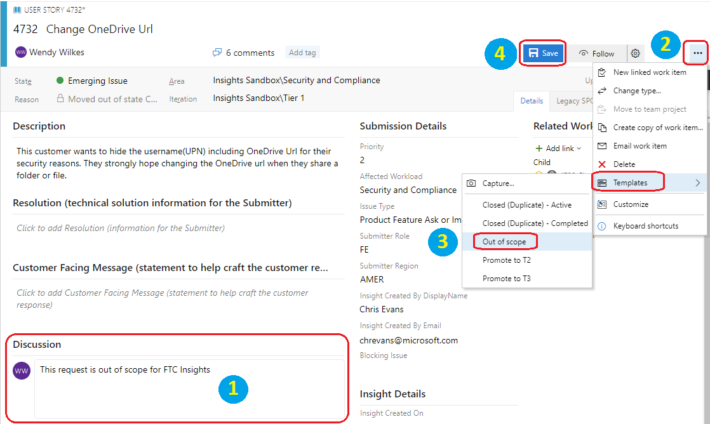
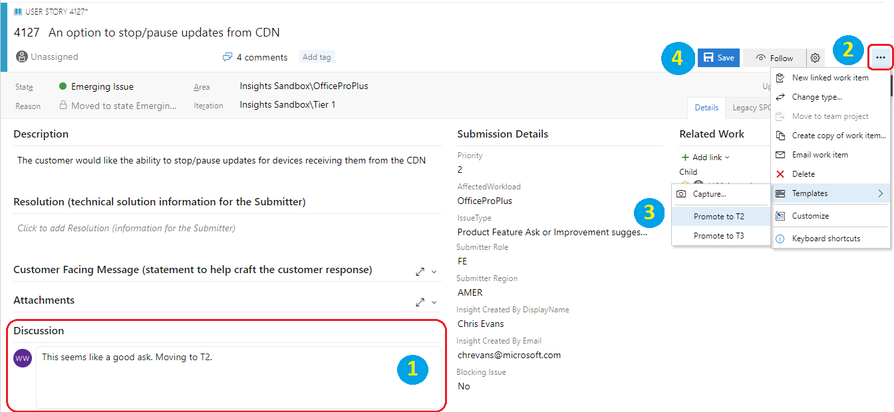

# Tier 1 Triage SME Team
The FTC Tier 1 Insights Triage team is composed of area SMEs (Subject Matter Experts) and is responsible for reviewing and processing items with states of ***Emerging Issue*** and ***More details/clarification required***. The Tier 1 Triage SMEs can be assigned ownership of items during either the Tier 1 or Tier 2 Triages. 

## States
The current list of **[FTC Insights States](../status.md)** can be found in the FTC Insights FAQ. *State* for the Triage Team maps to *Status* in the submission portal.

## Tier 1 Triage [Emerging Issue]
Review and triage Insights with a state of ***Emerging Issue*** for [scope](index.md#scope), accuracy, and proper description.
- Validate that the **affected workload** is correct and if not update it accordingly
    - If updating the **affected workload** the state should remain **Emerging Issue**
- If the item description is insufficient for escalation
    1. Assign a SME as the owner to follow up with the submitter
    2. Update the **State** to **More details/clarification required**
    3. Provide the relevant information in the **Discussion** field for tracking and transparency (this field is for triage use only and is not visible to the submitter)
    4. Update the **Resolution** field with direction for the submitter (if desired)
    5. **Save** the item

    

    - Owner should follow up with the submitter to gather additional information
        - Search for the item number in the Teams Channel for the Workload to locate the message card for the item. Reply to the message card with your questions and tag (@username) the submitter.

        

        - If needed, initiate an e-mail thread to submitter asking for more info
        - Once the details have been provided update the **State** to **Emerging Issue** for review during the next Tier 1 Triage meeting
        - Provide the relevant information in the **Discussion** field
        - **Save** the item 
- If a known workaround exists or the item requires some action prior to resolving
    1.	Assign a SME as the owner
    2.	Update the **State** to **More details/clarification required** 
    3.	Provide the relevant information in the **Discussion** field for tracking and transparency (this field is for triage use only and is not visible to the submitter)
    4.	Update the **Resolution** field with direction for the submitter (if desired)
    5.	**Save** the item

    

    - Owner should locate the documentation or take the action as needed and resolve the item
        1.	Remove the **Owner** from the item
        2.	Set the **State** to the appropriate **Resolved** status
        3.	Provide the relevant information in the **Discussion** field 
        4.	Update the **Resolution** field with direction for the submitter
        5.	Update the **Customer Facing Message** with an official statement for the submitter (if desired)
        6.	**Save** the item
        
        
 
- If the item requires no further action to resolve
    1. Remove the **Owner** from the item
    2. Set the **State** to the appropriate **Resolved** status
    3. Provide the relevant information in the **Discussion** field 
    4. Update the **Resolution** field with direction for the submitter
    5. Update the **Customer Facing Message** with an official statement for the submitter
    6. **Save** the item
- If the item is outside of the scope for FTC Insights apply the template **Out of scope** (removes owner if assigned, sets **State** to **Closed (Denied)**, updates **Resolution** with *"out of scope"* statement)
    1.	Provide the relevant information in the **Discussion** field 
    2.	Click on the **…** in the top right corner of the item
    3.	Expand **Templates** and choose **Out of scope**
    4.	**Save** the item
    
 
- If the item is break/fix and the customer needs to be directed to Support for escalation apply the template **Closed (Refer to CSS)** (removes owner if assigned, sets **State** to **Closed (Refer to CSS)**, updates **Resolution** statement)
    1.	Provide the relevant information in the **Discussion** field 
    2.	Click on the **…** in the top right corner of the item
    3.	Expand **Templates** and choose **Closed (Refer to CSS)**
    4.	**Save** the item
- Confirm that the issue is unique
    - If issue exists in another item
        - and the item is still **active** then move the **+1** customer tasks to the existing item
            - Record the number of the item which is the original (the *keeper*)
            - Record the number of the item which is the one to close (the *duplicate*)
            - Open the [Duplicate Resolver](https://dev.azure.com/ftc-cap/FTC%20Insights/_queries/query/56d92eca-a9f3-4e58-96c2-cdf47a4ff0b1) query
            - Choose the **Editor** pane
                - Enter the ID for the *keeper* item into the top ID field
                - Enter the ID for the *duplicate* item into the bottom field
            - Click on **Run query**
            - Switch to the **Results** pane
                - Click on the task which needs to be assigned to the *keeper*
                - Go to **Related Work**
                - Hover over the **Parent**
                - Click on the **X** to **Remove link**
            - Repeat for all of the tasks associated with the *duplicate*
            - Return to the **Results** pane and select all the unsaved tasks
                - Right-click to bulk edit
                - Select **Link to an existing item…**
                - Update the **Link type** to **Parent** (*this is critical*)
                - Update the **Work items to link** to the ID for the *keeper*
                - Select the resolved User Story when it appears
                - Click **OK**
            - Visually confirm that the parent association was made
            - Click **Save items** from the upper nav bar
            - Click **Run query** to confirm that all tasks have now moved to the *keeper*
            - Select the *duplicate* item which needs to be closed
            - Click the **...** for the item and apply the template for **Closed (Duplicate) – Active** (removes owner, sets **State** to **Closed (Duplicate)**, updates **Resolution** with *"duplicate of active item"* statement)
                - Update the **User Story ID** in the *Resolution* field text that the template added to the correct ID (or it will just say **ID [ ]**)
                - **Save** the item
        - and the item is **closed** update the status to **Closed (Duplicate)**
            - Record the number of the item which is the original (the *keeper*)
            - Record the number of the item which is the one to close (the *duplicate*)
            - Open the [Duplicate Resolver](https://dev.azure.com/ftc-cap/FTC%20Insights/_queries/query/56d92eca-a9f3-4e58-96c2-cdf47a4ff0b1) query
            - Choose the **Editor** pane
                - Enter the ID for the *keeper* item into the top ID field
                - Enter the ID for the *duplicate* item into the bottom field
            - Click on **Run query**
            - Switch to the **Results** pane
            - Select the *duplicate* item which needs to be closed
            - Click the **...** for the item and apply the template for **Closed (Duplicate) – Completed** (removes owner, sets **State** to **Closed (Duplicate)**, updates **Resolution** with *"duplicate of closed or resolved item"* statement)
                - Update the **User Story ID** in the *Resolution* field to the correct ID (or it will just say **ID [ ]**)
                - **Save** the item
            > [!VIDEO https://msit.microsoftstream.com/embed/video/53360ca0-eb98-42aa-8569-3b81595e766d?autoplay=false&amp;showinfo=true]
- Validate that the **Issue Type** is correct and if not update it accordingly
    See **Issue Type** and description in the table below:

    | Issue Type | Description |
    | :---------- | :----------- |
    |Product Feature ask or Improvement suggestion | The Insight targets a Product Feature gap blocking deployment |
    | Workload Documentation (public facing, i.e. TechNet, Support, Docs) | Related to any documentation issue, i.e. typo/wrong information/gap which is found in Docs.microsoft.com/TechNet…  etc. |
    | FTC Migration (Guidance, Tools, Migration docs, asks) | Any issue related to our Content / Mail Migration benefit. Depending on the load we may require extra triage help for a dedicated Migration Triage SMEs team. |
    | FTC Process, Documentation or delivery collateral | Any things related to our own FTC processes or FTOP Documentation   - Translation issue in our Doc  - Missing clarity in our Doc  - FTC scope limitation blocking or slowing down Onboarding

- If the item is qualified for escalation to Tier 2 Triage apply the template to **Promote to T2** (removes owner if assigned, sets **State** to **Escalated**, sets **Iteration** to **Tier 2**, adds Customer update)
    1.	Provide the relevant information in the **Discussion** field
    2.	Click on the **…** in the top right corner of the item
    3.	Expand **Templates** and choose **Promote to T2** 
    4.	**Save** the item
    
    

## Tier 1 Triage [More details/clarification required]
Review and triage FTC Insights with a status of ***More details/clarification required*** for scope, accuracy, and proper description.
- Check for responses and process the item as appropriate
- If the outstanding action has been completed and the item has qualified for escalation to Tier 2 Triage, follow the steps above
- If no response is received after 3 strikes/retries apply the template **3 Strikes** (removes owner if assigned, sets **State** to **Closed (Denied)**, sets **Resolution** statement)
    1.	Provide the relevant information in the **Discussion** field
    2.	Click on the **…** in the top right corner of the item 
    3.	Expand **Templates** and choose **3 Strikes** 
    4.	Review the **Resolution** statement and make any desired edits 
    5.	**Save** the item  
