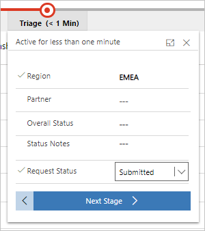

---
# required metadata
title: FastTrack Center Resource Request Approver User Guide - How to Approve a Request (PSM Pre-approval)
description: Process guidance for FastTrack Center users who need to approve resources.
author: Connie Brenden
ms.author: v-conbre
manager: jimmuir
ms.date: 3/17/2020
ms.topic: help-guide
ms.prod: non-product-specific
ms.custom: help-guide
ft.audience: internal
ft.owner: jimmuir
---
# How to Approve a Request (PSM Pre-approval)

Once a request is submitted you can find it in the [Management Portal](https://aka.ms/ftcreqmanagement):

Review newly submitted requests on a first in, first out basis. Select the preferred view for triage, either FTC Triage or FRP Triage in the view selector in the left upper corner:

You may filter by Region or POD as necessary. Double-click the request to open it. Once the request is open, you have access to all the details provided by the requestor:

Once all the information has been reviewed, initiate the flow on the top of the page.

In this stage, set the status to Submitted.

You can save the current status at this point. Click **Save**.

## Next steps

See [How to Request More Details](how-to-request-more-details.md)
