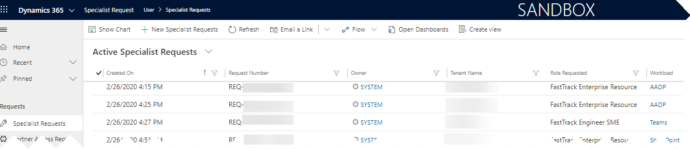
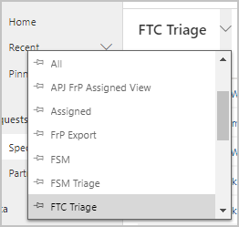
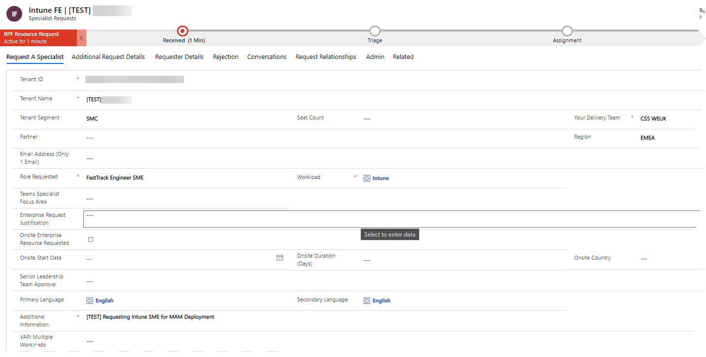
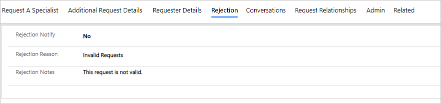
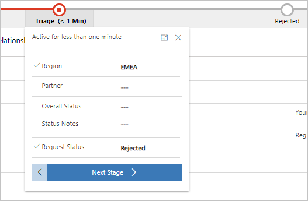
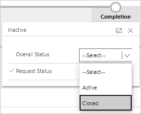

---
# required metadata
title: FastTrack Center Resource Request Approver User Guide - How to Reject a Request
description: Process guidance for FastTrack Center users who need to approve or reject resources.
author: Connie Brenden
ms.author: v-conbre
manager: jimmuir
ms.date: 2/28/2020
ms.topic: help-guide
ms.prod: non-product-specific
ms.custom: help-guide
ft.audience: internal
ft.owner: jimmuir
---
# How to Reject a Request

Once a request is submitted you can find it in the [Management Portal](https://aka.ms/ftcreqmanagement):

Review newly submitted requests on a first in, first out basis. Select the preferred view for triage, either FTC Triage or FRP Triage in the view selector in the left upper corner:

You may filter by Region or POD as necessary. Double-click the request to open it. Once the request is open, you have access to all the details provided by the requestor:

In order to reject a request, navigate to the Rejection section and provide information about the rejection. Both Rejection Reason and Rejection Notes are required.

Once this information is provided, initiate the triage flow:

1. Make sure the request is in the **Triage** stage.

1. Select **Rejected** in the Request Status.

3. Complete the flow by clicking **Next Stage**.

1. Review the Rejection Reason and the Rejection Notes to make sure they are properly set from previous steps or introduce the appropriate information.

1. In the last stage, select Overall Status as **Closed** and finish the flow.

An email will be generated to the requestor with the rejection notification.

## Next steps

See [How to Report Issues & Feedback](how-to-report-issues-feedback.md)
