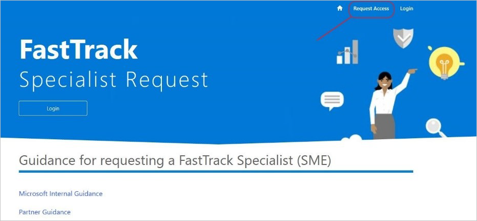
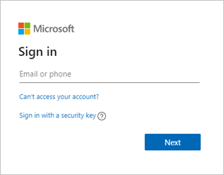
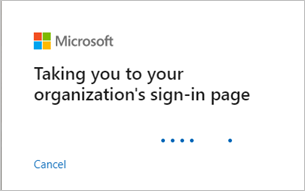
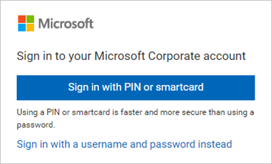
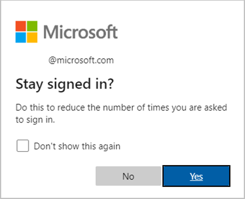
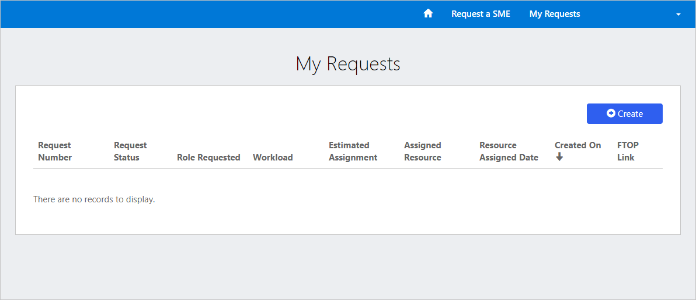

---
# required metadata
title: FastTrack Center Resource Request Requester User Guide - How to Request Access (FTC)
description: Process guidance for FastTrack Center users who need to request resources.
author: Connie Brenden
ms.author: v-conbre
manager: jimmuir
ms.date: 3/6/2020
ms.topic: help-guide
ms.prod: non-product-specific
ms.custom: help-guide
ft.audience: internal
ft.owner: jimmuir
---

# How to Request Access (FTC)

As part of the FastTrack (FTC) organization, all users should be able to access the tool to submit a request.

To log in to the tool:

1. Access tool [ftcfereq](https://aka.ms/ftcfereq).

1. Click **Login**.

3. Enter your Microsoft ( @microsoft) credentials.

You will be taken to your organization's sign-in page.

4. Choose your sign in method.

1. Click **Yes**, if you want to stay signed in.

You should be able to access the request site.

## Next steps

[How to Submit a Resource Request](how-to-submit-a-resource-request.md)