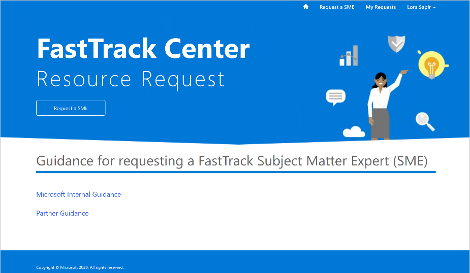
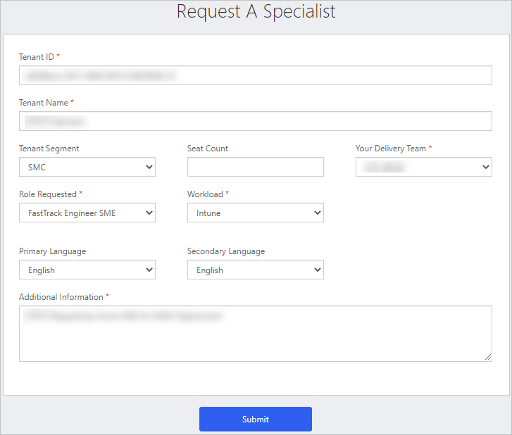
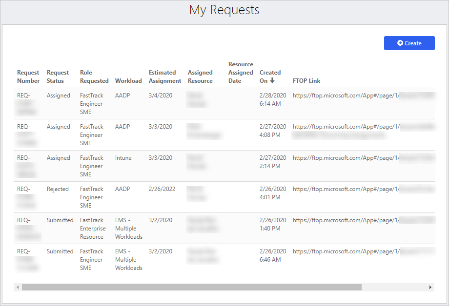

---
# required metadata
title: FastTrack Center Resource Request Requester User Guide - How to Submit a Resource Request
description: Process guidance for FastTrack Center users who need to request resources.
author: Connie Brenden
ms.author: v-conbre
manager: jimmuir
ms.date: 3/2/2020
ms.topic: help-guide
ms.prod: non-product-specific
ms.custom: help-guide
ft.audience: internal
ft.owner: jimmuir
---

# How to Submit a Resource Request

1. Submit a FTC resource request by selecting **Request a SME** from the CRM Application.

2. Complete all required fields in the form and include any additional information that would be helpful in identifying an appropriate resource for your engagement.

3. Within 5 minutes of submitting your request, you should receive an automated email validating that your request has been submitted.   

>[!NOTE]
>If you do not receive this notification, please email FastTrack SME Assignment (ftsmeassign@microsoft.com) for assistance.

4. Within 1 business day, your request will be triaged and if additional information is requested you will be notified.

1. Within 5 days of submission, your request will be either approved and a resource assigned or denied.

You can check the status of all your resource requests via your My Resource Requests view in the My Requests page.

## Next steps

[How to Report Issues & Feedback](how-to-report-issues-feedback.md)
