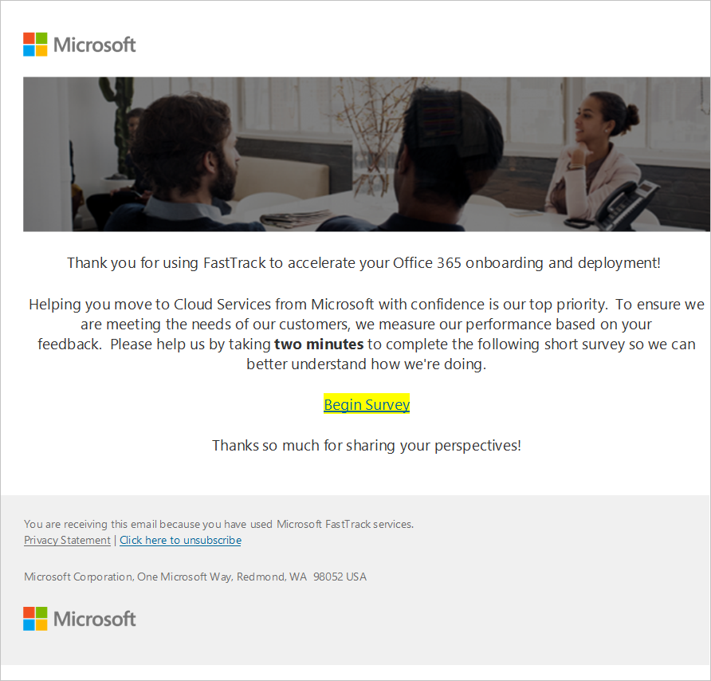
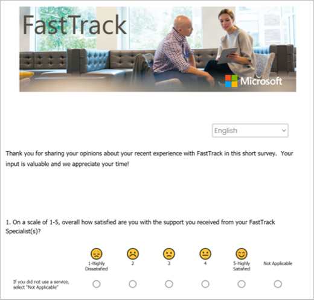
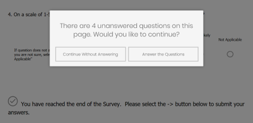

---
# required metadata
title: FTC Survey Process for FY20H2 - Customer Experience
description: Process guidance for internal FTC delivery team members.
author: Susan Funke, Brent Safrit
ms.author: v-sufun, v-crsafr
manager: evbassir
ms.date: 1/28/2020
ms.topic: index
ms.prod: non-product-specific
ms.custom: ftc-survey-process-for-fy20
ft.audience: internal
ft.owner: v-crsafr
---
# Customer Experience

The *customer* receives a survey via an email message that looks similar to the following:

Followed by rate your experience

## Survey tool process

- Email sent to customer with a link to the survey

- Survey available in all 12 FastTrack-supported languages 

- Emoticons help with clarifying rating scale

- Separate surveys for each phase of the FastTrack engagement

## Survey tool features

- The tool automatically reminds customer to complete questions before submitting

- Mobile-friendly

- Email reminders automatically sent two weeks before survey expires to increase survey responses

## Next steps

See [Appendix](appendix.md)