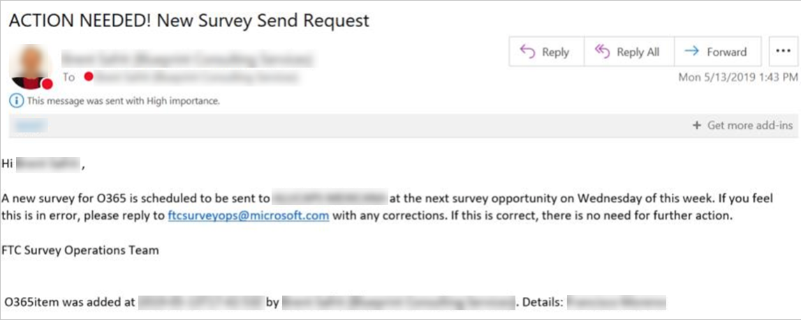

---
# required metadata
title: FTC Survey Process for FY20H2 - Survey Tasks
description: Process guidance for internal FTC delivery team members.
author: Susan Funke, Brent Safrit
ms.author: v-sufun, v-crsafr
manager: evbassir
ms.date: 1/28/2020
ms.topic: index
ms.prod: non-product-specific
ms.custom: ftc-survey-process-for-fy20
ft.audience: internal
ft.owner: v-crsafr
---
# Survey Tasks

## Overview

The survey process is changing for FY20 H2. It is now no longer necessary for FastTrack Managers (FM's) to initiate the sending of a survey. FM's should identify a survey eligible contact for each active engagement during the Kickoff Meeting and update the FTOP contact details with the associated customer’s language, country, and workload(s) to be surveyed (see screenshot below). This information is needed to ensure the right survey is sent and the associated email language meets GDPR requirements. If a customer contact name is not listed, please add.

> [!NOTE]
> A validation error message will show up if the FM tries to save the survey eligible field change, when the language, country, or services deployed/migrated field is still missing information.

## Initiate survey notifications

Primary FMs will be sent an email notifying them when a survey is planned for delivery. They will be given a few days to respond with any changes. A second email notification will be sent when the survey is delivered to the customer.

## Identify survey contact: FTOP Task 3690

Currently, **FTOP Task 3690** provides guidance around how to designate a customer contact as “survey-eligible”. We need this information to ensure the right surveys get sent to the correct customer contacts. We’ll use a report to track progress against this task.

> [!IMPORTANT]
> It is in the best interest of the Delivery Teams to ensure the right customer contact is selected and the FTOP assignments are correct. Otherwise, surveys may go out with the wrong assignments attached.

Sub Task ID:** 3690

Sub Task Title: Identify Survey Contact

- **Task Description:** Mark at least one (1) customer contact as Survey Eligible = "Yes" when the customer has completed Technical Enablement. Once identified, you will also need to add the survey language, customer country, and service(s) which the customer worked on.

- Mark task as "Complete".

- See guidance linked below for further information.

- **Task Owner:** FM

Task Content Links:

- [OPS - FY20 CPE+NPS Survey Report](https://aka.ms/FTsurvey)

## Next steps

See [Survey Questions](survey-questions.md)