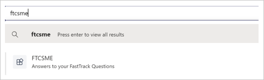
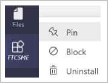

---
# required metadata
title: FTCSME Bot User Guide - Finding FTCSME Bot
description: User guide to help folks find, use, and provide feedback on the FTC SME Bot
author: Patrick Rodgers
ms.author: patrodg, v-conbre
manager: jwilkes
ms.date: 2/27/2020
ms.topic: ftc-help-guide
ms.prod: non-product-specific
ms.custom: ftc-help-guide
ft.audience: internal
ft.owner: patrodg
---
# FTCSME Bot User Guide

## Finding FTCSME Bot

1. Select “Search” within Teams and type “FTCSME”.
   
   

2. Select **Add** located at the top-right as shown below to add the BOT App to your Teams client.

   

3. Right-click **FTCSME** in the left navigation pane and select “Pin” to pin the BOT. This helps you easily access the BOT from left navigation in the Chat view.

   

You are all setup and now ready to use the BOT whenever needed.

## Next steps

See [Chatting with FTCSME Bot](chatting-with-ftcsme-bot.md).
