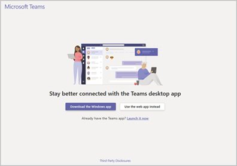
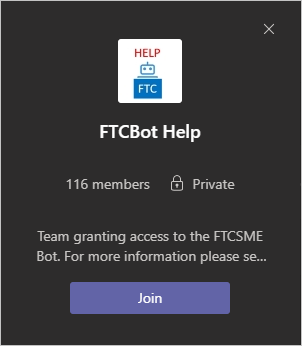
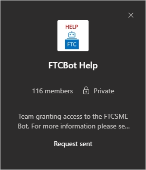
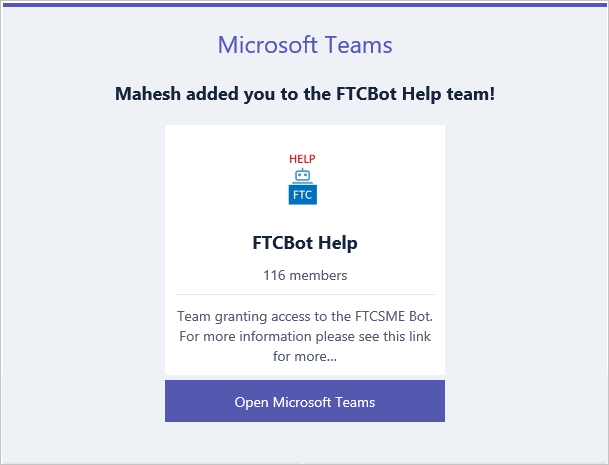

---
# required metadata
title: FTCSME Bot User Guide - Prerequisites
description: User guide to help folks find, use, and provide feedback on the FTCSME Bot
author: Patrick Rodgers
ms.author: patrodg, v-conbre
manager: jwilkes
ms.date: 2/27/2020
ms.topic: ftc-help-guide
ms.prod: non-product-specific
ms.custom: ftc-help-guide
ft.audience: internal
ft.owner: patrodg
---
# FTCSME Bot User Guide

## Prerequisites

In order to use the FTCSME Bot, you have to be a member of the [FTCBot Help](https://teams.microsoft.com/l/channel/19%3a7e26870bc62e4a01b2a3be2269b012ab%40thread.skype/General?groupId=092505a2-0f66-43ac-973a-d8cab626ebdc&tenantId=72f988bf-86f1-41af-91ab-2d7cd011db47) Team. Please follow these steps to ensure you are a member.

1. Select [FTCBot Help](https://teams.microsoft.com/l/channel/19%3a7e26870bc62e4a01b2a3be2269b012ab%40thread.skype/General?groupId=092505a2-0f66-43ac-973a-d8cab626ebdc&tenantId=72f988bf-86f1-41af-91ab-2d7cd011db47)

2. Select **Launch it now**.

   

3. Select **Join**.

   

   You will see **Request Sent**

   

   You will receive and email notifying you that you have been added to the FastTrack Security All Hands private group.

   

## Next steps

See [Finding FTCSME Bot](finding-ftcsme-bot.md).
