---
# required metadata
title: FTOP User Guide - Access to FTOP
description: Process guidance for accessing FTOP.
author: Connie Brenden
ms.author: v-conbre
manager: jimmuir
ms.date: 4/16/2020
ms.topic: access-to-ftop
ms.prod: non-product-specific
ms.custom: ftop-user-guide
ft.audience: internal
ft.owner: jimmuir
---
# Access to FTOP

## Overview

Access to FTOP (FastTrack Orchestration Portal) is managed through MyAccess and Security Groups (IDWeb). MyAccess provides security while allowing access to the FTOP tool. Security Groups are used to provide Role Based Access Controls (RBAC) to tenant data inside FTOP Tenant View. FastTrack Roles are tied to security groups which are granted one of three RBAC access levels; Assigned, Assigned and Assignment, and Privileged. There are no changes to the way partners access FTOP and tenant data.

This article is for internal FTOP users who need to request individual access, request access for direct reports, manage their access, and access related resources.

For questions regarding pending requests, projects, or anything else related to MyAccess contact **FastTrack MyAccess Help** at ftmyaccess@microsoft.com. You must be on Corp or logged into VPN.

## Request Access

The steps for requesting access will be slightly different depending on whether a user has direct reports. This section is for individuals requesting access for themselves; users without direct reports, users with direct reports, and users requesting access for their direct reports.

### Users without direct reports

The following steps are for users that do not have direct reports

#### To request access for yourself

1. Navigate to <https://myaccess>.

1. Select **Request Access**.

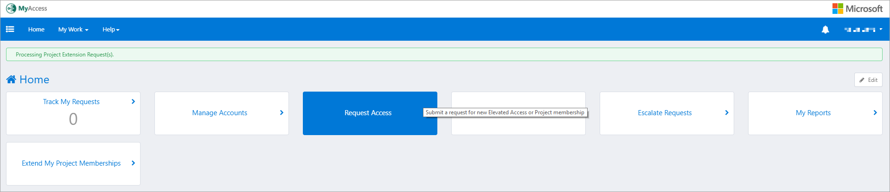

3. Search for **FastTrack Insights** project.

4. Select “check-mark” next to the *FastTrack Insights* project name.

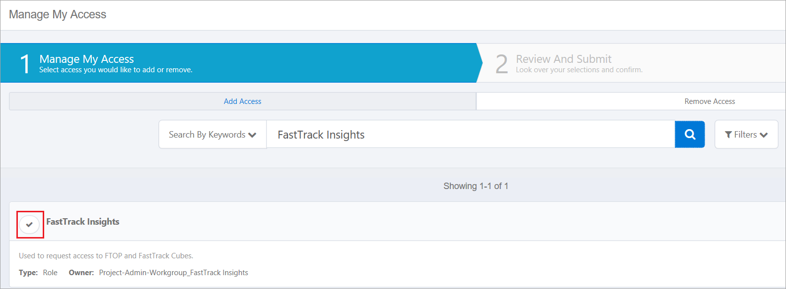

5. After you select the project, the **Review and Submit** option (button) will turn green (and show the number of requests).

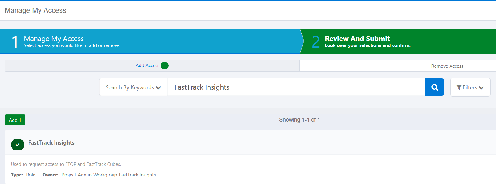

6. Select **Review and Submit**.

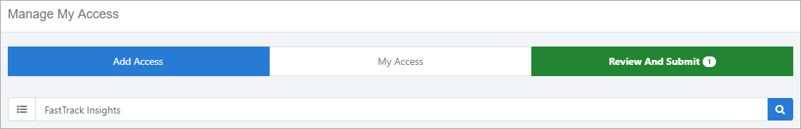

7. Select **Submit** to define your role.

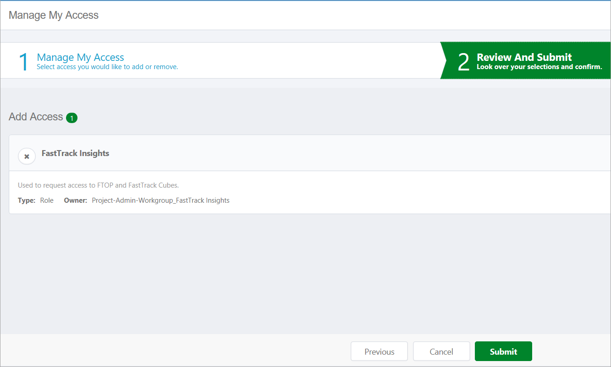

8. A pop-up window will appear that allows you to define the specific access request. FTOP access requires a permission level and justification:

    a. Ensure “Request for Myself” is selected

    b. Your user account will be selected (you can’t deselect it)    

    c. Select the permission level. FTEs should base the request on their role or group. Vendors/contractors should base the request on the vendor company (if available) or group. If you know the name of the role, start typing and available options will appear.

    d. DO NOT enter a machine name

    e. Enter a short justification (FTC members need to state they are a member of the FTC and their role/group).

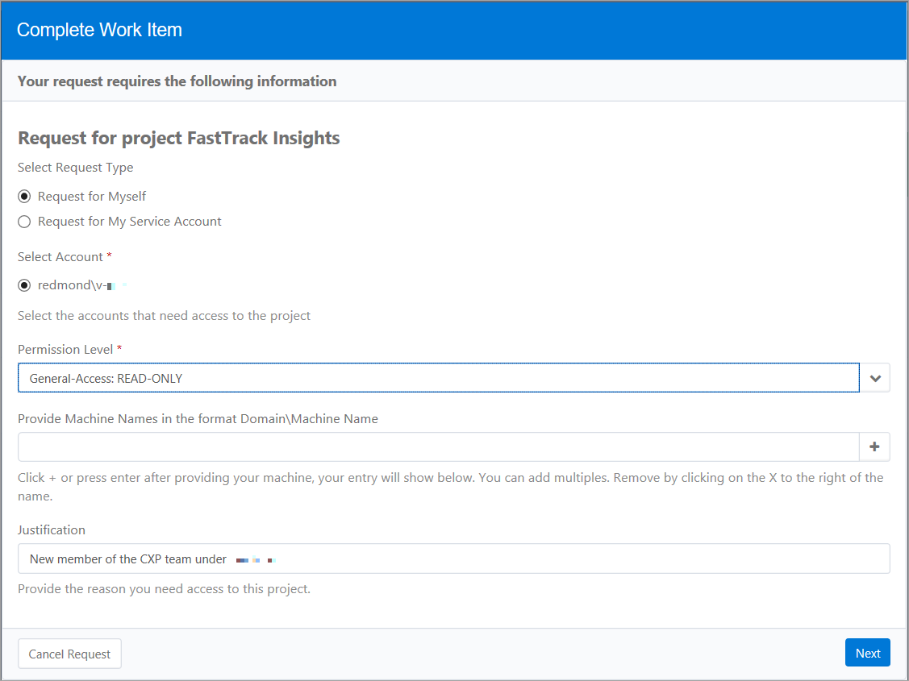

9. Once the required information is entered, select **Next** to continue. A short summary will then appear.

1. Confirm the information is correct then select **Submit Request**.

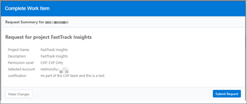

MyAccess will now take you back to the home page with the message stating above that your request is being processed.

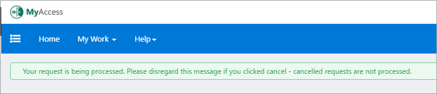

Once the request processed, you will receive an email notifying you if your request has been APPROVED, DENIED or further clarification is needed as to why you are requesting access to the desired project.

Access request will be routed based on permission level.

### Users with direct reports

The following steps are for users with direct reports that are requesting access for themselves.

#### To request individual access for yourself

1. Navigate to <https://myaccess>.

1. Click **Request Access**.

Users with direct reports will see the “Select Users” screen with a list of their direct reports. This page is NOT used for this scenario.

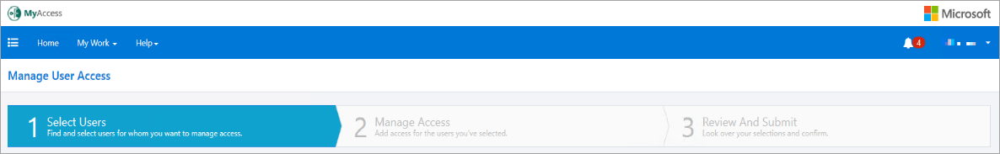

3. To request access for yourself, select **Manage Access** at the top of the screen.

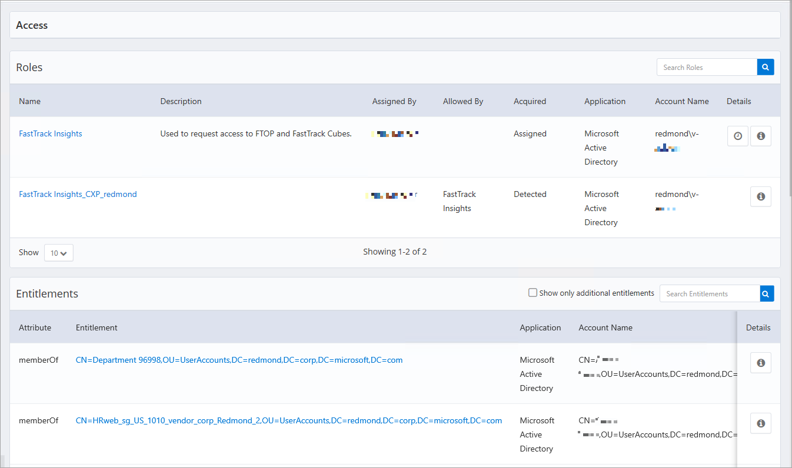

4. Search for the project you wish to request access to. For FTOP access, enter “**FastTrack Insights**”.

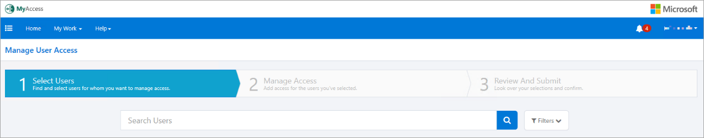

5. The project should appear.

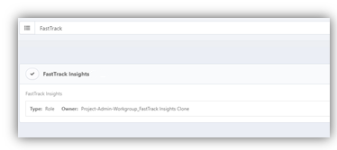

6. Select the project by selecting the “**check**” next to the project name (it will turn green when selected).

7. After you have selected the project, the “Review and Submit” option will turn green (and show the number of requests). Select **Review and Submit**.

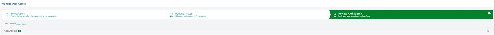

8. A summary of the request will appear. Select **Submit**.

9. A pop-up window will appear that allows you to define the specific access request. FTOP access requires a permission level and justification:

    a. Ensure “**Request for Myself**” is selected

    b. Your user account will be selected (you can’t deselect it)

    c. Select the permission level. FTEs should base the request on their role or group. Vendors/contractors should base the request on the vendor company (if available) or group. If you know the name of the role, start typing and available options will appear.

    d. DO NOT enter a machine name

    e. Enter a short justification (FTC members simply need to state that they are a member of the FTC and their role/group).

10. Once the required information is entered, select **Next**. A short summary will then appear.

1. Confirm the information is correct, then select **Submit Request**.

12. MyAccess will now take you back to the home page with the message stating above that your request is being processed.

Once the request processes, you will receive an email notifying you if your request has been APPROVED, DENIED or further clarification is needed as to why you are requesting access to the desired project.

### Users requesting access for their direct reports

If you have direct reports your will see additional options on the MyAccess home page that allow you to approve, request, and remove access on behalf of your direct reports. When you request access for a direct report, you have two options you can select **Request Access** or you can make individual requests using the **Direct Reports** section. The end result is the same, the Direct Reports section is slightly faster.

#### To request access for direct reports using **Request Access**

1. Select Request Access. This will open the “Manage User Access” page.

2. Select the user that you want to request access for (select the “check” icon next to their name). Once you select a user, the check icon for all other users becomes greyed out.

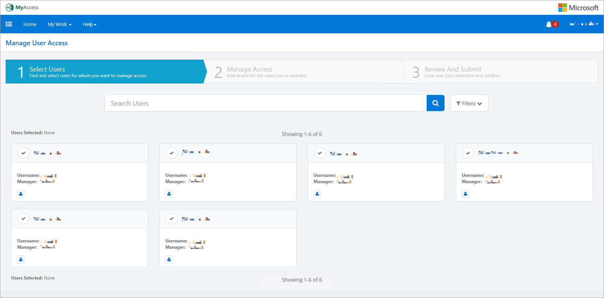

3. Once you have all of the users selected, select **Manage Access** to proceed.

From here the process is the same as any other request scenario, see [To define access](#to-define-access).

#### To request access using Direct Reports

1. Select the “**check box**” icon next to the user name.

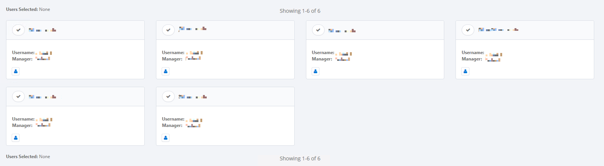

This will take you directly to the “**Manage User Access**” section of MyAccess.

From here the process is the same as any other request scenario, see [To define access](#to-define-access).

### To define access

Once you are on the Manage Access page, the process is the same regardless of how you started the request.

1. Search for the project you are wishing to request access to. For FTOP access, use the “**FastTrack Insights**” project.

2. Select the project by selecting the “**check**” next to the project name (it will turn green when selected).

3. After you have selected the project, the “Review and Submit” option (button) will turn green (and show the number of requests). Select “**Review and Submit**.

4. A summary of the request will appear. Select **Submit** to define your role.

5. A pop-up window will appear that allows you to define the specific access request. FTOP access requires a permission level and justification:

    a. Ensure “**Request for Myself**” is selected

    b. The user’s account will be selected (you can’t deselect it)

    d. Select the permission level. FTEs should base the request on their role or group. Vendors/contractors should base the request on the vendor company (if available) or group. The list is not in a specific order, but if you know the name of the role, you can start typing the name in and available options will appear.

    d. DO NOT enter a machine name. You do not need to provide a machine name as FTOP does not leverage this functionality.

    e. Enter a short justification (FTC members simply need to state that they are a member of the FTC and their role/group).

Once the required information is entered, select **Next** to continue. A short summary will then appear. After confirming that the information is correct, select **Submit Request**.

MyAccess will navigate you back to the home page with the message stating your request is being processed.

Once the request processes, you will receive an email notifying you that your request has been APPROVED, DENIED or further clarification is needed as to why you are requesting access to the desired project.

## Manage my Requests

From manage my requests, you can track, extend, or approve requests.

### Track My Requests

Tracking your request allows you to see who the request is with for Approval.

#### To track my request

1. Navigate to <https://myaccess>.

1. Click **Track my Requests**.

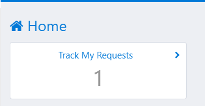

Tracking your request allows you to see who the request is with for Approval.

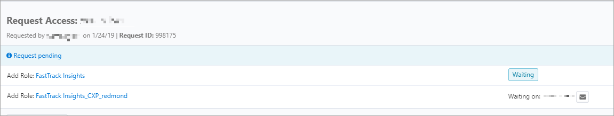

From this dialog, you can email the approver.

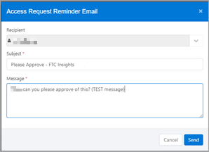

Enter in additional comments and if need be cancel the request.

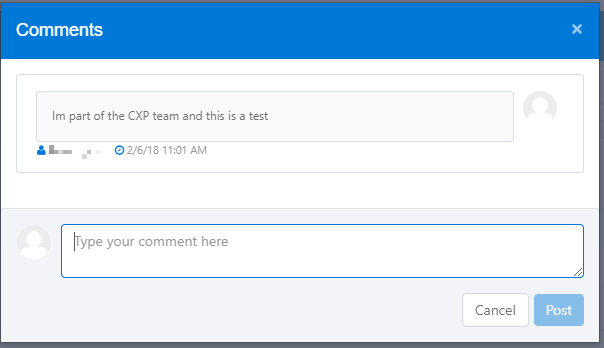

### Extend Project Memberships

When your project access approaches its expiration date, you will be sent a notification warning that your access is about to expire. The notification shows you the name of the project, the permission level, and when access is scheduled to expire.

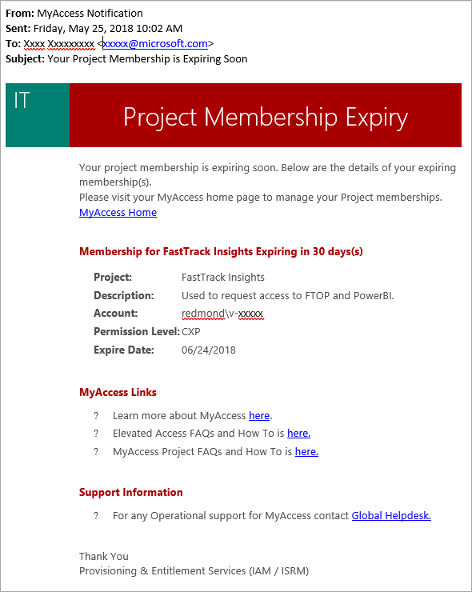

> [!NOTE]
> The link takes you to the MyAccess home page, you will need to navigate to the renew section of MyAccess.

Project access can be renewed at any time, but the extension period is based on the renewal date. For example, if you renew 30 days into your 90-day renewal period your new expiration date will be 90 days from that date. FastTrack Insights defaults to 90 or fewer days of access, depending on whether you are a member of the FastTrack Center organization or not.

#### To extend/renew your project access.

1. Navigate to <https://myaccess>.

1. Select **Extend My Project Memberships**.

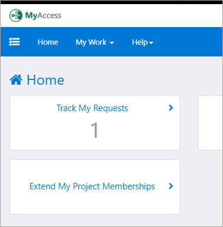

3. From the drop-down menu, select the project memberships you would like to extend.

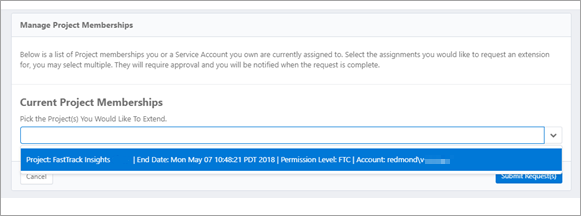

4. Select **Submit**.

### Approve Requests

If you are a manager of a vendor/contractor or are in a group that is not part of the FastTrack Center, you will be required to approve access for your direct reports.

#### To approve/deny access requests

1. Navigate to <https://myaccess>. When you have direct reports, you have two options for reviewing and approving approvals.

1. Select the user name in the **Pending Approval** window on the MyAccess home page. Alternatively, you can select the **notification “bell**” in the upper right corner of MyAccess.

3. In the upper right-hand corner, you will see a bell with a number attached to it showing the number of PENDING requests that need approval.

4. Click the **bell** and a drop-down will appear.

5. Click **Approvals**. The **Manage Work Items** screen displays showing each pending request waiting for approval.

#### To approve/deny each user

1. Select the user name.

In either case, the next screen to open is the “Approval” screen. 

#### To approve all/deny all

1. Select **Approve** **All** or the **Deny All**.

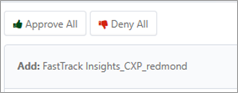

Once you have completed all Approvals / Denials you will be prompted with the following message below:

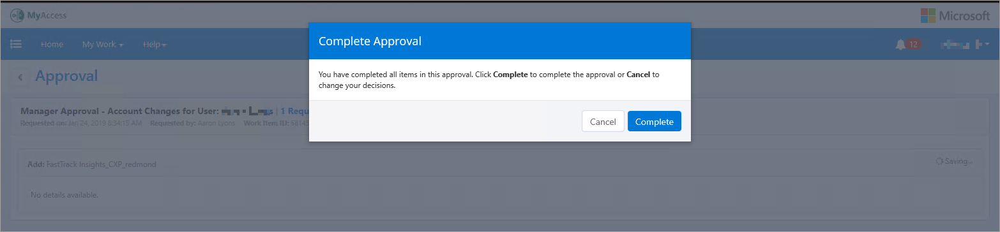

> [!NOTE]
> All requests that require manager approval will also be sent to the project sponsor for approval.

### Unable to view Tenant Data

Under tenant view, if no filters are showing, you are likely not assigned to a security group that grants you permission to tenant data. You should reach out to your team lead to ensure proper security group memberships.

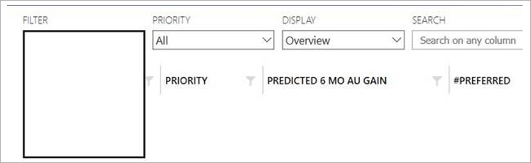

## Additional access options

Depending on your role, you may need access to the following additional resources.

### Partner access

If you are asked about FTOP partner access, direct the person who asked you to ask their FastTrack Partner Manager (FPM).

### FastTrack Reporting Power BI Access Guide

For access, see [FastTrack Reporting Power BI Access Guide](../fasttrack-reporting-power-bi-access-guide).

### ViewPoint

For ViewPoint access, go to <https://idweb> and request access to the “ViewPoint Basic Access for Engineering” group.

## Next steps

To learn about RBAC Controls, see the [**RBAC Controls**](rbac-controls.md).