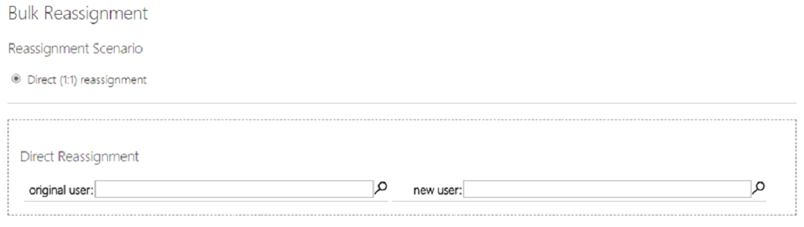
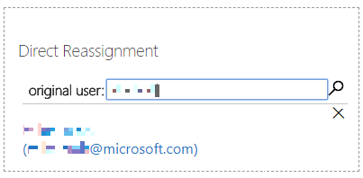
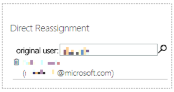
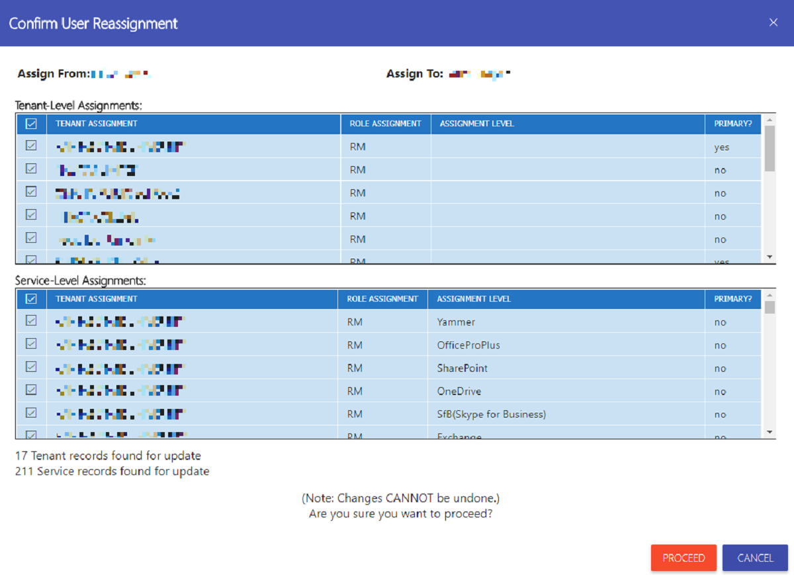
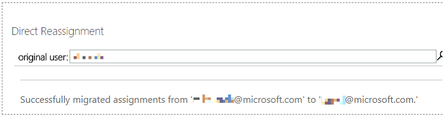

---
# required metadata
title: FTOP User Guide - Appendix
description: Process guidance for internal FTOP users.
author: Connie Brenden
ms.author: v-conbre
manager: jimmuir
ms.date: 2/22/2019
ms.topic: ftop-user-guide
ms.prod: non-product-specific
ms.custom: ftop-user-guide
ft.audience: internal
ft.owner: jimmuir
---
# Appendix

## Overview

This section provide additional information on tenant exceptions and bulk reassignment.

### Tenant Exception

The Eligibility tasks under Advanced Features allow you to enter tenant exceptions.

#### To manually add customers in FTOP

1. Request access to the FTCAssignmentTeam@microsoft.com
2. Navigate to the [**FastTrack Orchestration Portal**](https://ftop.microsoft.com/)
3. Click [**Enable a customer exception for eligibility for Go Back, Win Room, and other eligibility scenarios**](https://aka.ms/ftoptenantexception)
4. Click Tenant ID and enter your customer’s tenant ID to search. 
5. Scroll to the bottom and locate *Manual addition* reason and set it to *WinRoom*.
6. Click **Save**. Use the steps above unless a customer submits a special request.
The customer appears in FTOP; if the customer does not appear, try manually adding them again in 24 hours. If the issue persists, reach out to your team lead for escalation.

### Bulk reassignment

The Bulk Reassignment Tool is an Advanced Feature of FTOP used by the Regional Manager group. The Bulk Reassignment Tool enables the RM to reassign tenants from one user to another. Think of it as a search and replace function, where the existing user assignment is copied/updated and assigned to a new user (removing the original user assignment).

When you first enter the Bulk Reassignment tool, you see the Direct Reassignment configuration options (additional reassignment options will be added in the future).

#### To reassign tenants

1. Enter the user name (or partial user name) or e-mail address of the original user you want to reassign tenants from. 

1. Tap Enter or click the magnifying glass to search. 

> [!NOTE]
> If the original user is not assigned to any tenants the user will not be returned.

3. Click the name to confirm the user you want to use. A trash can will appear next to the user.

> [!NOTE]
> Since the tenants are being assigned to them, the new/target user will always appear (if a valid name) even if they are not currently assigned to tenants.

4. When you are ready to complete the reassignment, click Update. All assignments for the original user are gathered.

Once all assignments are gathered, a dialog appears displaying all assignments available for reassignment. This dialog is used to validate the tenants and services that will be reassigned and can be used to remove tenants or services from the reassignment scenario.

Due to the way assignments are completed in FTOP, two grids display. The top grid displays all tenant-level assignments. The bottom grid displays all service level assignments (including scenarios where the tenant level was selected, and all service level assignments were enabled by default). Each row displays the customer/tenant name, role assignment, assignment level (service), and whether the user is assigned as the primary for the tenant or service

Below the grid is a summary of the assignment records that are in scope. If a tenant/service is deselected, the summary will update to show counts for both selected and deselect assignments.

To remove a tenant level assignment from the scope of the reassignment, first the tenant level assignments must be checked for the assignment(s) to remove and, if a relevant assignment is found, deselected.

> [!IMPORTANT]
> Tenant level assignments are separate from the service assignments. Deselecting the tenant level assignment does not automatically deselect the associated service level assignments.

To remove a service level assignment from the scope of the reassignment, the service level assignments are checked for the assignment(s) to remove and, if a relevant assignment is found, each service is deselected as needed.
If you intend to remove all assignments for a specific tenant, both tenant level and assignment level assignments must be deselected.

> [!IMPORTANT]
> Tenant and service level assignments are not connected in the reassignment scenario. Each assignment left selected when the proceed button is clicked will update based on the criteria selected.

Once all in-scope assignments have been validated, click Proceed. If you do not want to proceed with the change, click Cancel.

> [!IMPORTANT]
> There is no undo function for the Bulk Reassignment tool. Once proceed is clicked, all changes are committed. A manual (tenant by tenant/service by service) bulk reassignment could be used to undo changes but could be extremely complicated when a large number of tenants is involved.

After you click Proceed, the updating dialog appears.

The tool updates the assignments. When the changes are complete, a confirmation dialog appears (and the users are no longer selected).

In scenarios where a user’s assignments must be split across one or more users, the reassignment can be completed multiple times (starting a new search each time) with tenants/services selected/deselected based on whether they are to be assigned to the new/target user. Once all the original user assignments are reassigned, the original user will no longer be found when searching.

## Next steps

For a list of frequently asked questions, see the [**FAQ**](faq.md).
