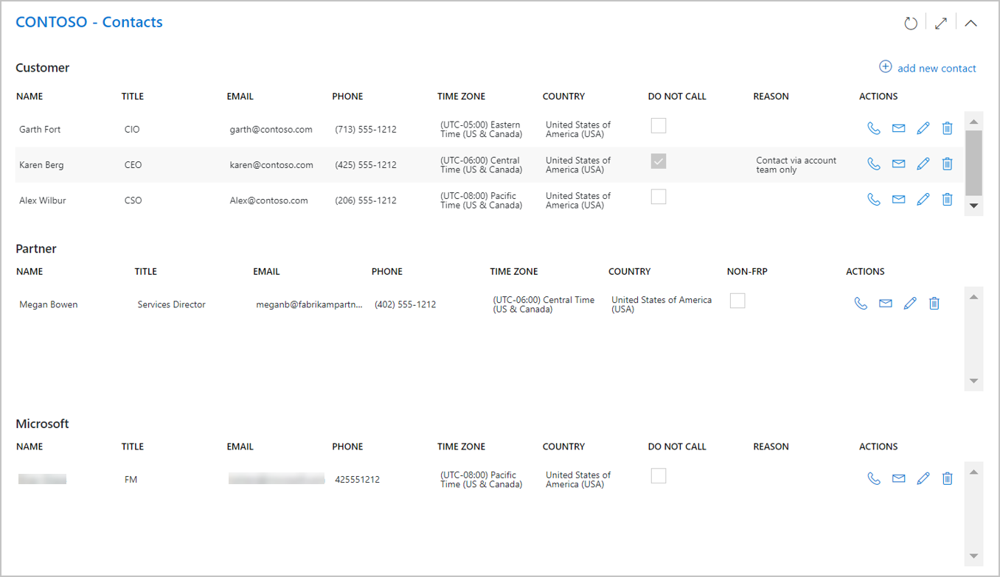
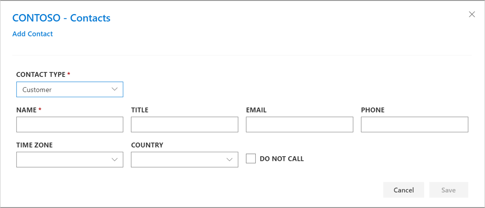

---
# required metadata
title: FTOP User Guide - Customer View - Contacts
description: Process guidance for internal FTOP users.
author: Connie Brenden
ms.author: v-conbre
manager: jimmuir
ms.date: 4/22/2020
ms.topic: ftop-user-guide
ms.prod: non-product-specific
ms.custom: ftop-user-guide
ft.audience: internal
ft.owner: jimmuir
---

# Contacts

## Overview

The customer level contacts are managed in this section by the assigned roles to the customer. The contacts are organized by customer, partner, and Microsoft.

Customer and Microsoft contacts can be flagged where they should not be called. When selecting this option a reason will be required.

### Procedure

#### To add new contact

1. Click **Add contact**.

1. Select the contact type (Customer, Partner, Microsoft).

1. Enter the contact details. Select the **DO NOT CALL** checkbox if contact prefers to not to be contacted.

1. Click **Save**.

#### Interacting with contacts

After a contact is entered actions allow you to directly call, email, edit, or delete the contact.

- Select the call icon to call the contact. If the contract has been flagged DO NOT CALL, this icon will be disabled.

- Select the email icon to email the contact.

- Select edit to update contact information.

- Select delete icon to remove contact.

## Resources

- FTOP [Customer Health Training](https://aka.ms/ftop/customertraining)
- FTOP [Customer View - Contacts](https://aka.ms/AA895a3) Video 1:49 Minutes
- FTOP [All Customer Walk-through Videos](../ftop-user-guide/customer-view-videos.md)

>[!TIP]
>When you launch the video, right-click, select Open in new tab.

## Next steps

To learn about the next view, see the [**Tenant View**](tenant-view.md).
