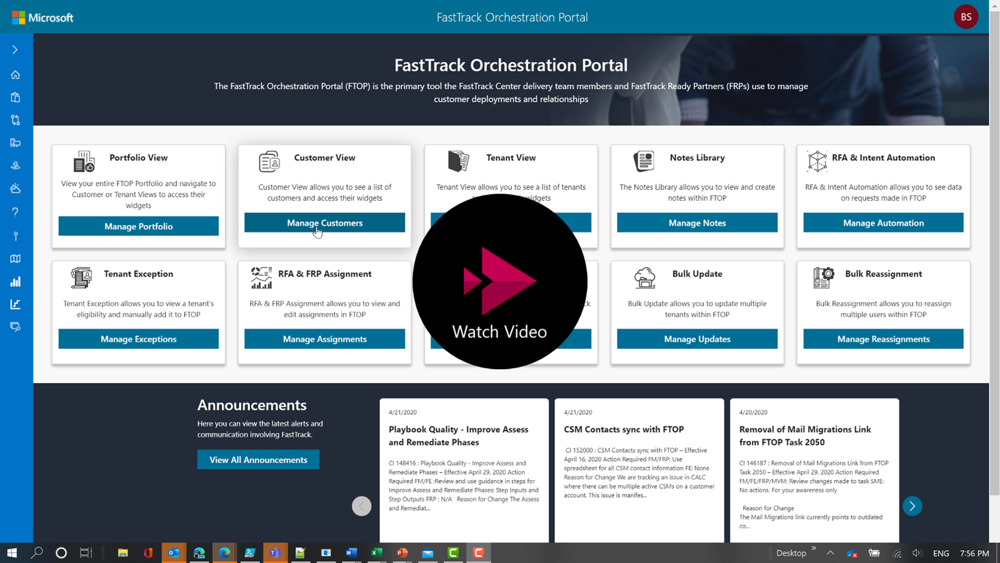
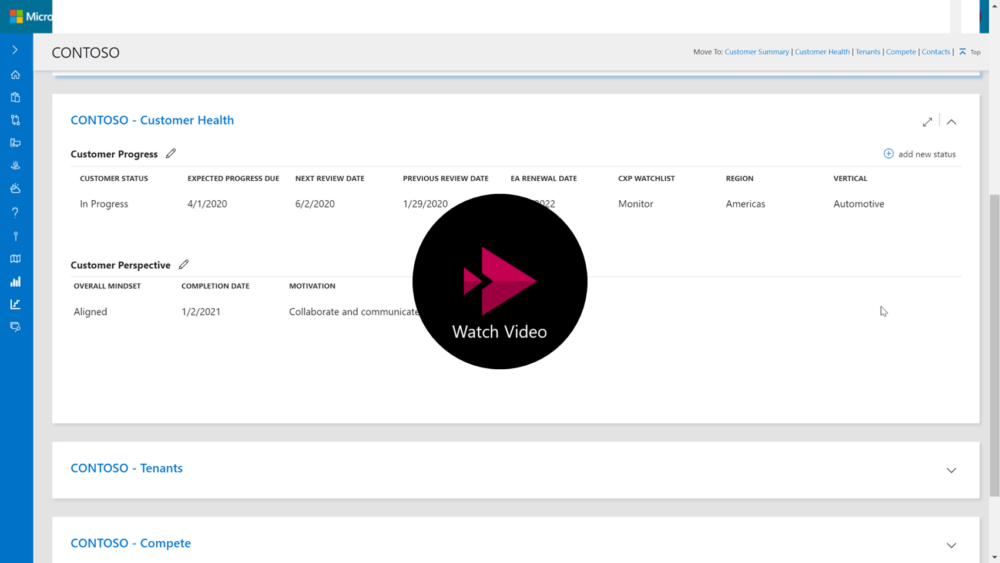
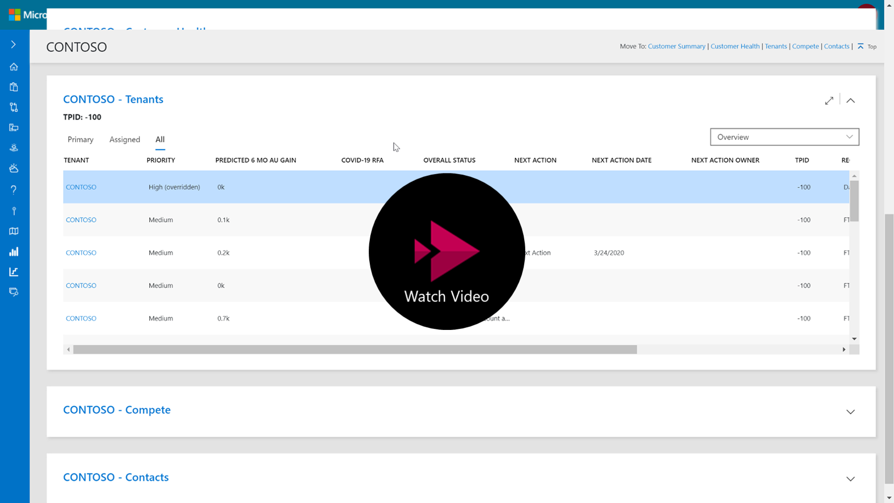
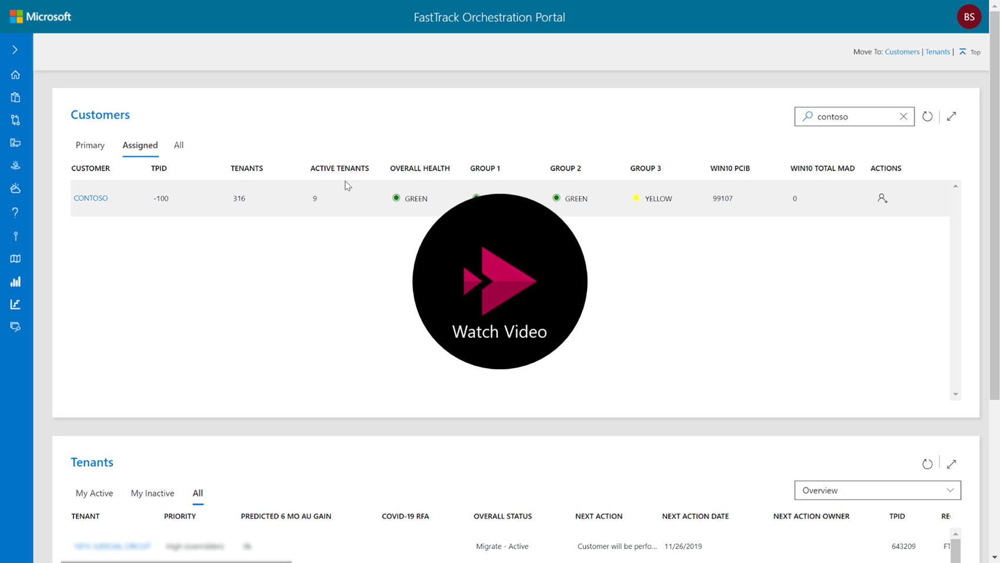

---
# required metadata
title: FTOP User Guide - Customer Walk-through Videos
description: Process guidance for internal FTOP users.
author: Connie Brenden
ms.author: v-conbre
manager: jimmuir
ms.date: 4/23/2020
ms.topic: ftop-user-guide
ms.prod: non-product-specific
ms.custom: ftop-user-guide
ft.audience: internal
ft.owner: jimmuir
---
# Customer Walk-through Videos

This page contains quick videos about each customer view section, portfolio view, and the customer training video.

>[!TIP]
>When you launch the video, right-click, select Open in new tab.

## Quick Videos

**FTOP Customer View Summary** Video 1:07 Minutes

**FTOP Customer View - Customer Health** Video 2:08 Minutes

**FTOP Customer View - Tenants** Video 0:58 Seconds

**FTOP Customer View - Contacts** Video 1:49 Minutes

**FTOP Portfolio View** Video 1:37 Minutes

## Customer Training Video

FTOP [Customer Health Training](https://aka.ms/ftop/customertraining)
