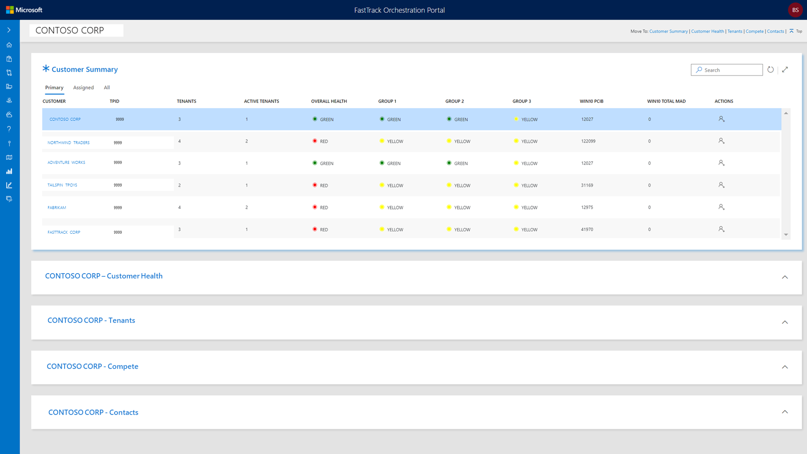

---
# required metadata
title: FTOP User Guide - Customer View
description: Process guidance for internal FTOP users.
author: Connie Brenden
ms.author: v-conbre
manager: jimmuir
ms.date: 4/25/2020
ms.topic: ftop-user-guide
ms.prod: non-product-specific
ms.custom: ftop-user-guide
ft.audience: internal
ft.owner: jimmuir
---

# Customer View

## Overview

Customer Summary is the primary way to view and access customer information in FTOP. At this time, the customer view is intended for customer health and compete scenarios. These scenarios are primarily delivered by FastTrack Architects (FTAs), FastTrack Managers (FMs), and Release Managers (RMs).

In the summary section you will see a list of your assigned customers or all customers if you have permissions to view all. Selecting a customer in the summary list sets the context for each of sections below. You must select a customer record to continue with other actions.

### Filters

Customer View provides the option to view customers by the following filters:

|Filter Name  |Filter Description  |
|---------|---------|
|Primary  |List of customers assigned to you as the primary in the role. At launch of the customer view, the primary FM, FE, SME, RM, FTA, and GM FTA roles have been assigned to the customers from the winner tenant.  |
|Assigned |List of customers you are assigned to where you are not primary. At launch of the customer view, non-primary tenant assignments are not applied to customers. |
|All  |List of all customer records available in FTOP. Your list is limited to customers you are assigned, unless you have permissions to view all.    |

>[!NOTE]
>Tenant assignments do not change the customer view.

### Additional functions

- The assignment icon in the action column allows you to view current customer assignments, and if you have permissions, to assign additional users to the customer.

- The customer search option can be used to narrow your customer list.

- The move to navigation option is available to jump to the selected section without the need to scroll.

## Customer sections

Detailed guidance about these sections can be found in following links:

- [**Customer Health**](customer-health.md)
- [**Tenants**](customer-tenants.md)
- [**Compete**](customer-compete.md)
- [**Contacts**](customer-contacts.md)

## Resources

- FTOP [Customer Health Training](https://aka.ms/ftop/customertraining) Video 55:05 Minutes
- FTOP [Customer View - Summary](https://aka.ms/AA895a2) Video 1:07 Minutes
- FTOP [All Customer Walk-through Videos](../ftop-user-guide/customer-view-videos.md)

>[!TIP]
>When you launch the videos, right-click, select Open in new tab.

## Next steps

To learn about the next section, see [**Customer Health**](customer-health.md).
