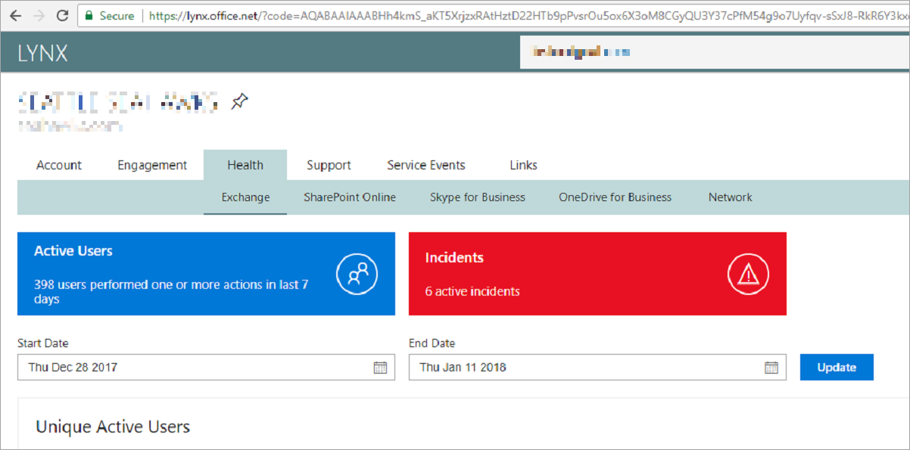

---
# required metadata
title: FTOP User Guide - Detailed Tenant View Lynx Tab
description: Process guidance for internal FTOP users.
author: Connie Brenden
ms.author: v-conbre
manager: jimmuir
ms.date: 2/22/2019
ms.topic: ftop-user-guide
ms.prod: non-product-specific
ms.custom: ftop-user-guide
ft.audience: internal
ft.owner: jimmuir
---
# Lynx tab

## Overview

The lynx tab directs you to a [**Lynx**](https://lynx.office.net) screen, which displays similar information as displayed on other screens, only in a slightly different format. If you are not assigned any tenants, the screen displays no results. Below is an example of entering either the GUID, Domain, Email, PUID, or Incident ID will load that specific page for that tenant.

The lynx tab includes hover-over text that gives insight to the tab before clicking:  

Access customer information regarding domains, caretaker information, subscriptions, service configuration, and support history.

## Next steps

To learn about the next tab, see the [**ViewPoint tab**](detailed-tenant-view-viewpoint-tab.md).
