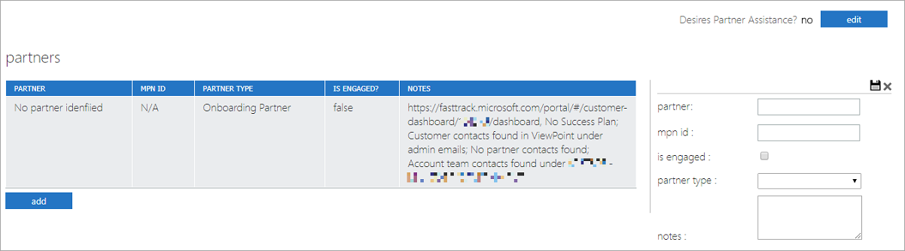

---
# required metadata
title: FTOP User Guide - Detailed Tenant View Partners Tab
description: Process guidance for internal FTOP users.
author: Connie Brenden
ms.author: v-conbre
manager: jimmuir
ms.date: 2/22/2019
ms.topic: ftop-user-guide
ms.prod: non-product-specific
ms.custom: ftop-user-guide
ft.audience: internal
ft.owner: jimmuir
---
# Partners tab

## Overview

The Partners tab is rarely used and would, when relevant, contain partner (company) information.

> [!NOTE]
> This should not be confused with the partner section under Contacts. Partners in this section are the company. Partners in the Contact section are individuals that work for the partner company/companies.

## Next steps

To learn about the next tab, see the [**Eligibility tab**](detailed-tenant-view-eligibility-tab.md).
