---
# required metadata
title: FTOP User Guide - Detailed Tenant View Playbook Tab
description: Process guidance for internal FTOP users.
author: Connie Brenden
ms.author: v-conbre
manager: jimmuir
ms.date: 3/23/2020
ms.topic: ftop-user-guide
ms.prod: non-product-specific
ms.custom: ftop-user-guide
ft.audience: internal
ft.owner: jimmuir
---
# Playbook tab

## Overview

Use the Playbook tab to view playbook processes, steps, and to update tasks that occur during customer engagement. You can filter on services, search for keywords, view work items, view role and status, and set status directly on tasks.

> [!NOTE]
> When you first open the playbook page, it displays filtered on your role.

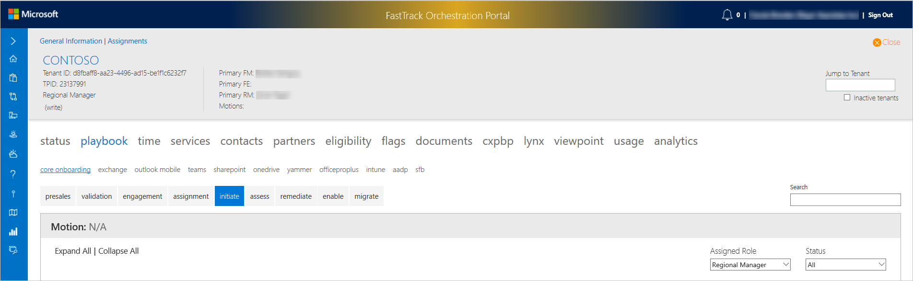

The default service is set to **Core Onboarding**. Core Onboarding is done one time for a tenant and it applies to every service. You can change to another service to see additional playbook content.

>[!NOTE]
>Services **oatp**, **mdatp**, and **edge** have been added to the menu. These services are conditional and only display if eligible to the tenant.

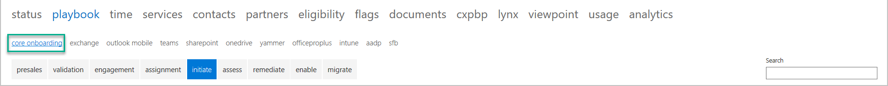

An example of how you might filter on this page would be as follows:

1. Select Exchange
2. Select Assess phase
3. Set assigned role to FastTrack Engineer

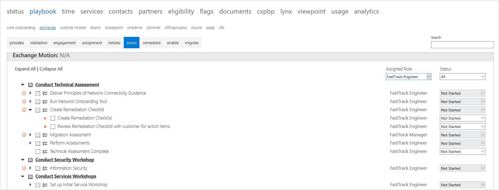

### Assigned Role

The page displays tasks that are associated with your assigned role. In the following diagram, the assigned role is Regional Manager.

If you wanted to see more playbook items, you could set the assigned role filter to **All Roles**.

### Status

When you are viewing the playbook tab,  you can filter on status.

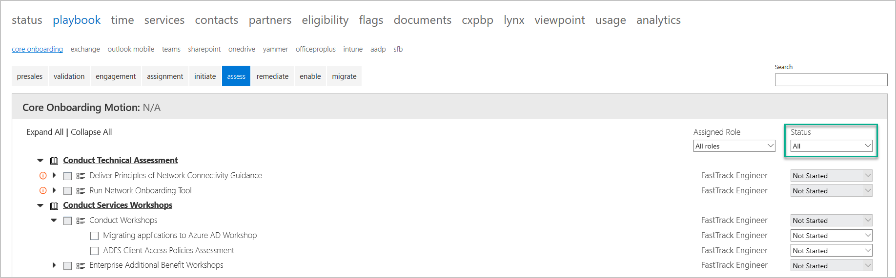

The work performed is divided into phases.

### Search Criteria

Search covers all tasks and filters in the view of the tasks to those that match the search criteria. You can search within the current selected services. For example, you could search for tasks about authentication.

#### To search for tasks that relate to authentication

1. Select service, for example, Core Onboarding
2. Search for authentication

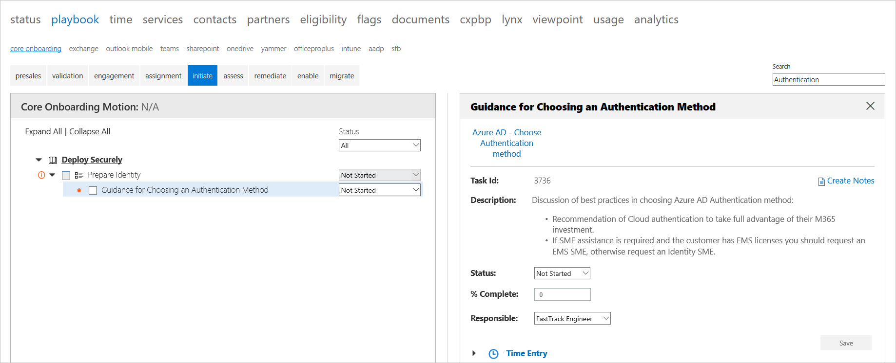

> [!NOTE]
> If the first task found is in a different phase than what is selected, the display moves to the *next* phase that contains a visible task. For example, if you are in the Initiate tab when you search for the word migrate, the **migrate** tab appears as the first task with the word migrate in the name.

## Playbook Structure

The playbook structure consists of a playbook process, playbook step, and tasks, and it displays in a hierarchical order.

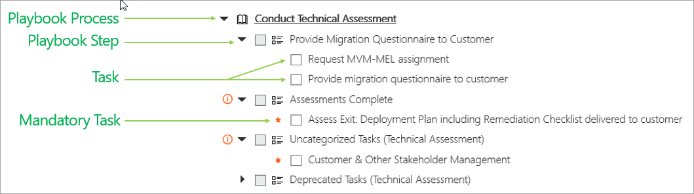  

### Playbook Process

The highest level group is a process.

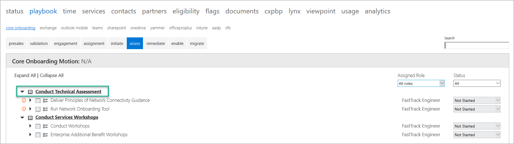

A process has an arrow with book icon  expand the arrow to display the step.

### Playbook Step

Steps with arrows to the left of them have tasks. Expand the arrow to display the task. Some steps require attention, you can hover over the tooltip to see the required task. Steps are not used for tracking purposes.

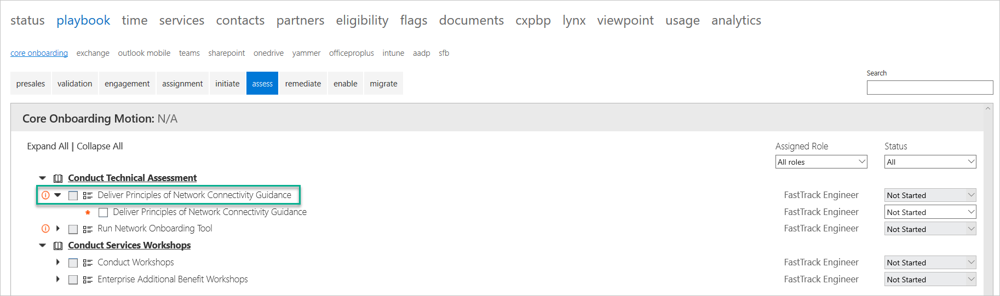

### Tasks

Task are used to provide status.

Tasks with a red asterisk  are mandatory and must be completed when applicable to a tenant or specific service. You can quickly find mandatory tasks if you expand the parent task that displays the red information icon .

When you select a task, a dialog appears displaying task details. This dialog is divided into sections: *task overview*, *time entry*, and *wizard results*.

The task overview displays:

- The task number (task ID)

- Link to **Create Notes**

- A description of the task (what to do)

- A drop-down list for the status of the task
    - Not Started
    - Not Required
    - In Progress
    - Complete
    - Paused-Customer Delay
    - Deferred-Customer Extended Delay
    - Warning
    - Blocked-Pending Remediation
    - Blocked-Technical-Customer
    - Blocked-Business
    - Blocked-Other
    - Blocked-Technical-MS
    - Cancelled
   
- A % Complete
    - Text box

- A drop down list for the responsible FTC role
    - Any Role
    - Regional Manager
    - FastTrack Architect v2
    - FastTrack Manager
    - FastTrack Solution Architect
    - FastTrack Engineer
    - Migration Velocity Manager
    - FastTrack Partner Manager
    - Migration Engagement Lead
    - SME
    - App Assure Manager

> [!NOTE]
> The task description is not required and may be left blank on some tasks.

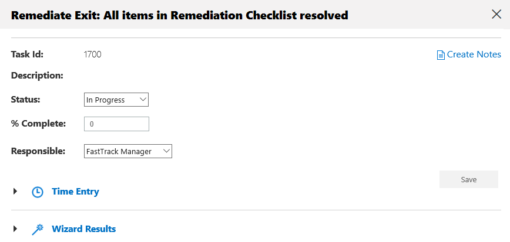

#### To create note from playbook task id

When you create a note from within the Playbook Task Id, the Notes Editor opens with Technical Enablement Notes Category, tenant you were viewing and Task Id populated.

1. Select **Create Notes**.

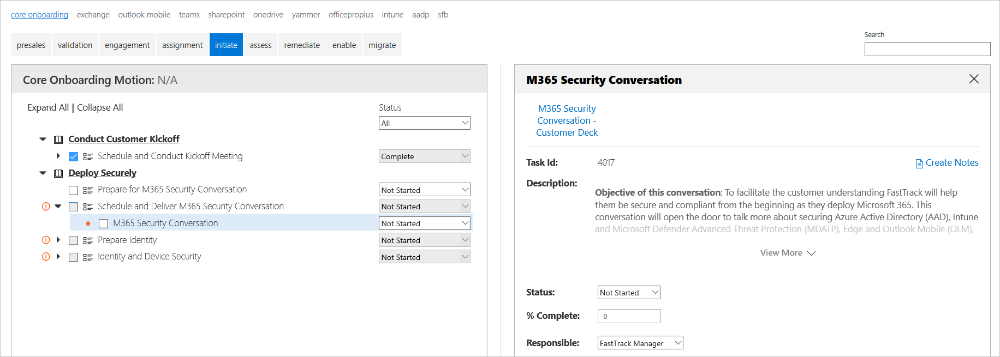

The data flows from the Task Id you were viewing.

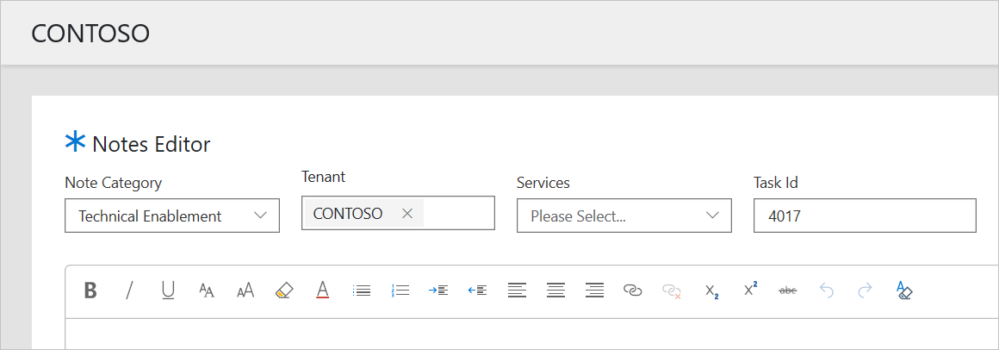

#### To save your updated task

1. Update the task status, % complete, or responsible role, click **save**

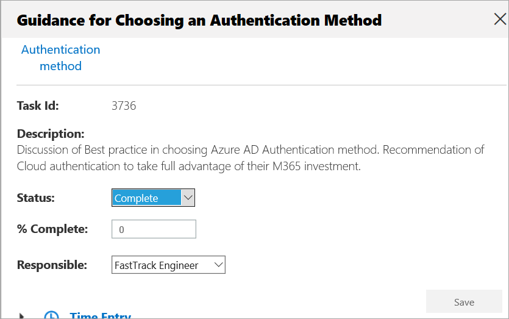

Tasks may also include links to wizards or external files. These links display at the top of the task overview section.

#### To save your updated tasks using checkbox

1. Select the checkbox

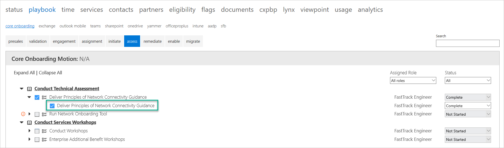

#### To save your updated tasks using status drop-down menu

1. Select the status from the drop-down menu

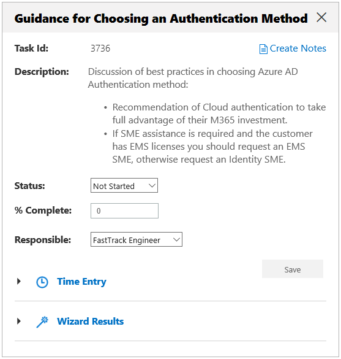

#### To view time entry

1. Expand Time Entry
2. You will be prompted to start time entry, click **Start**

## Next steps

To learn about time entry and wizard results, see the [**Time tab**](detailed-tenant-view-time-tab.md "Time Tab").