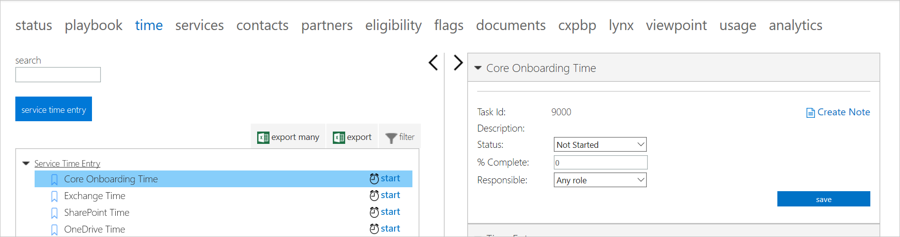
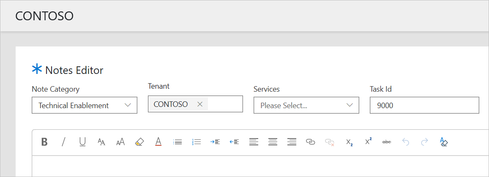
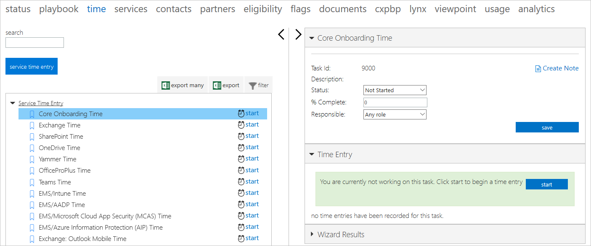
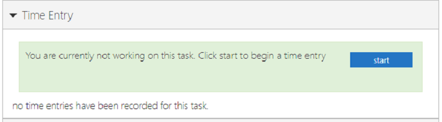
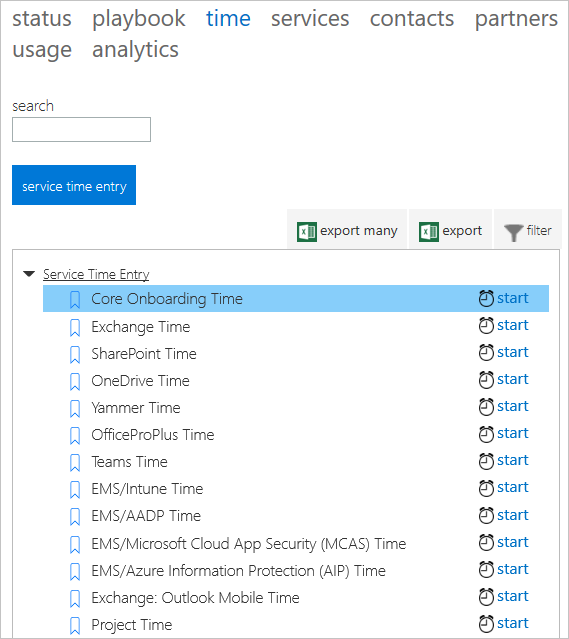
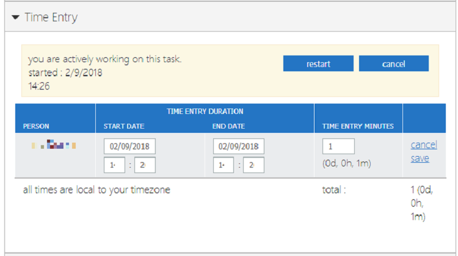
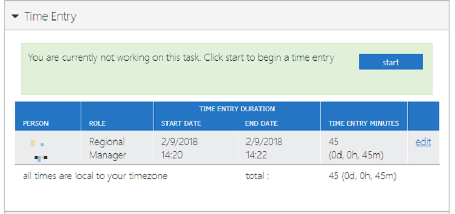
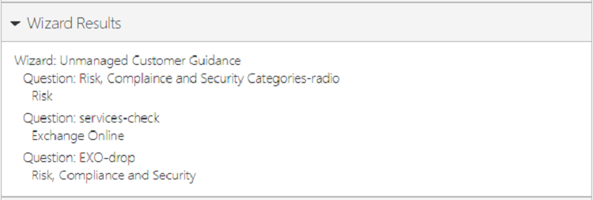

---
# required metadata
title: FTOP User Guide - Detailed Tenant View Time Tab
description: Process guidance for internal FTOP users.
author: Connie Brenden
ms.author: v-conbre
manager: jimmuir
ms.date: 2/4/2020
ms.topic: ftop-user-guide
ms.prod: non-product-specific
ms.custom: ftop-user-guide
ft.audience: internal
ft.owner: jimmuir
---
# Time tab

## Overview

### Time entry

FastTrack Engineers and some SME roles should utilize the workload specific *Service Time Entry* tasks to record notes and capture the engagement status each time they have an interaction with a customer, internal stakeholder, or undertake an engagement related activity.

#### Create note from Time tab

You can create a note from Service Time Entry.

The data flows from the Task Id you were viewing.

> [!NOTE]
> To view the template for updates to the *Technical Enablement* notes, please refer to the [**FTOP Notes Guidance**](https://aka.ms/FTNotesGuidance).

The following image shows a task that has not had any time entered.

#### To track your time

1. Enter your time, click **start**. A timer starts tracking your time on a task until you click **finish**, **restart**, **cancel**, or **edit**.

2. Click **finish**  to stop the clock and save the time based on the duration of the timer. The start and finish approach are not useful in most scenarios because many people do not start the timer when they start a task. Instead, most users simply edit the time entry (After you click **finish**, the edit option appears.)

3. Click **edit** to manually enter the start and end times or enter the time (in minutes) directly.

4. Entering your time, click **save**.

> [!NOTE]
> Once a time entry is saved it cannot be deleted. You can edit the time of an entry, but all time-entries must have a minimum of one minute.

5. Click **restart** to restart the clock.

6. Click **cancel** to cancel the clock or cancel the edit.

The time you spend on each phase of onboarding is a critical metric of the FastTrack process; therefore, tracking the time you spend working with, or on behalf of a tenant, is vital to your role.

In some cases, you may be required to work with a customer to whom you are not assigned. This might happen in the case of a consultation, filling in for an absent FE or FM, or assisting on an issue about which you have expertise. In those cases, you need to add yourself to the tenant as an FE or FM, which enables you to track your time.

### Wizard results

If a task has an associated FTOP wizard and the wizard has been completed, the wizard results screenshot displays the results of questions/selections from the wizard.

> [!NOTE]
>  The link for a FTOP wizards is usually prefixed with Internal or Private, while Admin Portal wizards are usually prefixed with Public. If there is no prefix, wizards that have an ftop.microsoft.com URL will be FTOP wizards.

Tasks without a wizard or with an incomplete wizard return no results. (i.e., the section is blank).

## Next steps

To learn about the next tab, see the [**Services tab**](detailed-tenant-view-services-tab.md).