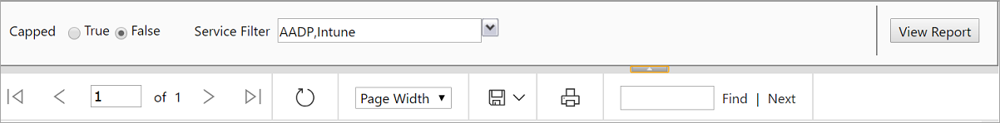
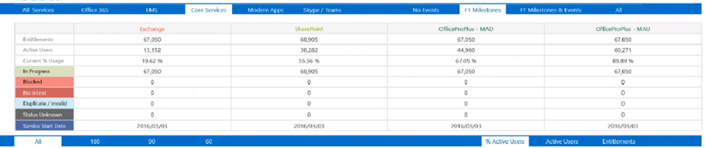
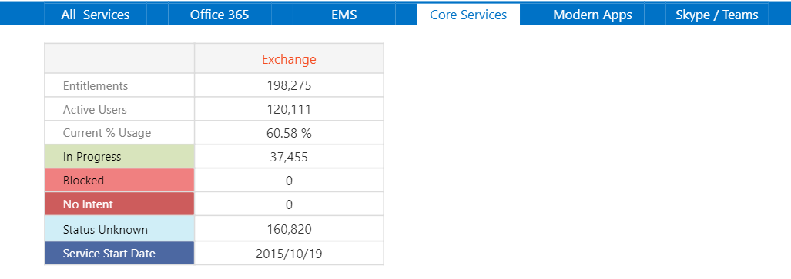
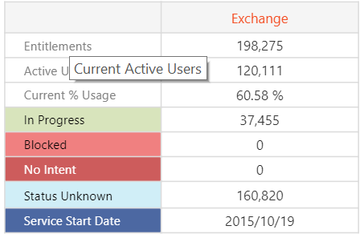
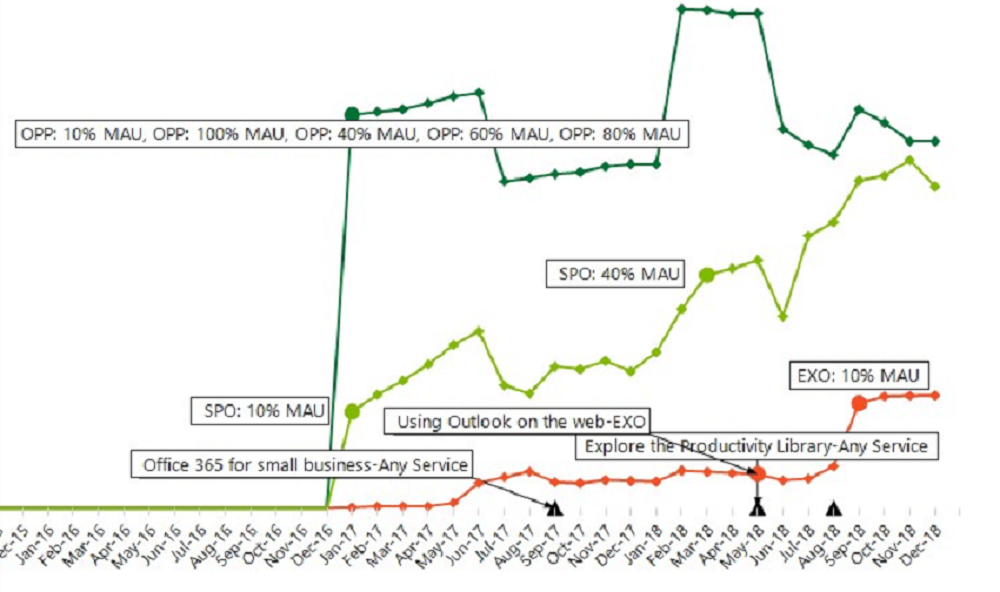
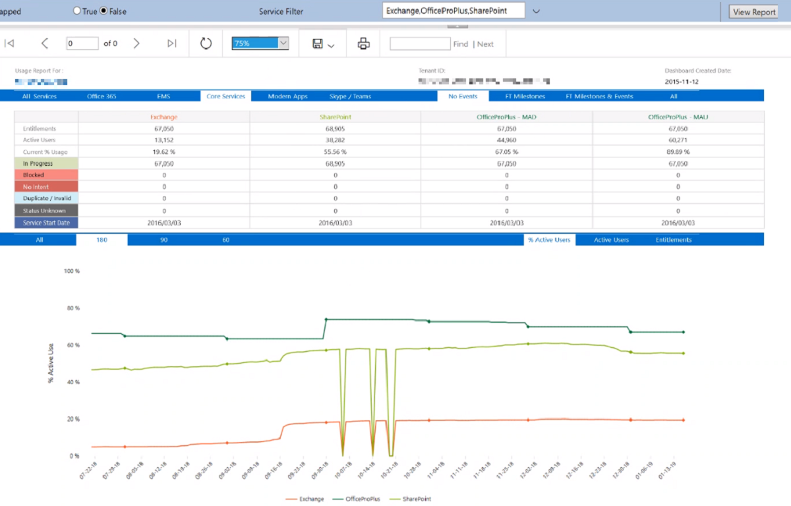
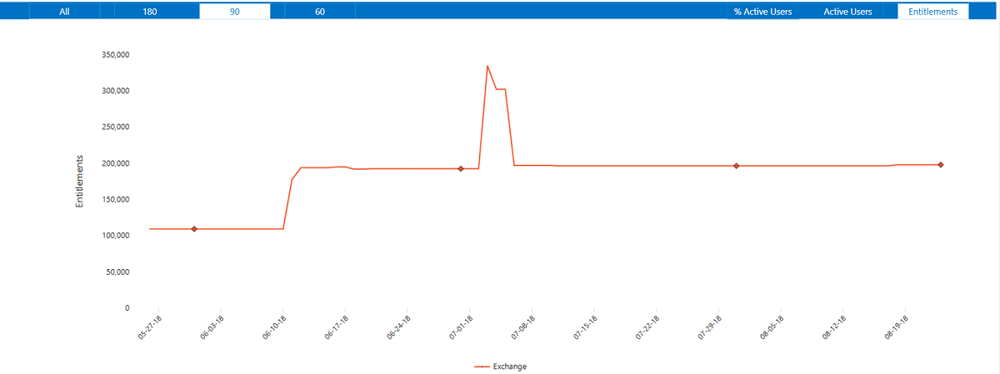

---
# required metadata
title: FTOP User Guide - Detailed Tenant View Usage Tab
description: Process guidance for internal FTOP users.
author: Connie Brenden
ms.author: v-conbre
manager: jimmuir
ms.date: 2/22/2019
ms.topic: ftop-user-guide
ms.prod: non-product-specific
ms.custom: ftop-user-guide
ft.audience: internal
ft.owner: jimmuir
---
# Usage tab

## Overview

The usage tab opens the Usage Report that provides usage statistics for each tenant. This report provides details and insight into active use at set points in time, and changes in use from month to month, providing you with a high-level view of the customer lifecycle.

The usage tab includes hover-over text that gives insight to the tab before clicking: **Track and monitor the customer’s product consumption related to workloads, entitlements, active users, and usage trending by workload.**

### Viewing the Usage Report

#### To open Scorecard Adoption view

1. Click the down arrow next to a tenant’s name.

1. Click the **usage** tab. The Usage Report appears in a new browser window.

If the Usage Report does not display the ribbon in the example below, click the downward arrow to expand the ribbon.

Review the table below for a definition of each control in the ribbon.

| Field                | Action                                                                                                                                                                                                                                                                                        |
| -------------------- | --------------------------------------------------------------------------------------------------------------------------------------------------------------------------------------------------------------------------------------------------------------------------------------------- |
| Capped Radio Buttons | You can view the Tenants Active Usage in a capped or uncapped format by selecting the desired radio button. To change the view of the report, select the **True** or **False** radio button and click **View Report**.                                                                        |
| Service Filter       | You can customize your view by selecting one, several, or all services from the **Service Filter** drop-down list. To change your view, select the desired service(s) from the **Service Filter** drop-down list and click **View Report**.                                                   |
| Graph Value Type     | You can view different insights by adjusting the graph value type by selecting a value from the Graph Value Type drop-down list. To change the value of the graph, select **Percent**, **RawAU**, or **Entitlements** from the **Graph Value Type** drop-down list and click **View Report**. |
| Page Buttons         | To view the previous or next page, return to the first page, skip to the last page, or select a specific page from the report, use the buttons in the first section of the ribbon.                                                                                                            |
| Refresh Button       | To refresh the report, click the circle and arrow button on the ribbon.                                                                                                                                                                                                                       |
| Page Width           | To adjust the width of the page, select a size from the Page Width drop-down list.                                                                                                                                                                                                            |
| Save                 | To export or save the report locally, click the floppy-disk on the ribbon. Microsoft recommends exporting the report to Excel or MHTML to optimize the results.                                                                                                                               |
| Print                | To print the report, click the printer on the ribbon.                                                                                                                                                                                                                                         |
| Search               | To search the report, enter search criteria in the box and click **Find**. To view the next instance, click **Next**.                                                                                                                                                                         |

The Usage Report displays data for the Core Services tab as a default.

#### To view the data for those categories

1. Click **All Services**, **Office 365**, **EMS**, **Core Services**, **Modern Apps**, and **Skype / Teams**

#### To view data for a specific service

1. Click the service name at the top of the column (for example, **Exchange**).

The table refreshes and displays only the data for the selected service. Not all columns are displayed.

#### To view a definition of the attribute

1. Use your mouse to hover-over each attribute in the left column.

Review the table below for a definition of each attribute.

| Attribute          | Definition                                               |
| ------------------ | -------------------------------------------------------- |
| Entitlements       | Licensed Entitlements Available                          |
| Active Users       | Current Active Users                                     |
| Current % Usage    | Active Users/Entitlements                                |
| In Progress        | Customer declared intent to deploy services              |
| Blocked            | Customer has intent to deploy, but workload is blocked   |
| No Intent          | Customer has no intent to deploy the service at any time |
| Status Unknown     | Unsuccessful customer contacted to determine intent      |
| Service Start Date | First date Service was initiated                         |

#### To view the graph details

1. Scroll down. The default view displays the % of Active Users from the day of creation to today.

#### To view event labels about the customer lifecycle

1. Click **No Events**, **FT Milestones**, **FT Milestones & Events**, and **All**  

#### To view event labels for the various milestone and events

1. Click on the other tabs.
2. Then, as you move from left to right, more detail will be shown.

Review the table below for a definition of event.

| Event                  | Definition                                                                                           |
| ---------------------- | ---------------------------------------------------------------------------------------------------- |
| No Events              | No event labels are shown.                                                                           |
| FT Milestones          | Labels for specific Milestones that FastTrack wants to track will be shown (Small amount of detail). |
| FT Milestones & Events | Labels for the Milestones and certain FastTrack events will be shown (Medium amount of detail).      |
| All                    | These are all events that we track across a variety of sources (Large amount of detail).             |

The following image displays event detail.

The following image displays Core Services with No Events.

The following image displays Core Services with FT Milestones.

#### To view data from the desired number of most recent days

1. Click **All**, **180**, **90**, or **60**.

#### To view the desired data category

1. Click **Active Users** or **Entitlements**.

The following image displays the Usage Report Graphi showing the last 90 days for Entitlements Data for Exchange.

> [!NOTE]
> The diamonds in the graph represent month-end.

## Next steps

To learn about the next tab, see the [**Analytics tab**](detailed-tenant-view-analytics-tab.md).
