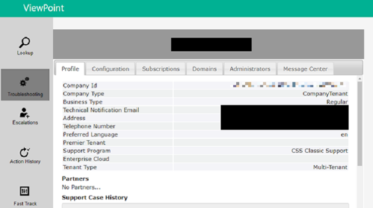

---
# required metadata
title: FTOP User Guide - Detailed Tenant View ViewPoint Tab
description: Process guidance for internal FTOP users.
author: Connie Brenden
ms.author: v-conbre
manager: jimmuir
ms.date: 2/22/2019
ms.topic: ftop-user-guide
ms.prod: non-product-specific
ms.custom: ftop-user-guide
ft.audience: internal
ft.owner: jimmuir
---
# ViewPoint tab

## Overview

The ViewPoint tab is a URL that opens the current customer’s tenant information in the ViewPoint portal. Viewpoint displays service health, tenant info and other useful tools. Use ViewPoint to access customer information such as customer location, domains, subscriptions, and administrators.

### Using ViewPoint

The viewpoint tab includes hover-over text that gives insight to the tab before clicking:

### To request access

1. Request access to the ViewPoint Basic Access security group at [**IDWEB**](https://idweb/identitymanagement/default.aspx).

## Next steps

To learn about the next tab, see the [**Usage tab**](detailed-tenant-view-usage-tab.md).
