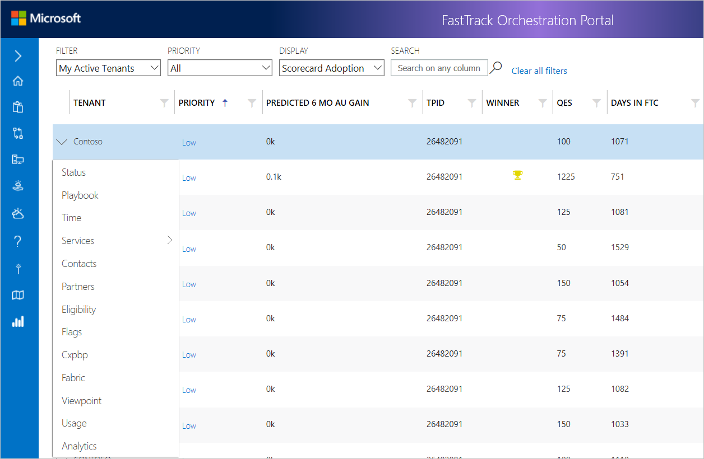
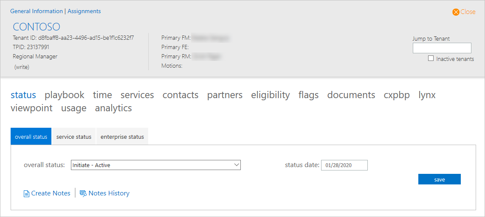

---
# required metadata
title: FTOP User Guide - Detailed Tenant View
description: Process guidance for internal FTOP users.
author: Connie Brenden
ms.author: v-conbre
manager: jimmuir
ms.date: 2/4/2020
ms.topic: ftop-user-guide
ms.prod: non-product-specific
ms.custom: ftop-user-guide
ft.audience: internal
ft.owner: jimmuir
---
# Detailed Tenant View

## Overview

The down-arrow to the left of the tenant name allows you to select and view detailed tenant information, the information appears with a series of tabs below the tenant name. Some tabs include hover-text detailing the function of each tab.

The Detailed Tenant View also displays tabs across the top of the page.

For more information, view an overview of each tab:

- [**Status tab**](detailed-tenant-view-status-tab.md)

- [**Playbook tab**](detailed-tenant-view-playbook-tab.md)

- [**Time tab**](detailed-tenant-view-time-tab.md)

- [**Services tab**](detailed-tenant-view-services-tab.md)

- [**Contacts tab**](detailed-tenant-view-contacts-tab.md)

- [**Partners tab**](detailed-tenant-view-partners-tab.md)

- [**Eligibility tab**](detailed-tenant-view-eligibility-tab.md)

- [**Flags tab**](detailed-tenant-view-flags-tab.md)

- [**Documents tab**](detailed-tenant-view-documents-tab.md)

- [**CXPBP tab**](detailed-tenant-view-cxpbp-tab.md)

- [**Lynx tab**](detailed-tenant-view-lynx-tab.md)

- [**ViewPoint tab**](detailed-tenant-view-viewpoint-tab.md)

- [**Usage tab**](detailed-tenant-view-usage-tab.md)

- [**Analytics tab**](detailed-tenant-view-analytics-tab.md)

## Next steps

To learn about the next tab, see the [**Status tab**](detailed-tenant-view-status-tab.md).
