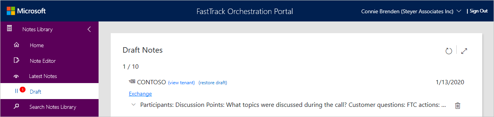

---
# required metadata
title: FTOP User Guide - Notes Library - Draft Notes
description: Process guidance for internal FTOP users.
author: Connie Brenden
ms.author: v-conbre
manager: jimmuir
ms.date: 2/4/2020
ms.topic: ftop-user-guide
ms.prod: non-product-specific
ms.custom: ftop-user-guide
ft.audience: internal
ft.owner: jimmuir
---
# Draft Notes

When you are in the Notes Editor, you have the option to save drafts. Ten drafts may be saved to be reviewed at a later time.

- You can expand the body of your note by using the up/down arrows.
- You can hide the details of your draft using the up/down arrows.
- If you no longer need the draft, select the delete icon and you will be asked to confirm your deletion.

To continue to work on a draft, select restore draft. An example of when you may want to create a draft would be while on a call during the discussion. Next, you can save the draft, return to it later to restore and finalize. When you are finished, select save. Your note will now be associated with the latest notes for that tenant.

Define the screen

> [!IMPORTANT]
> Once you save a note, you cannot delete it. For guidance on crafting good notes, see [FTOP Notes Guidance](https://aka.ms/FTNotesGuidance)

## Next steps

To learn about searching the notes library, see [**Search Notes Library**](notes-library-search-notes-library.md).
