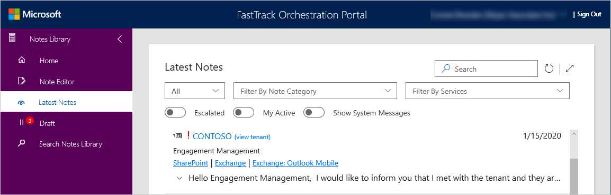
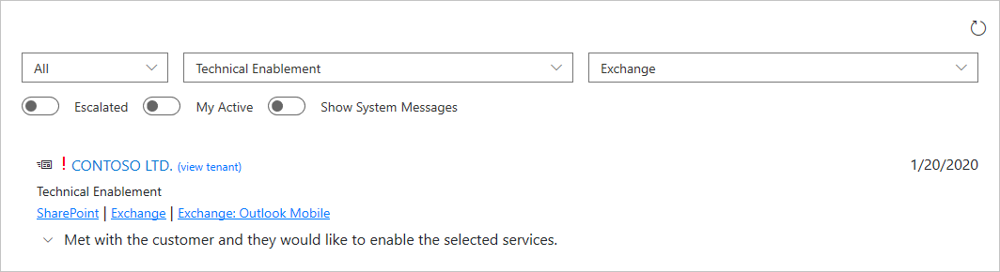
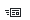

---
# required metadata
title: FTOP User Guide - Notes Library - Latest Notes
description: Process guidance for internal FTOP users.
author: Connie Brenden
ms.author: v-conbre
manager: jimmuir
ms.date: 2/4/2020
ms.topic: ftop-user-guide
ms.prod: non-product-specific
ms.custom: ftop-user-guide
ft.audience: internal
ft.owner: jimmuir
---
# Latest Notes

## Overview

This page provides two separate functions depending on the context of where you access Latest Notes.

- If you access Latest Notes directly from the Notes Library landing page, you will see all notes associated with the tenants you have been assigned to.
- If you access Notes History, or if you are in the Notes Editor and have a tenant selected, you will only see notes associated with that tenant.

The following screen shows latest notes accessed from the Notes Library and not within the context of a tenant.

The following screen shows latest notes accessed from within the context of a tenant.

### Controls

It is important to understand that Search is more robust than the rest of the controls on the page which are filters.

#### Search field

Search for all notes within your permission level.

#### Set date filters

Specify your selections from the drop-down menus. When you see **Tenant** in the Notes category, it means you are viewing notes at the tenant level.

|Drop-down Menu |Menu Items and Descriptions  |
|---------|---------|
|All |All 0-30 Days 30-60 Days 60-90 Days     |
|Note Category   |Engagement Management Technical Enablement Service Intent Environment Enterprise Status        |
|Services    |List of services available. Select the services associated with the tenant that you would like your note to reference.   |

#### Turn on flags

Specify your selections from the drop-down menus.

|Flags |Descriptions  |
|---------|---------|
|Escalated    |Turn on to mark notes with a Red Exclamation point. This marks the note and you can also search Escalated notes from the Search Notes Library.  |
|My Active   |Turn on to display your Active Tenants.        |
|Show System Messages   |Turn on if you want to display system messages.   |

#### Understand the icons

The icons provide visual ques that help you quickly identify notes. 

|Icon  |Label |Description |
|--------|----|-----|
| |Recent Note |Shows notes that are up to a week old. |
| |Escalated Note |Shows notes that have been flagged as escalated. 

## Next steps

To learn about saving drafts, see [**Draft Notes**](notes-library-draft-notes.md).
