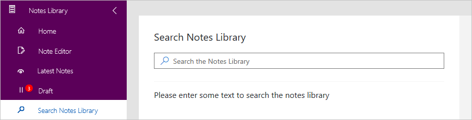
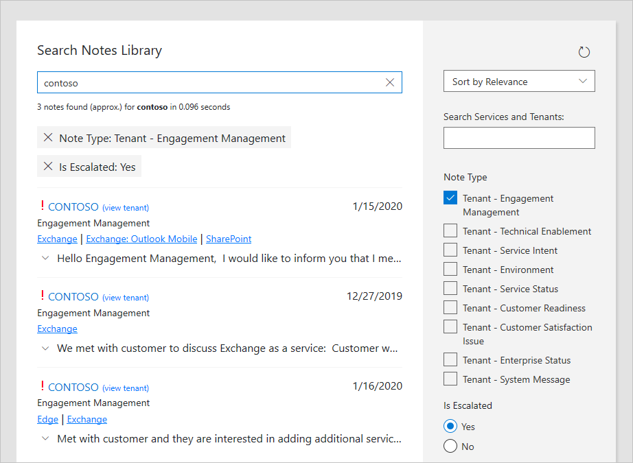

---
# required metadata
title: FTOP User Guide - Notes Library - Search Notes Library
description: Process guidance for internal FTOP users.
author: Connie Brenden
ms.author: v-conbre
manager: jimmuir
ms.date: 2/4/2020
ms.topic: ftop-user-guide
ms.prod: non-product-specific
ms.custom: ftop-user-guide
ft.audience: internal
ft.owner: jimmuir
---
# Search Notes Library

When you open Search Notes Library, a search field displays.

When you search notes, it returns a list of notes and displays additional sorting and filtering in the right pane. You can sort or filter on the following:

|Search Options |FIlters  |
|---------|---------|
|Refresh     |Refresh Icon         |
|Sort  |Sort by Relevance Sort by Created Date Sort by Tenant Name         |
|Search Services and Tenants    |If you enter "exchange" you will be prompted to select from Exchange - Service or Exchange: Outlook Mobile - Service         |
|Note type - Select   |Tenant - Engagement Management Tenant - Technical Enablement Tenant - Service Intent Tenant - Environment Tenant - Service Status Tenant - Customer Readiness Tenant - Customer Satisfaction Issue Tenant - Enterprise Status Tenant - System Message         |
|Is Escalated    |Yes No         |
|Tenant Name    |Displays tenants assigned to you.         |
|Service Name   |Displays the services associated with your tenants         |
|Next Update   |This Week This Month This Quarter         |
|Note Author |All Notes My Notes         |
|Is Legacy     |Yes No         |

As you make your selections, they display at the top of your results list. If you change your mind, simply close them and they will also be deselected from the right pane.

## Next steps

To learn about the detailed tenant view, see [**Detailed Tenant View**](detailed-tenant-view.md).
