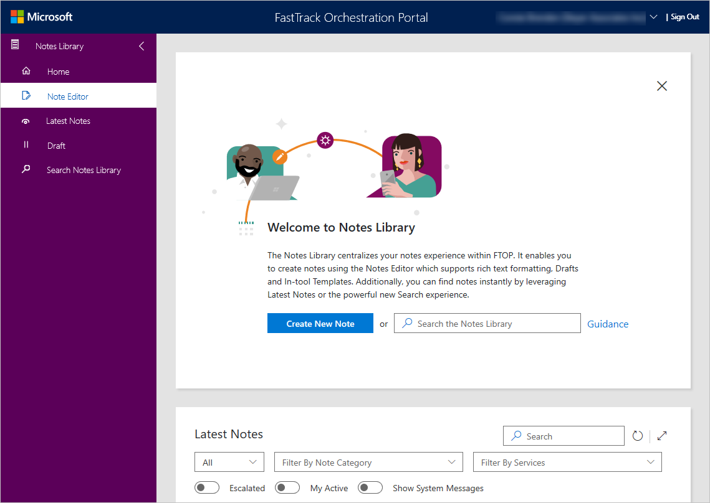

---
# required metadata
title: FTOP User Guide - Notes Library
description: Process guidance for internal FTOP users.
author: Connie Brenden
ms.author: v-conbre
manager: jimmuir
ms.date: 2/4/2020
ms.topic: ftop-user-guide
ms.prod: non-product-specific
ms.custom: draft
ft.audience: internal
ft.owner: jimmuir
---
# Notes Library

## Overview

Welcome to the **Notes Library**, a centralized repository for all your notes. When you launch Notes Library, two pages appear: Welcome to Notes Library and Latest Notes. In the Notes Library you can create, read, and search for notes.

.

From this page, you have several options.

- **Create New Note**, see [Notes Editor](notes-library-notes-editor.md)
- **Search the Notes Library**, see [Search Notes Library](notes-library-search-notes-library.md)
- **Guidance**, see [FTOP Notes Guidance](https://aka.ms/FTNotesGuidance)

> [!NOTE]
> Once you are familiar with Welcome to Notes Library, you can close it. If you want to see it again, simply select the down arrow next to your name and select **Reset User Preferences (refresh page)**.

From this page you can also view the Latest notes, see [**Latest Notes**](notes-library-latest-notes.md).

## Next steps

To learn more about the Notes Editor, see [**Notes Editor**](notes-library-notes-editor.md).
