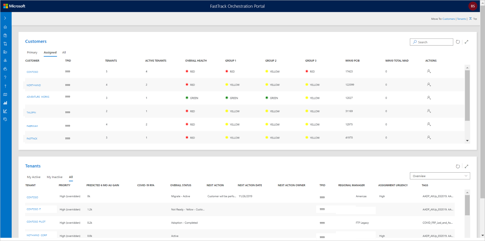

---
# required metadata
title: FTOP User Guide - Portfolio View
description: Process guidance for internal FTOP users.
author: Connie Brenden
ms.author: v-conbre
manager: jimmuir
ms.date: 4/25/2020
ms.topic: ftop-user-guide
ms.prod: non-product-specific
ms.custom: ftop-user-guide
ft.audience: internal
ft.owner: jimmuir
---
# Portfolio View

## Overview

This view provides any FTOP user the ability to see all current assignments at the customer and tenant level. This view is structured in the customers and tenants sections.

## Customers

The customer view displays customer records you are assigned to as the primary role by default. Use the assigned or all (where RBAC allows) to view the customer list. Selecting a customer in this view will open the selected customer in a new browser tab limited to that customer. Refer to the Customer View section to review the capabilities in the customer view.

At this time, the customer view is intended for customer health and compete scenarios. These scenarios are primarily delivered by FastTrack Architects (FTAs), FastTrack Managers (FMs), and Release Managers (RMs).

The assignment icon in the action column allows you to view current customer assignments, and if you have permissions, to assign additional users to the customer.

Use the customer search option to narrow your customer list if it is long and is difficult to scroll your assigned list.

## Tenants

The tenant view displays the list of tenants you are assigned to as the primary role by default. Use the assigned or all (where RBAC allows) to view the tenant list. Selecting a customer in this view will open the selected customer in a new browser tab limited to that customer. Refer to the Customer View section to review the capabilities in the customer view.

The default display view uses the overview display. You can select alternate tenant displays. These are the same displays available in the tenant view. These displays are explained in the display section of [Sorting and Filtering](tenant-view-sorting-and-filtering.html#display).

Selecting a tenant in this view will open the selected tenant in a new browser tab in the detailed tenant view. Refer to the [Detailed Tenant View](detailed-tenant-view.md) page to review the capabilities in the view.

## Resources

- FTOP [Customer Health Training](https://aka.ms/ftop/customertraining) Video 55:05 Minutes
- FTOP [Portfolio View](https://aka.ms/AA88xpn) Video 1:37 Minutes
- FTOP [All Customer Walk-through Videos](../ftop-user-guide/customer-view-videos.md)

## Next steps

To learn about Customer View, see [Customer View](customer-view.md).
