---
# required metadata
title: FTOP User Guide - Tenant View - Summary View
description: Process guidance for internal FTOP users.
author: Connie Brenden
ms.author: v-conbre
manager: jimmuir
ms.date: 4/16/2020
ms.topic: ftop-user-guide
ms.prod: non-product-specific
ms.custom: ftop-user-guide
ft.audience: internal
ft.owner: jimmuir
---
# Summary View

## Overview

When you click the tenant/customer name a summary of the tenant displays in **Maximized** view.

- Select **Close** to return to the list of tenants.

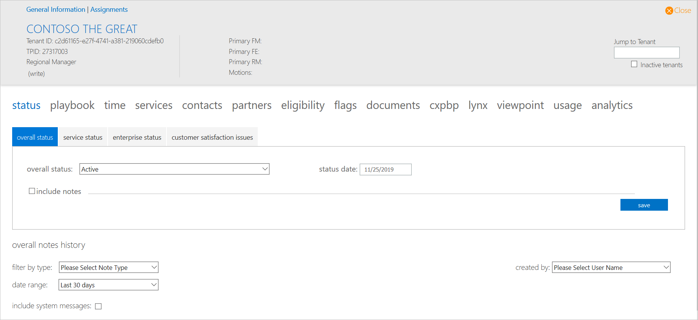

Click any tenant to display **general**, **eligibility**, and **assignments**.

### General

The General tab displays an overview of the tenant including status, services, and FTC assignments. All information on this tab, except for the **id**, is read-only.

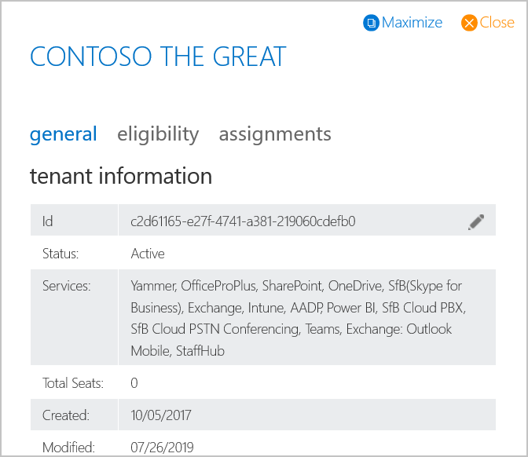

Review the table below for a description of fields on the general tab.

| Field       | Description                       |
| ----------- | --------------------------------- |
| ID          | Tenant ID                         |
| Status      | Overall status                    |
| Services    | Services in scope                 |
| Total Seats | Total seats to be deployed        |
| Created     | Date the record was created       |
| Modified    | Date the record was last modified |
| RM          | Regional Manager                  |
| FM          | FastTrack Manager                 |
| FE          | FastTrack Engineer                |
| PSM         | FastTrack Partner Manager         |
| SME         | Subject Matter Expert             |
| AAM       | App Assure Manager​                  |
| G-RM        | RFA Manager                       |
| G-TM        | Targeting Manager                 |
| FAv2        | FastTrack Architect 2             |
| FA          | FastTrack Architect               |
| GMFTA       | Get Modern FastTrack Architect    |
| MVM         | Migration Velocity Manager        |
| P-RM        | Partner Regional Manager          |
| P-FM        | Partner FastTrack Manager         |
| P-FE        | Partner FastTrack Engineer        |

### Eligibility

The Eligibility tab displays information about tenant eligibility for the FTC. The information is read-only and is a copy of the eligibility tab found in the detailed customer view.

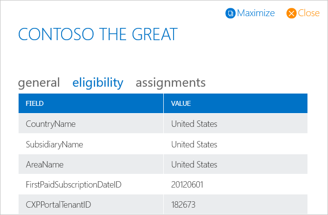

### Assignment

The Assignment tab displays assignments for each FTC role and enables you to add yourself or other team members to a tenant.

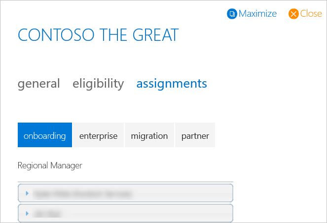

> [!NOTE]
> Tabs for various FTC functions are listed above the individual assignments. Each tab displays a list of associated roles.

Review the table below for a description of the FTC functions and roles listed on the assignments tab.

| FTC Function     | Roles                       |
| ----------- | --------------------------------- |
| Onboarding  | Regional Manager, FastTrack Manager, FastTrack Engineer, FastTrack Partner Manager, formerly Partner Success Manager, SME, App Assure Manager, RFA Manager, Targeting Manager |
| Enterprise  | FastTrack Architect v2, FastTrack Solution Architect, GetModern FTA     |
| Migration   | Migration Velocity Manager, Migration Engagement Lead, use MVM instead  
| Partner     | Regional Manager, FastTrack Manager, FastTrack Engineer      |

#### To add a user to a role

1. Click the **+**. The Add a User dialog appears.

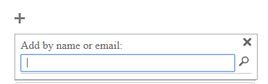

2. Enter the name of the person (as it appears in the address book) or their e-mail address.

1. Click the **magnifying glass** to complete the search. A username appears if a result returns for the name or e-mail address.

1. Click the **name** to add the user. The Available Tenants/Services dialog appears.

1. Select which tenants or services from the list to assign to the user.

Use the buttons at the bottom of the dialog to select or deselect all the options.

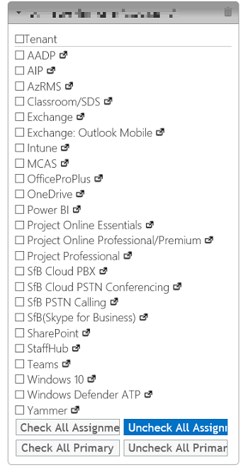

> [!NOTE]
> The button to the right of the service name will open that service’s detail page for the tenant (in a new browser tab).

6. For each service selected, a **primary** checkbox appears. This checkbox is optional and should only be used for individuals that are the primary FTC contact for the role.

1. After you have made all assignments (for the tab), scroll to the bottom of the assignment window and click **apply assignments**.

> [!NOTE]
> If a single assignment is configured for the “Regional Manager”, we will automatically promote that object to be tenant primary by default. This will be done on the backend and will show up when the tenant refreshes.

#### To add a SME

Throughout the phases within FastTrack, you may require a subject matter expert (SME) for supporting a discussion, a plan, a configuration, and so forth. You can assign these resources in FTOP.  Not all SMEs will be associated with a workload and the following screenshot shows how the FTOP User Interface allows for the various types of selections.

1. Select the **plus sign "+"**, type in a few letters of the first name and search, select enter.

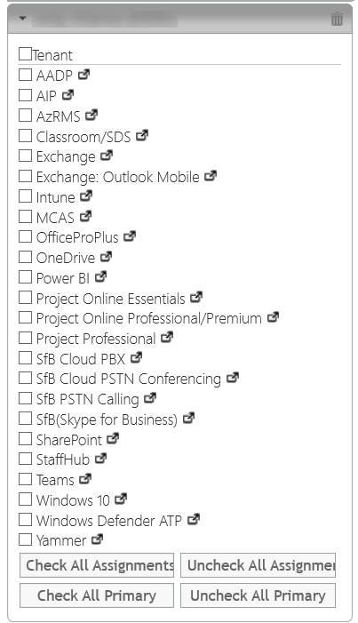

2. Select the Tenant checkbox or Service as appropriate. For each service selected, a primary checkbox appears. This checkbox is optional and should only be used for individuals that are the primary FTC contact for the role.

    - If you only want tenant checked, scroll to the bottom of the list to Uncheck All Assignments.

    - If you are being assigned as a workload SME, select the appropriate service or services. The primary field is not typically set when adding a SME.

    - If your focus is not specific to a service, select the appropriate item from the dropdown (Adoption, Identity, or Network)

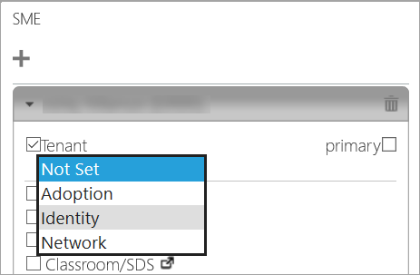

3. After you have made all assignments (for the tab), scroll to the bottom of the assignment window and click **apply assignments**.
 

> [!NOTE]
> Selecting Tenant will result in ALL services being checked.

4. To remove a service, deselect the checkbox next to the service. The primary checkbox option disappears once the user is not assigned to that service.

> [!NOTE]
> For faster editing, the buttons at the bottom of the dialog can be used to add or remove all services.

#### To edit an assignment

1. Click the **arrow** next to the user’s name you want to edit. This expands to show all the services that user is assigned to for that role.

2. To add a service, select the checkbox next to the service. The primary checkbox will also appear for each service selected.

> [!NOTE]
> Selecting Tenant will result in ALL services being checked.

3. To remove a service, deselect the checkbox next to the service. The primary checkbox option disappears once the user is not assigned to that service.

> [!NOTE]
> For faster editing, the buttons at the bottom of the dialog can be used to add or remove all services.

4. After you have made all assignments changes for the user, scroll to the bottom of the assignment window and click **apply assignments**.

#### To delete an assignment

1. Click the arrow next to the user’s name you want to edit. The user’s name expands and displays all services assigned to that user for that role.

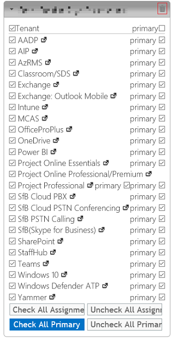

2. Click the **trash can** to the right of the user name to delete the use from the role. The Assignment Deletion Confirmation dialog appears.

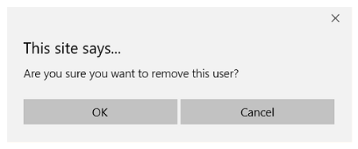

3. Click **OK**. The dialog closes and the user role unassigns from the user.

4. After you delete the user, scroll to the bottom of the assignment window and click **apply assignments**.

#### Important notes about assignments

Assignments are an important part of FTOP. If you are not assigned to a tenant, you cannot edit information about that tenant (you will be in read-only mode). This limitation is to ensure that users are only working on the tenants to which they are assigned.

Please ensure you are setting a Tenant Primary for the Regional Manager and FastTrack Manager Role. Not having a Tenant Primary configured will result in incorrect reporting. Please check the primary checkbox across from “Tenant”.  

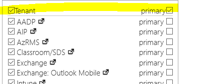

Tenant Primary is indicated by a star next to the assignment.

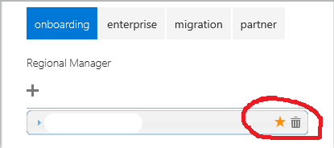

When in read-only mode, all editing dialogs and buttons are disabled or not displayed.

For security purposes, FTOP logs each change to the assignments for each tenant. The date, time, assigned user, role, and service assignments are all tracked. Also, the name of the person that assigned the user is logged.

FTOP displays your assigned access level (roles) to the tenant when you enter the detailed tenant view. If you are not assigned to a specific role (e.g., *FastTrack Manager*), your access is listed as *Guest (read-only)* (as shown in the example below).

### Navigation

There are two navigation links at that display in the detailed tenant view.

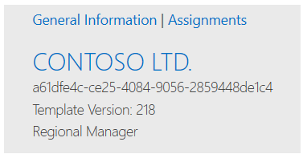

General Information opens the maximized view, the detailed tenant view, and functions the same as clicking the down arrow. Assignments displays the split screen.

## Next steps

To learn about the Notes Library, see [**Notes Library**](notes-library.md).
