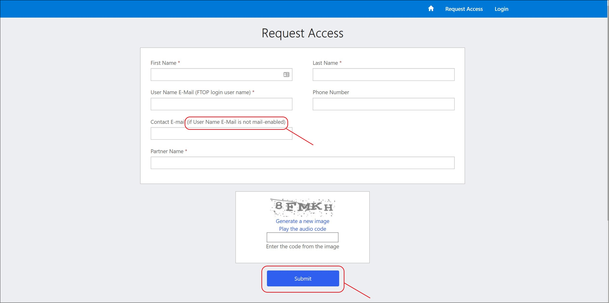
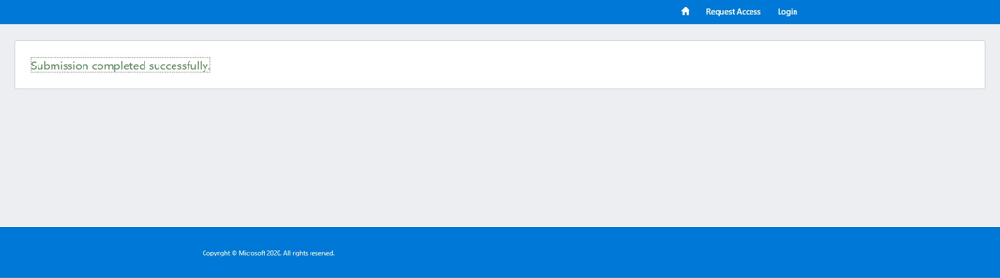
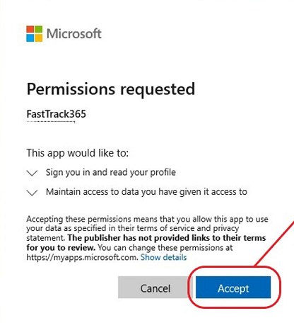
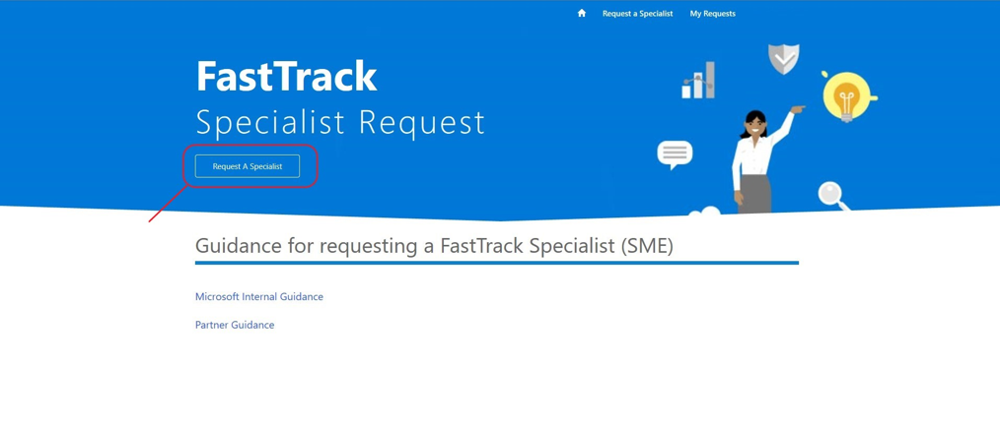

---  
# required metadata  
title: FastTrack Partner Playbook - Subject Matter Expert Resources
description: FastTrack Partner Playbook - Subject Matter Expert Resources
author: Celia Kennedy
ms.author: v-cekenn
manager: pagrim
ms.date: 02/24/2020 
ms.topic: partner-playbook  
ms.prod: non-product-specific  
ms.custom: partner-playbook  
ft.audience: partner
ft.owner: pagrim
---  

# Request FastTrack Subject Matter Expert (SME) Resources

## Determining Required SME Role

A key benefit for FastTrack Ready Partners is the availability of a Subject Matter Expert (SME) to provide deep technical and/or deployment guidance to the **FastTrack Ready Partner (FRP)** and Customer. Subject Matter Experts have demonstrated expert levels of knowledge in specific workload, core, or security and compliance areas.

The FRP may request a SME and the FastTrack Partner Manager (FPM) (formerly known as Partner Success Manager (PSM)) is responsible for approving requests. Once the request is approved, a SME will be assigned. The SME will work with the FRP rather than with the customer in most scenarios.

A SME can be requested through the [FTC Resource Request page](https://aka.ms/frpsmerequest) and can include the following roles:

- **FastTrack Engineer SME:** assists on any FRP workloads  

- **FastTrack Migration Resource:** available to respond to Exchange migration questions  

An FRP works with their FPM to determine the role requirements and expectations prior to submitting the request.

Below are some additional details for requesting **Security & Compliance SME** Requests:

| Workload | Region | Language | License Count | Subject Matter Expert/Routing Request Steps|
|:-----------:|:-----------:|:-----------:|:-----------:|:-----------:|
| AADP P1 & P2 |Americas, APJ, EMEA | WW FTC Supported | More than 150 seats | Nexus FTC Resource Request Tool > Select AADP workload |
| OATP P1 & P2 |Americas, APJ, EMEA | English | More than 150 seats | Nexus FTC Resource Request Tool > OATP workload |
| MDATP |Americas, APJ, EMEA | English | More than 150 seats | Nexus FTC Resource Request Tool > Select MDATP workload |
| AIP P2 |Americas, APJ, EMEA | English | More than 150 seats | Nexus FTC Resource Request Tool > Select AIP workload |
| MIG P2 |Americas, APJ, EMEA | English | More than 150 seats | Nexus FTC Resource Request Tool > Select Security and Compliance |
| MCAS |Americas, APJ, EMEA | English/Limited| Above 10k seats | Nexus FTC Resource Request Tool > Select Security and Compliance |
| AATP |Americas, APJ, EMEA | English/Limited | Above 10k seats | Nexus FTC Resource Request Tool > Select Security and Compliance |

| Workload | Region | Language | License Count | *Self-Deploy Resources Only*|
|:-----------:|:-----------:|:-----------:|:-----------:|:-----------:|
| AIP P1 |Americas, APJ, EMEA | English | No restriction |[No people resources available - self-deployment guidance](https://docs.microsoft.com/en-us/azure/information-protection/)|
| MCAS |Americas, APJ, EMEA | English Only | Below 10k seats | [No people resources available - self-deployment guidance](https://docs.microsoft.com/en-us/cloud-app-security/)|
| AATP |Americas, APJ, EMEA | English Only | Below 10k seats | [No people resources available - self-deployment guidance](https://docs.microsoft.com/en-us/azure-advanced-threat-protection/)|
| MIG P1|Limited/Exception Based| English Only | Above 5k seats | Nexus FTC Resource Request Tool > Select Security and Compliance|

## Scope of SME Activities

SME assistance can be requested to help FRPs with customer deployments, assist with unblocking deployment issues and to help upskill FRPs.  

- Technical expertise for complex issues, escalations, and scenarios

- Guidance and delivery coaching for:

    - All FRP workloads remotely
    - Customer business value and adoption conversations
    - Unblocking workloads

- Partner development for new workloads

- Best practice guidance and coaching

- FastTrack Migration benefit delivery – SME scenario where they work directly with a customer

- SMEs will **not** lead customer engagements

- When engaged, a SME will assist an FRP, **not replace** the FRP

> [!NOTE]
> FRPs requesting repeated assistance for the same topic may have their request denied.

## Submitting a SME Request

The assigned contact or requester from an FRP can submit a SME request using the [FTC Resource Request page.](https://aka.ms/frpsmerequest)

- Follow the form instructions, complete the required fields, noting that certain workloads will require specific details to determine the "best fit" SME assignment.  

- The process will be delayed if the information requested is incomplete or incorrect. The request will be returned to the requestor for additional details.

- The FPM will approve or deny the SME request.

- The FPM will receive an email regarding the SME request once the form has been submitted.  

- The requestor will receive an email notification upon successful submission.

## Get access to FTC Resource Request page

From the [FTC Resource Request page](https://aka.ms/frpsmerequest) you will need to submit the required information. Contact your FPM with any access or approval issues.

1. Click **Request Access.**

2. Submit the required information. Please note that **if your username email is not email enabled you must provide an alternate contact email address** to ensure you receive notifications.

3. Submission Completed screen

4. Await the Invitation Email

5. Click the Invitation Link and Accept the Permissions Requested

6. Complete Registration (Invitation Code will be prepopulated)

## Submit a request for subject matter expertise

1. In your browser, go to the [FTC Resource Request Page](https://aka.ms/frpsmerequest) and login.

")

2. To **create** and **submit** a SME Request, in the lower left-hand corner, under My Resource Requests, click "new item." (See image below for clarification.)

3. Complete all the required fields and **Submit.**

Fill in all the required fields, including additional information that can help identify any appropriate resource for your request.

- Tenant ID

    - The customer's tenant ID  

- Tenant Name

    - The customer name as it is displayed in FTOP  

- Tenant Segment

    - Select SMC or Enterprise based on the size of the customer  

- Seat Count

    - Number of active licenses the customer has for this workload  

- Your Delivery Team

    - Select FTP Partner from the list  

- Partner Name

    - Select your company's name from the list  

> [!NOTE]
> If your company's name is not on the Partner Name list, contact your FPM.  

- Region

    - Select the customer's region:

        - Amer (Americas)

        - APJ (Asia Pacific Japan)

        - EMEA (Europe, Middle East, Africa)  

- Partner Email Address

  - The point of contact for the SME request. If there are questions, this is the person the FPM will contact for more information.  

- Role Request

    - Select a role:  

        - For Migration SME, select FastTrack Migration Resource  

        - For workload-specific SMEs, select FastTrack Engineer SME  

> [!NOTE]
> If you have questions regarding which role, contact your FPM.

- Requested Workload

    - Select a workload for which a SME is needed

- Primary Language

    - Select a primary language for the SME  

- Secondary Language
  
    - Select a secondary language for the SME  

- Additional information regarding your request or the engagement that may be helpful. Include the information in this box:  

    - Name the FPM the request should be routed to  

    - Any noteworthy information about the request for the SME, **including** the justification for the SME  

    - For Migrations, include any relevant information about the email source (Lotus Notes, etc.)

4. Track the Request.

## SME Request Timelines

After a submission is completed, the request goes through a triage process.

- Within 5 minutes of submitting the request you should receive an automated email validating that the SME request has been submitted.  

>[!NOTE]
>If a notification is not received, contact your FPM and the FastTrack SME Assignment team at: **ftsmeassign@microsoft.com** for assistance.  

- The FPM will approve or deny the SME request.

- Within 1 business day the SME request will be triaged, if additional information is required you will be notified.

- Within 5 days of submission, the SME request will be approved, and a resource is assigned, or the SME request will be denied, and you will be notified.  

- Once a SME is assigned, you will be directly contacted by the SME.

- The FPM will then close the request on website.

## Proactive SME assignment by Microsoft to Partners

In certain circumstances, a SME will be assigned proactively by Microsoft with agreement with an FRP; it is done with the goal of upskilling a partner by coaching them through customer engagements. These engagements are set for a specific period, with agreed upon outcomes. 

## SME Request Denials

Please discuss any questions you may have with the FPM before submitting the request to avoid denials based on issues listed below:  

- If you do not fill out the *Additional Information* section, there may not be enough information to approve it.

- If you request SME assistance for the same topic for multiple customers.  

## Onboarding a SME  

Once a SME is assigned by Microsoft, the requestor will receive notification with onboarding steps. A SME may reach out directly. It is expected that the FRP will participate with the FPM & SME to clearly set expectations, outcomes, exit criteria and timelines (for example: customer-facing guidance, FE shadowing, FTOP task execution), and any pertinent criteria to release the SME once the activities are complete.

## Accountabilities and Expectations during SME Engagement  

The following are the roles and responsibilities of an engagement with a SME.

## FastTrack Ready Partner (FRP)

- Contact the FPM **first** and keep them in the loop.

- Once a SME is assigned, the FRP will receive notification with the next steps.  

- Participate with the FPM & SME to clearly set expectations, outcomes, exit criteria and timelines (customer-facing guidance, FE shadowing, FTOP task execution, etc.), and any pertinent criteria to release the SME once the activities are complete. 

- Once a SME closes the engagement, FRPs do not reach out to them directly for any new or existing issues without consulting the FPM.

- Take accountability for learning from SMEs to upskill resources on every engagement and to train additional resources at the Partner on the subject matter.

- Minimize requesting SMEs for similar scenarios, except for data migration.

## FastTrack Partner Manager (FPM)

- The FPM will handle issues, concerns, and escalations related to the SME request.

- Review and approve or deny SME requests.

- Ensure commitment from the partner to assign specific resources towards learnings from the engagement.

- Collaborate with the SME and Partner to clearly set expectations, outcomes, exit criteria and timelines between Customer, SME, and Partner.

- Hold Partners accountable for learning from each engagement by ensuring their active participation.

- Monitor that SME **requests are not made** for similar scenarios repeatedly.

## Subject Matter Expert (SME)

- Collaborate with the Partner and FPM to support the customer. There may be circumstances where the SME works directly with the customer, with the partner in a supporting role.

- Follow the FastTrack Service description and enable the partner to deliver to the Service Description.

- Update information via the FastTrack Orchestration Portal (FTOP) to give a summary to the FPM and partner upon completion of service.

- SMEs to capture feedback about the engagement and share it with the FPM. The FPM is listed in FTOP.

### Refresh Summary

|Date|Who Changed|What Changed|
|---------|---------------|----------------------------|
|03/28/2020| Celia Kennedy| General Maintenance |
|02/28/2020| Celia Kennedy| SME Engagement Partner Facing Guidance |

[Home](http://partner-docs.microsoft.com)
