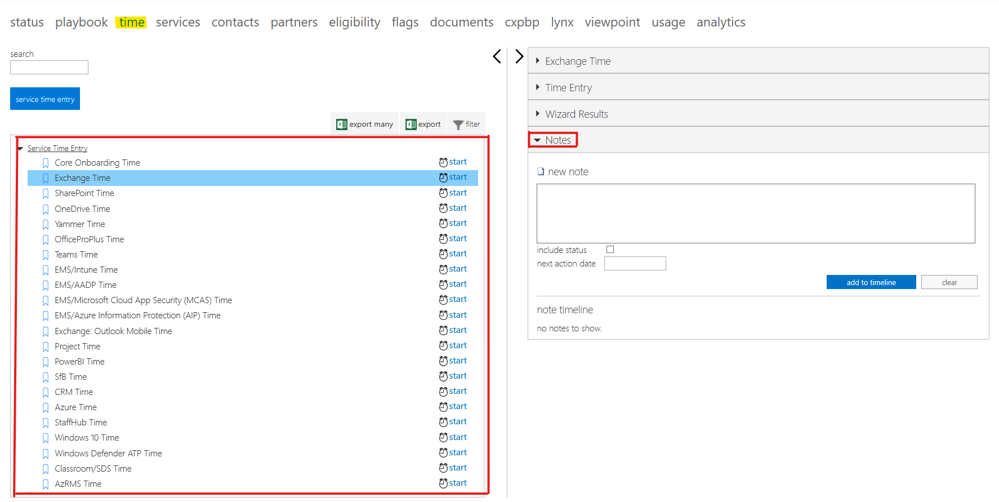
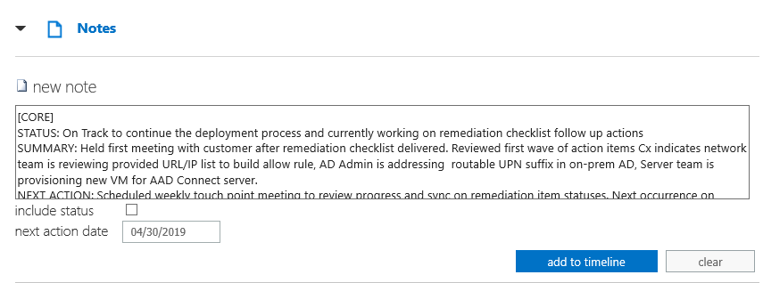

---  
# required metadata  
title: FastTrack Partner Playbook - FE/SME Notes Guidance 
description: FastTrack Partner Playbook - FTOP Notes Guidance 
author: Celia Kennedy
ms.author: v-cekenn
manager: pagrim
ms.date: 10/03/2019  
ms.topic: partner-playbook  
ms.prod: non-product-specific
ms.custom: partner-playbook  
ft.audience: partner
ft.owner: partner
--- 

# Leitfaden für FE/SME-Notizen

Primäre Rolle: **FastTrack Engineer; FastTrack Engineer SME**  
Gilt für: **Alle Dienste**

## Ziele

Die Rollen FE und FE SME müssen während ihres gesamten Kundenkontakts Notizen im FastTrack-Orchestrierungsportal (FTOP) erfassen. Diese Notizen müssen erfasst werden, sobald Besprechungen zum Unternehmenswert (BVDs), technische Workshops, Erfolgsworkshops, Korrekturaktivitäten, Aktivierungsaktivitäten und weitere spezifische Aktivitäten stattfinden, um den Status der Beteiligung festzuhalten. In diesem Dokument wird beschrieben, welche Erwartungen der FE/SME im Hinblick auf die Häufigkeit, den Speicherort sowie den Inhalt und das Format der Notiz erfüllen muss.

## Häufigkeit

Notizen müssen jedes Mal im FTOP erfasst werden, wenn ein FE/SME eine Interaktion mit einem Kunden oder einem internen Beteiligten durchführt oder wenn er eine mit der Beteiligung zusammenhängende Aktivität durchführt. Hier sind einige Beispiele:

- Kick-off-Meeting
- BVD-Gespräche
- Technische Workshops
- Analyseaktivitäten
- Korrekturbesprechungen und Folgeaktionen
- Aktivierungsbesprechungen
- Tests oder Reproduktionen während der Kundenbereitstellung und damit verbundenen Aktivitäten

## Speicherort

Der FE/SME gibt seine Notizen im Eingabebereich **Zeit** im FTOP ein und wendet dabei die Arbeitszeiterfassungsaufgabe an, die am besten zur jeweiligen Aktivität passt.

Wenn keiner der in der Liste enthaltenen Arbeitsbereiche zutreffend ist, wird die Aufgabe für die Haupt-Onboarding-Zeit verwendet. Falls mehrere Arbeitsbereiche zutreffend sind (z. B. Compliance Center, Outlook Mobile in Intune), erfassen Sie eine Notiz und verwenden den Präfix im Notizeintrag, um die anderen Notizen abzubilden.

**Beispiele**

- Notizen zu BVD-Gesprächen werden unter der Zeiterfassungsaufgabe für den Arbeitsbereich erfasst. 
- Notizen für technische Workshops und Korrekturaktivitäten, die zu einem bestimmten Arbeitsbereich gehören, werden unter der Zeiterfassungsaufgabe für den Arbeitsbereich erfasst.
- Notizen für Aktivitäten, die nicht direkt zu einem bestimmten Arbeitsbereich gehören, z. B. Tenant und Lizenzierung, Networking, Client- und Verzeichnissynchronisierung/-authentifizierung, werden unter der Aufgabe für die Haupt-Onboarding-Zeit erfasst.

## Inhalt und Format von Notizen

Alle FE/SME-Notizen müssen Folgendes beinhalten:

**Vorlage für Notizeinträge**

- BETROFFENER ARBEITSBEREICH
- STATUS: Kurze Zusammenfassung des Status der Beteiligung
- ZUSAMMENFASSUNG: Eine Zusammenfassung der während der Interaktion ausgeführten Aktivitäten
- NÄCHSTE AKTION: Geben Sie die nächste Aktion an und wann diese planmäßig das nächste Mal stattfindet
- BEDENKEN: Geben Sie hier gegebenenfalls vorhandene Bedenken an

1. Betroffener Arbeitsbereich: Stellen Sie jeder Notiz in der ersten Zeile den betroffenen Arbeitsbereich als Präfix voran.

   **Erwartetes Format**

   -  [EXO] Exchange Online
   -  [SPO] SharePoint Online
   -  [OD] OneDrive for Business
   -  [YAM] Yammer Enterprise
   -  [OPP] Office ProPlus
   -  [TEAMS] Teams    
   -  [INTUNE] Intune
   -  [AADP] Azure Active Directory Premium
   -  [MCAS] Microsoft Cloud App Security
   -  [AIP] Azure Information Protection
   -  [OLM] Outlook Mobile
   -  [PROJ] Project Online
   -  [WDATP] Windows Defender ATP
   -  [WIN10] Windows 10
   -  [SDS] Classroom/School Data Sync (SDS)
   -  [IDSEC] Identity Security
   -  [CORE] Für alles, was nicht zu den obigen Arbeitsbereichen passt
   -  [OLM+INTUNE] Beispiel für mehrere betroffene Arbeitsbereiche

2. Technischer Arbeitsbereichsstatus: Wählen Sie eine der folgenden Statusangaben aus:

   **Erwartetes Format**

- STATUS: Kurze Aussage zum Status der Beteiligung
   - Nach Plan
   - Angehalten
   - Kunden-Feedback ausstehend
   - FastTrack Center (FTC) oder internes Feedback ausstehend

3. Zusammenfassung der Details der Aktivität

   **Erwartetes Format**

- ZUSAMMENFASSUNG: Eine Zusammenfassung der während der Interaktion ausgeführten Aktivitäten.

4. Nächste Aktion/Nächstes Aktionsdatum
   **Erwartetes Format**

- NÄCHSTE AKTION: Erwartete nächste Schritte und deren planmäßige Ausführung

5. Bedenken
   **Erwartetes Format**

- BEDENKEN: Angaben zur Art der Bedenken (Erstanbietersoftware, Drittanbietersoftware oder -hardware, Geschäftsbetrieb, Sicherheit, Projektressourcen oder Finanzierung).   

  Hinweis: Wenn Probleme mit der Erstanbietersoftware angegeben werden, muss die zugehörige FTC Insight-ID angegeben werden.

**Beispiele für Notizen**

- [CORE]
- STATUS: Nach Plan, um den Bereitstellungsprozess fortzusetzen; aktuell wird an Nachfolgeaktionen der Korrekturcheckliste gearbeitet.
- ZUSAMMENFASSUNG: Erste Besprechung mit Kunde nach Lieferung der Korrekturcheckliste durchgeführt. Erste Phase der Aktionselemente geprüft; Kunde teilt mit, dass das Netzwerkteam die Liste mit Uniform Resource Locator (URL)/Internetprotokoll (IP) prüft, um die Zulassungsregel zu erstellen; Active Directory(AD)-Admin kümmert sich um routingfähigen User Principal Name(UPN)-Suffix im lokalen AD; Serverteam stellt neue virtuelle Maschine (VM) für den Azure AD Connect-Server bereit.
- NÄCHSTE AKTION: Wöchentliches Treffen zur Prüfung des Fortschritts und zur Synchronisierung des Status der Korrekturelemente wurde geplant. Nächster Termin: 30. April 2019.
- BEDENKEN: Netzwerkteam des Kunden hat mitgeteilt, dass seine Drittanbieter-Firewall möglicherweise keine auf Platzhalter-URLs basierenden Regelsätze unterstützt; laut seiner Aussage bestehen erweiterte Regelsatzanforderungen. Der Kunde hat mitgeteilt, dass seine Bereitstellung sich verzögern wird, falls keine Upgrade-Option verfügbar ist, weil dann ein Austausch erforderlich ist, dessen Finanzierung, Beschaffung und Bereitstellung erfolgen muss.

### Zusammenfassung aktualisieren

|Datum|Geändert durch|Änderung von|Notizen|
|---------|---------------|----------------------------|-------------|
|27.09.2019| Celia Kennedy| Partneranleitung aktualisiert| |

[Startseite](http://partner-docs.microsoft.com)
