---
# required metadata
title: FTOP Partner User Guide
description: Assigned Tenant List
author: Celia Kennedy
ms.author: v-cekenn
manager: pagrim
ft.owner: pagrim
ms.date: 01/07/2020
ms.topic: assigned-tenant-list
ms.prod: non-product-specific
ms.custom: ftop-partner-user-guide
ft.audience: internal, partner
ft.owner: pagrim
---

# Assigned Tenant List

Assigned Tenant list displays the Tenants that are associated with the Assigned Tenant Tab (*My Active, My Inactive or Partner*) that has been selected.

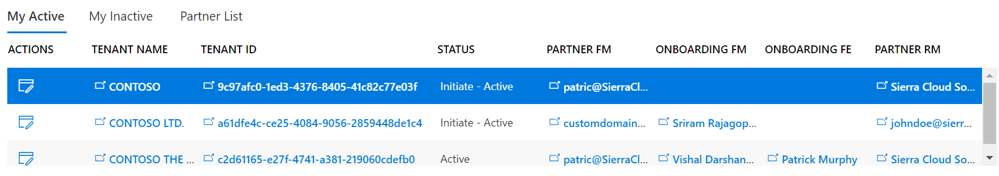

This view provides **access to additional data and edit functionality** either through a simplified UI available through the Actions buttons, or using the full FastTrack user experience through the various hyperlinks marked with the  symbol.

The Actions buttons provide a simplified pop-up experience for partners to edit Tenant Data or Assignments without exposing the full FastTrack UI.

## Actions

You may edit a **tenant** or **assignment**.

### Edit Tenant Button

The Edit Tenant button  launches a modal dialog-box that enables editing of all the relevant and required FTOP fields for the specified tenant.

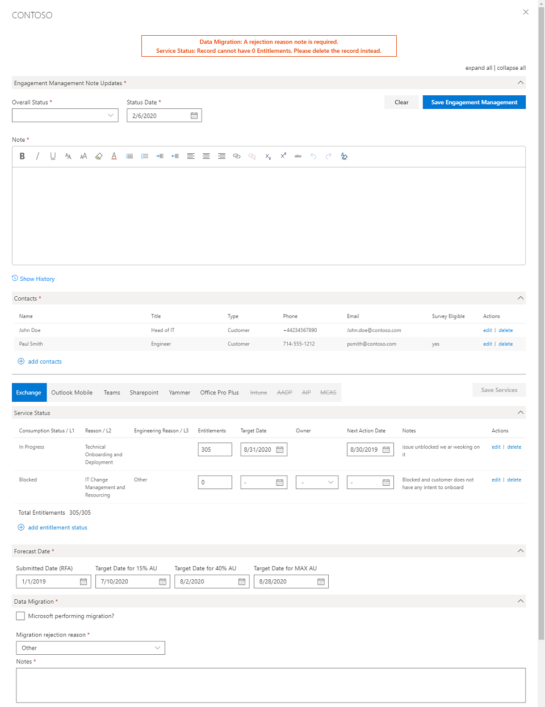

## Procedures

### Edit Tenant Dialog-box

Edit Tenant Button 

This dialog box is split into two main sections with tool required fields marked by a red asterisk (*).

- **Tenant level data**
  - Engagement Management Note
  - Contacts
- **Service level data** - managed per entitled service
  - Service Status
  - Forecast Date
  - Data Migration
  - Service Engagement Scenario
  - CPOR Partner Information
  - Primary Assignments

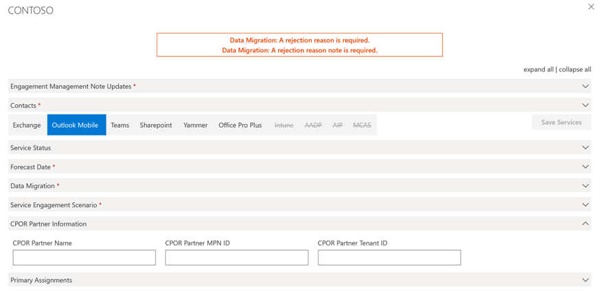

### Engagement Management Note Updates

In this section the user will set Overall Status, Status Date and enter a progress note outlining the current state of the engagement, services being worked on, issues and next steps.  This note should be writing as an executive summary rather than a lengthy review of all the details of the engagement.

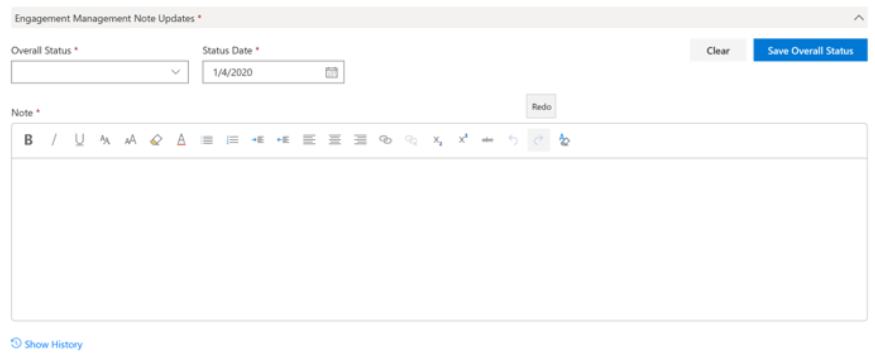

The user may make updates directly in the available fields or may select   to launch the Notes Editor experience and gain access to the historical notes library.  For this guide we will focus on the dialog box experience.

- Overall Status: Choose from Active, Blocked or Paused 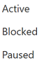 in the drop-down list.
- Status Date: Default is today's date, there is no need to change this value.
- **Note:** Enter executive summary style note giving overview of services being discussed, current status, next steps and issues.
- Select  to commit changes once satisfied.

### Contacts

The use may edit or delete existing contact(s) and may add additional contact(s) in this section of the dialog box.

#### Edit Contact

- Select the  icon in the Actions column
- Validate and or update the required fields
- Required fields for a survey eligible contact are:
  - Is Engaged check box
  - Name
  - Email
  - Country
  - Survey Eligible
  - Survey Language
  - Services Deployed / Migrated
- Click  to commit changes

**Note:** all other fields are considered optional, but users are encouraged to provide as much information for a specific contact as possible.
**Note:** Survey will be sent to contacts identified for the specific services covered by the survey (O365, Migration, Intune, AADP).  If no contact specified for the specific service(s) the survey will be sent to all survey eligible contacts for this tenant.

#### Add Contact

- Fill in the appropriate information for the required fields
- Required fields for a survey eligible contact are:
  - Contact Type = Customer
  - Is Engaged check box = 
  - Name
  - Email
  - Country
  - Survey Eligible
  - Survey Language
  - Services Deployed / Migrated (minimum of 1)
- Click  to commit changes

**Note:** All other fields are considered optional, but users are encouraged to provide as much information for a specific contact as possible.
**Note:** Survey will be sent to contacts identified for the specific services covered by the survey (O365, Migration, Intune, AADP).  If no contact specified for the specific service(s) the survey will be sent to all survey eligible contacts for this tenant.

Example of properly filled in Survey Eligible Contact entry:

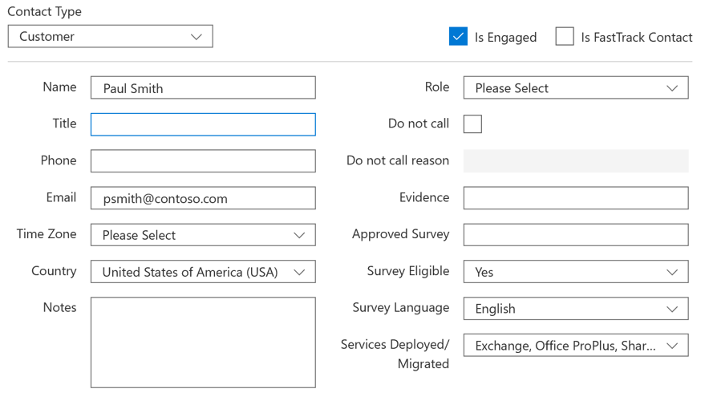

The service or workload-specific section of the Edit Tenant dialog-box contains tabs for each key service. The fields under each tab are identical, the data entered is specific to the selected service.

### Entitlement Status Grid

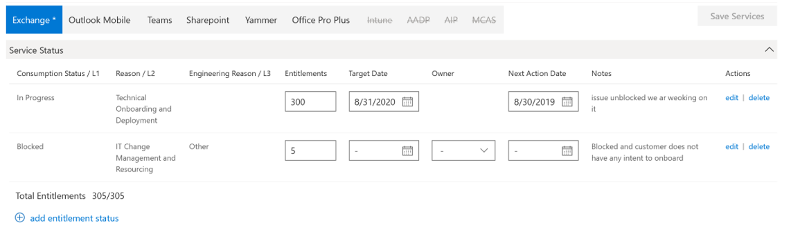

The Entitlement Status grid allows a user to enter and edit entitlement status (intent) data for the selected service. Only services with eligible entitlements can be selected.  All services with eligible entitlements should have Entitlement Status set for all entitlements.

The assigned service owner (FRP or FTC) is responsible for maintaining the Entitlement Status for their assigned services.  If the service is not assigned to a delivery channel, it will remain in default state until assignment is made. When a customer acquires additional entitlements for a service, those new entitlements are automatically set to "Status Unknown" and it is the responsibility of the assigned delivery team to update the status of these new entitlements to either In Progress, Blocked or No Intent as needed.

This section contains a machine learning user interface that interprets entered text and proposes an appropriate L1/L2/L3 (Consumption Status L1, Reason L2, or Engineering Reason L3) status.  The user is able to override the proposed status if required.

#### Edit Existing Service Status

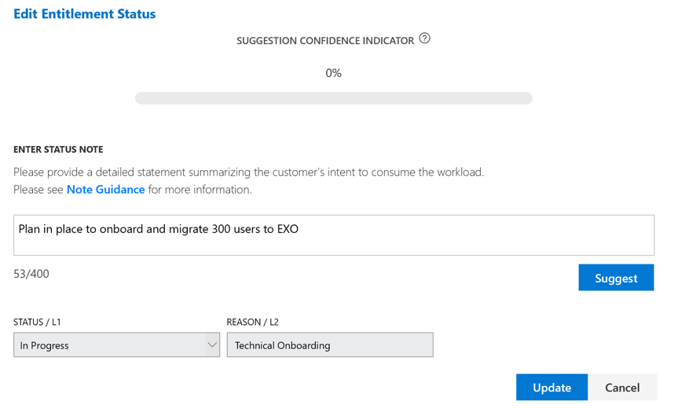

- Select  from the Actions column
- Enter short description of situation 
  - Ex. Customer has plan to deploy this service to 300 of their users
  - Ex. Service will not be deployed due to legal restrictions for data residency in customer country.
- Click  to have the ML engine propose a Status / L1 and Reason / L2
- If *satisfied* with the suggestion click 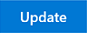 to commit the change

or

- If *dissatisfied* with the suggestion
- Open the drop-down menu for the Status / L1 box and choose preferred Status (Status Unknown, In Progress, Blocked, No Intent or Duplicate/Invalid)
- Open the drop-down menu for Reason / L2 and Engineering Reason / L3 boxes and choose answer that is closest to the specific situation
- Click  to commit the change

#### Add Entitlement Status

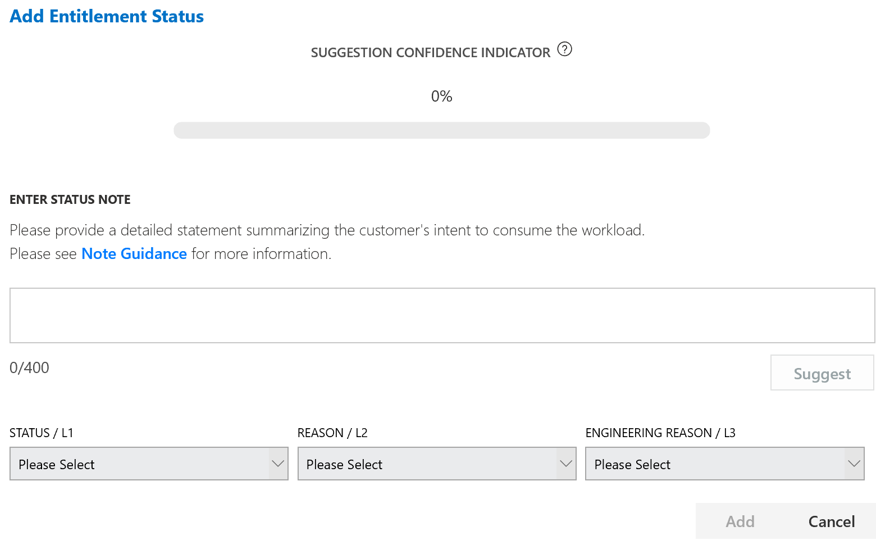

- Click 
- Enter short description of situation
    - Ex. Customer has plan to deploy this service to 300 of their users
  - Ex. Service will not be deployed due to legal restrictions for data residency in customer country.
- Click Click   to have the ML engine propose a Status / L1 and Reason / L2
*    If *satisfied* with the suggestion click Click   to commit the change
or
- If *dissatisfied* with the suggestion
  - open the drop-down menu for the Status / L1 box and choose preferred Status (Status Unknown, In Progress, Blocked, No Intent or Duplicate/Invalid)
  - open the drop-down menu for Reason / L2 and Engineering Reason / L3 boxes and choose answer that is closest to the specific situation
*    Click  to commit the change

**Note:** For guidance regarding use of the machine learning interface please see [Entitlement Status Note](../fasttrack-playbook/english-playbook/status-guidance-entitlement-status-notes-partner.md)
**Note:** Entitlement Status must be set for **all** entitlements, there may be multiple statuses for one set of entitlements that equal the total entitlements for that service, an example: 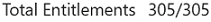; 300 In Progress and 5 Blocked.

### Forecast Dates

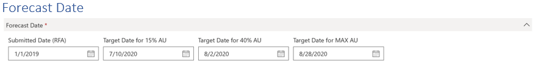

This section is used to enter and maintain forecast dates for the 15% AU, 40% AU and Max AU milestones.  Choose the correct dates for the following fields, no explicit save action required.

- Submitted Date (RFA)
  - Should be pre-populated
  - If not pre-populated choose today's date
- Target Date for 15% AU
  - Must be in future
  - Must be after Submitted Date (RFA) or tool will not allow entry
- Target Date for 40% AU
  - Must be in future
  - Must be after Target Date for 15% AU or tool will not allow entry
- Target Date for Max AU
  - Must be in future
  - Must be after Submitted Date (RFA) or tool will not allow entry

**Note:** 15% AU and 40% AU dates are only required if the customer will achieve the specified milestone.  It is possible to have 15% AU and Max AU dates and leave 40% AU blank if the customer only plans to use 39% or less of their entitlements.

### Data Migration

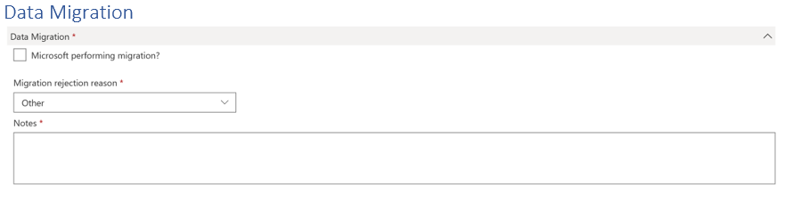

This section is used to record whether the customer will use the Microsoft Migration factory to perform data migration for the selected service.

Microsoft Performing Migration:

- Check-box
- Input Migration Start Date
- Input Migration End Date
- Select Migration Type
- Select from drop-down menu
- Click  to add that type to the list Ex. Mig-ExHybrid
- Repeat to add additional types to the list Ex. Mig-GmailStaged
- For each Migration type added to the list
- Enter number of entitlements that will be used for that migration type
- Enter Estimated Migration Date
- Enter any relevant notes
- Enter size of data to migrate if known
- Status will be entered by Migration SME

**Note:** The Dates are used by the FT Migration Factory team for planning purposes. Dates should be current best estimate and must be updated as the customer timeline becomes more solid.  
**Note:** Total entitlements must equal entitlements in the migration list Ex. 305 entitlements 200 Mig-ExHybrid and 105 Mig-GmailStaged for  

#### Customer declines Microsoft data migration

- Uncheck 
- Select Migration rejection reason Ex. Customer will self-migrate
- Input brief description of why customer is rejecting migration support in Notes

### Service Engagement Scenario

This is used to designate who, which delivery team, is responsible for the FastTrack Benefit delivery for the selected service for that tenant.  The delivery team responsible for the FastTrack Benefit delivery is responsible for maintenance of service level data in FTOP.

- For FRP led services it should always be set to FTC-FTP Led
- For FTC led services it should always be set to FTC-CSS Led

*Note: Service Engagement Scenario is used to allocate AU growth to delivery teams.  If it is set to FTP Led the AU growth is attributed to the FRP Partner assigned as primary for that service.  If it is set to CSS Led it is attributed to the FTC team assigned as primary for that service.

*Note: FRP partners may work in cooperation with the FTC on services for S1500 customers that are set to CSS led.  In this instance the FTC would be responsible for data maintenance in FTOP but the FRP Partner may add notes regarding their activities.

**CPOR Partner Information**
 
This section is read-only and displays the CPOR registration data fed into FTOP from Partner Center. If this section is blank or incorrect, the change will have to be made through the CPOR claiming process or via the Partner Center help ticket system.

**Primary Assignments**
 
This section shows the Primary service level assignments for Onboarding RM, Partner RM, Partner FM and Partner FE
The [pen-icon.png](media/new-content/pen-icon.png "Pen Icon") button launches the full FTOP Assignment editing experience.  We recommend using the Add Assignment functionality in the Partner Interface if you want to manage assignments for a tenant.

### Edit Assignments

The edit assignments button 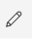 opens a new tab and navigates the user into the standard FTOP UI from the FRP View page, specifically to the assignments pane for the in-scope tenant. The assignments pane enables editing of all the assignment types for the selected tenant. Partner users are restricted to making changes on the Partner tab.

#### Onboarding Tab

In the onboarding tab the partner user can review, but not edit, the specific assignments made for the tenant in question.

> [!TIP]
> The partner user could review the Onboarding Regional Manager (Onboarding RM) field to ensure that the correct Onboarding RM queue is assigned to the appropriate services/workloads. They may similarly validate that the correct FastTrack Partner Manager (FPM), previously known as Partner Success Manager (PSM), is assigned.  

#### Partner Tab

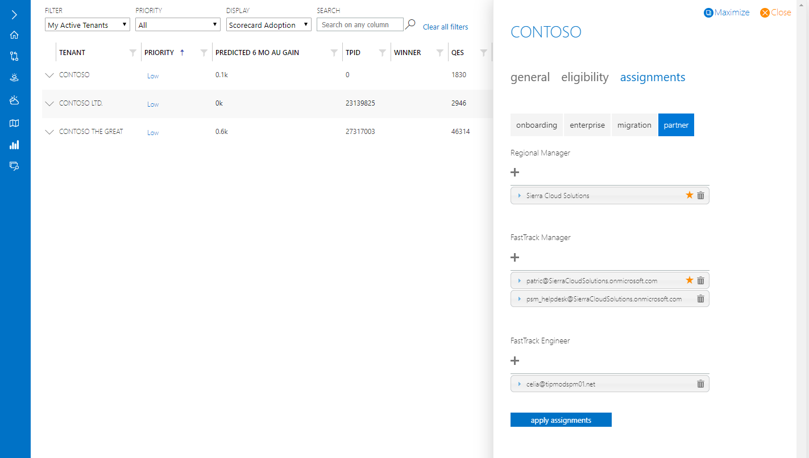

On this tab the partner user can Add, Remove or Edit assignments for the 3 partner roles, Partner Regional Manager (P-RM), Partner FastTrack Manager (P-FM) and Partner FastTrack Engineer (P-FE).  

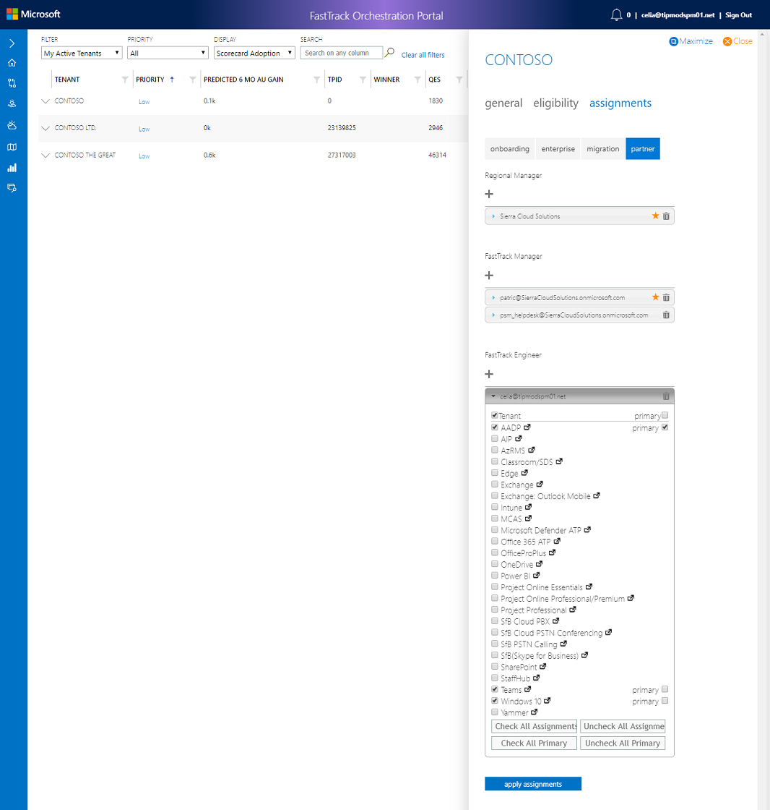

This view shows a number of important data points:

- Who is assigned for that role type 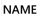
- What service(s) they are assigned to 
- Whether they are Primary for the services 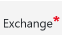 or not 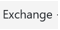
- How many services they have been assigned to 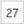 out of the 27 possible services.

**Add New Assignment**

Click the  under the desired RM, FM or FE label.

A text box will open. You can **enter a partner username** (e.g. partneruser@partner.onmicrosoft.com or partneruser@partner.com).

**Notes**

- Each such assigned user must be from the partner tenant that is whitelisted for FTOP access. Once you have entered the relevant username, click the **add button.** This will expand the services/workloads pane. Select one or more workloads and the primary check-box as appropriate.
- Selecting only the Tenant or only 1+ services will cause the tenant to show in the users My Active or My Inactive assigned tenant list
- Users should only be assigned to services that they are actively engaged with a customer on. This will ensure the most accurate picture of who is working on what with a given customer.
- Users have edit capability for all services once they are assigned to the tenant regardless of service level association.
- Click the **apply assignments button**  to complete the process.

**Edit Existing Assignment**

Click the **apply assignments** button at the bottom of the dialog box.

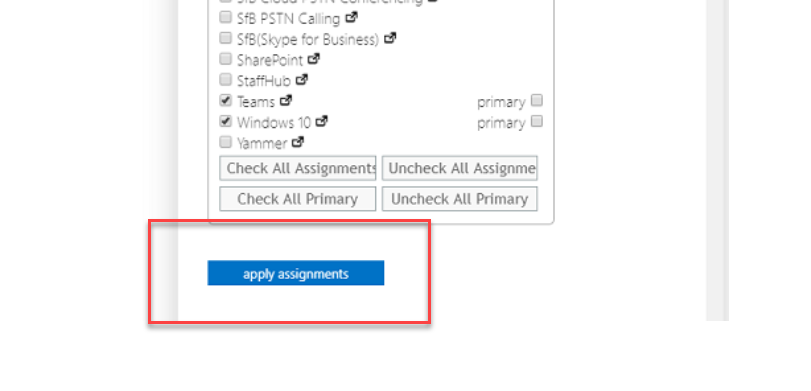

On the assignment record you wish to edit, click the ; this will expand the services/workloads pane.

In the Services/Workloads pane:

- **Assignment:** you can choose to Check All or Uncheck All which will assign or un-assign all services to that P- user.
- **Primary Assignment:** you can choose to Check All or Uncheck All which will set the primary assignment or remove the primary assignment from all services for that P- user.
- For **both dialog boxes** you can expand the list and select individual services for Assignment and Primary assignment.  

- When satisfied with the assignment selections click the apply assignments button to commit the changes.

**Delete Existing Assignment**

- On the assignment record you wish to remove, click the 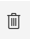 icon.
- Confirm the choice in the validation pop-up dialog box.

**Note:** There can be only one Primary assignment fore each tenant and service for each assignment type (P-RM, P-FM, P-FE).  
**Note:** There can be multiple assignments for each tenant and service for each assignment type to allow many users access to the record in the FTOP tool.
**Note:** If you remove all assignments from a given P- user, that user will be removed from the FTOP record for that tenant. 
**Note:** DO NOT REMOVE the P-RM assignment or that tenant will no longer be associated with your Partner firm and you will no longer accrue credit for an AU generate by that tenant/service.

### To navigate to the existing FTOP UI

1. Select any clickable values in the FRP View, such as the Tenant Name or the Tenant ID.
2. In the Tenant Entitlement view, select Service opens a new tab to that service in the existing FTOP view.

### Next step

[**Required Data**](required-data.md)

### Refresh Summary

|Date|Who Changed|What Changed|
|---------|---------------|----------------------------|
|1/14/2020| Celia Kennedy| General Maintenance|
|11/20/2019| Celia Kennedy| FTOP Partner User Guide updated|

[Home](http://partner-docs.microsoft.com)
