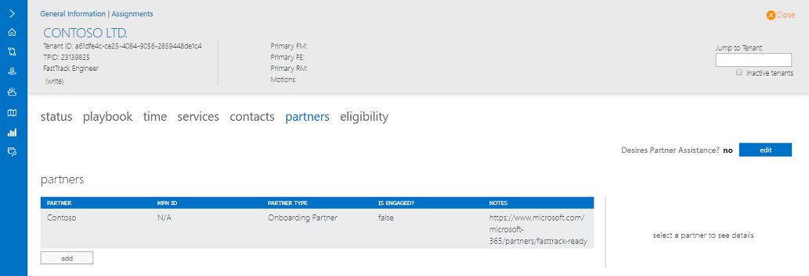
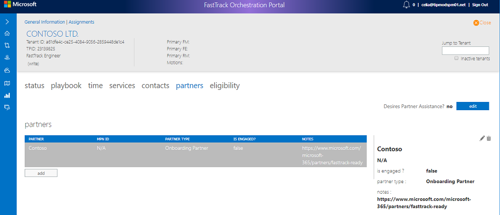
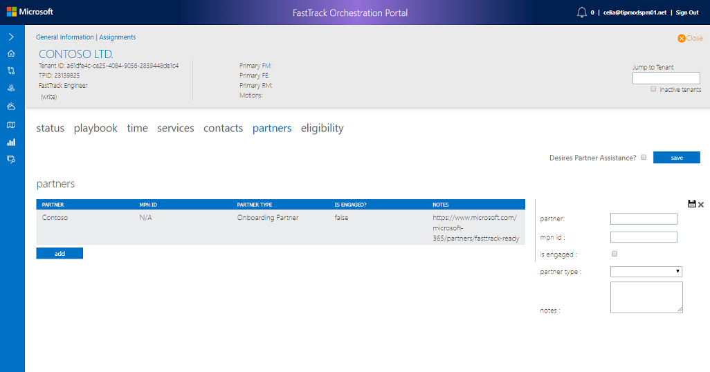
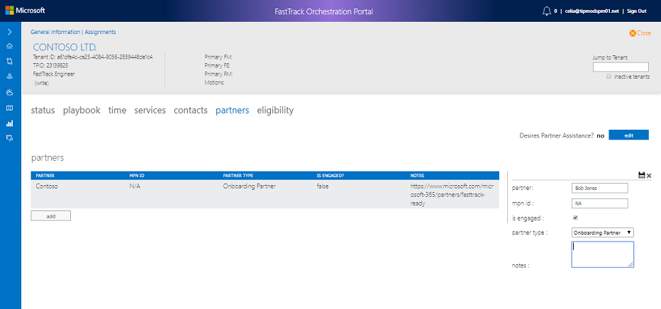

---
# required metadata
title: FTOP Partner User Guide
description: Partners Tab
author: Celia Kennedy
ms.author: v-cekenn
manager: pagrim
ms.date: 1/28/2020
ms.topic: ftop-partner-user-guide
ms.prod: non-product-specific
ms.custom: ftop-partner-user-guide
ft.audience: partner
ft.owner: pagrim
---
# Partners Tab

## Overview

The Partners Tab is rarely used and would, when relevant, contain partner (company) information.

> [!NOTE]
> This should not be confused with the Partner section under **Contacts.** Partners in this section are **the company.** Partners in the Contact section are individuals that work for the partner company/companies.

### Desires Partner Assistance

1. Select the Partners name in the contact list.
2. Select either **no** or **edit.**

3. To **edit,** use the Pencil Icon, then **save.**
4. To **delete changes,** use the Garbage Can Icon.

### Adding Partners

1. Select the **add** button.

2. Enter Partner information.

3. Select the floppy disk to **save** or select **x** to close without saving.

## Next Steps

- To learn about the next tab, see the [Eligibility tab](detailed-tenant-view-eligibility-tab.md).

[Home](http://partner-docs.microsoft.com)
