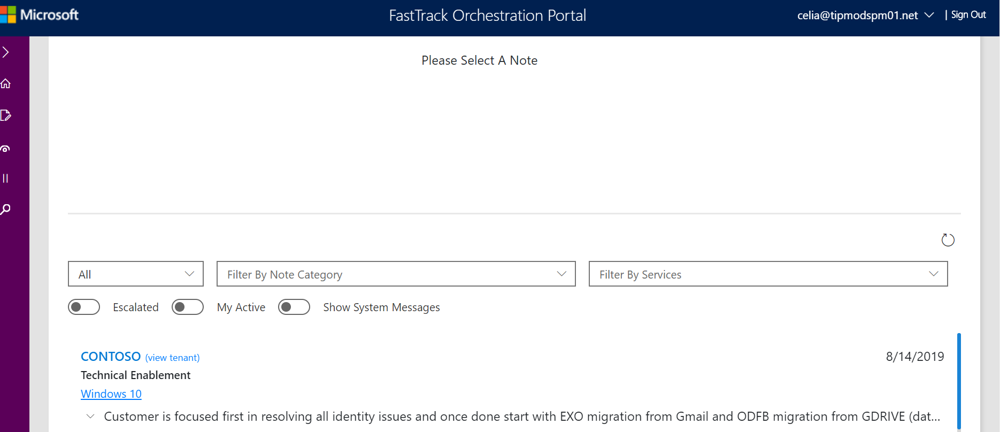
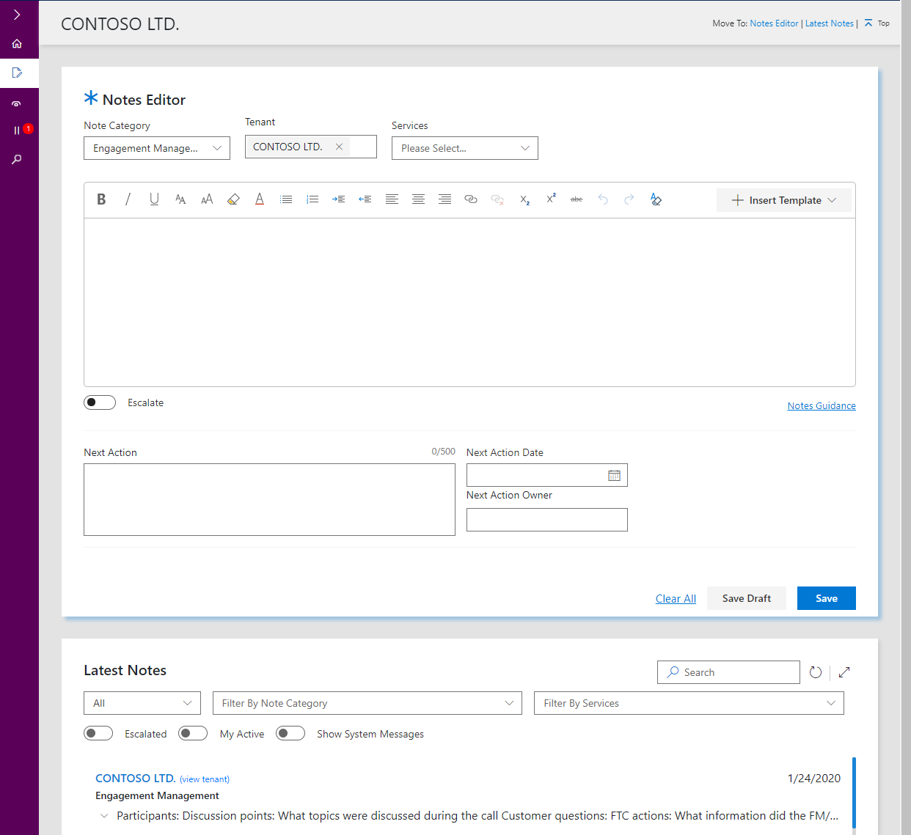
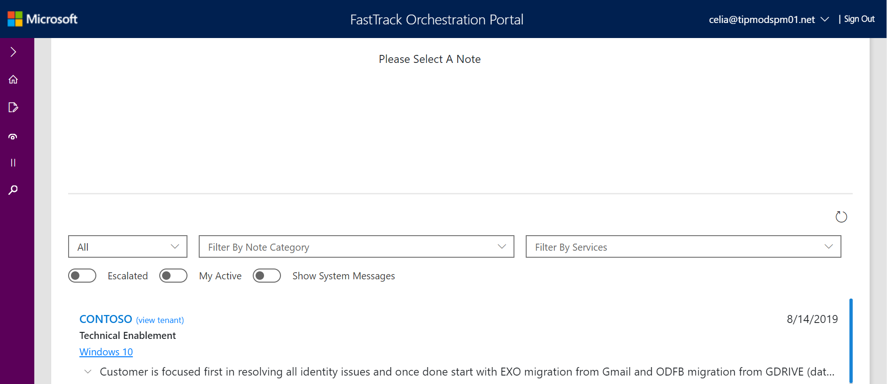
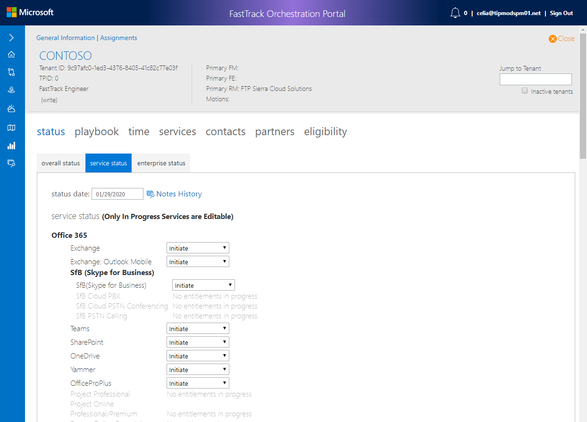
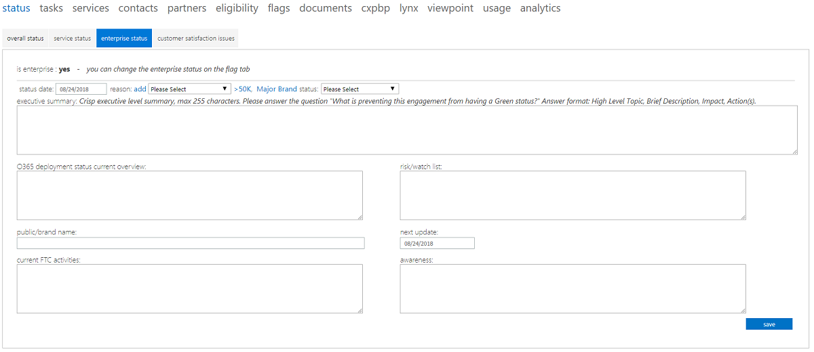
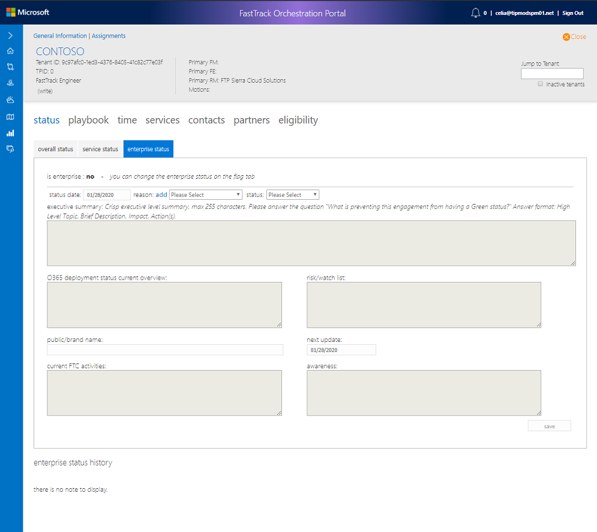

---
# required metadata
title: FTOP Partner User Guide
description: Status Tab
author: Celia Kennedy
ms.author: v-cekenn
manager: pagrim
ms.date: 1/27/2019
ms.topic: ftop-partner-user-guide
ms.prod: non-product-specific
ms.custom: ftop-partner-user-guide
ft.audience: partner
ft.owner: pagrim
---
# Status Tab

## Overview

The status tab in the detailed tenant view contains tenant information. There are subsections, tabs, for recording overall status, service status, enterprise status.

> [!NOTE]
> When these subheadings change this document will be updated accordingly.

### Overall Status

#### To update the overall status

1. Select a status from the **overall status** drop-down list.

2. Enter a date in the **status date** field.

### Overall Status Notes

Use this screen to record status notes, onboarding scope, risks, next actions, next action date, and next action owner.

#### To update the overall status note

**Create Notes**

1. If you wish to record notes for this customer, select **Create Notes** to open the Note Editor. Learn how to use the [Notes Editor](notes-library.md) tool.

2. Click **save**.

**Notes history**

The **Notes History** section displays a history of all available notes for the tenant. The history shows the last 30 days of notes by default. You can change the date range of notes displayed from the date range drop-down list. You can also filter the notes history by type of note category and by service.

1. If you wish edit notes for this customer, go to [Notes History.](notes-library-latest-notes.md)

>[!NOTE]
> The Overall Notes History section is now a consolidated display of all notes for the tenant (not just overall status notes).

### Service Status

In FY20 the Service Status notes will be deprecated, therefore it is suggested that teams using these notes instead adopt the note types as recommended in the [Playbook Notes Guidance.](https://aka.ms/FRPNotesGuidance)

> [!IMPORTANT]
> Service status is an important metric in the FastTrack service as it identifies a customer’s progress on the FastTrack path. The goal is to move a customer through the onboarding process and to successful adoption, so understanding where they are on the path and the steps needed to help them move to the next stage is critical.

For specific L1 to L2 taxonomy definitions and example scenarios, see [Status and Entitlement Home](l1l2l3-homepage-list.md).

Review the table below for the various adoption statuses and the order in which they are followed in the preferred path.

|Phase  |Description  |
|---------|---------|
Initiate    |During the initiate phase, we discuss the onboarding process, verify data and set up a kick-off meeting with the customer. The focus of this phase is to drive intent especially for those customers who don’t currently have intention to use all services.          |
|Assess   |During the assess phase, we work to assess the customer’s source environment and gather requirements. The FE will identify environmental issues that need to be addressed to insure a successful move to the cloud. One important output of this phase is an FE report to the customer on their environment and necessary changes.         |
|Remediate    |During the remediate phase, we work with the customer to create a remediation plan to meet the requirements for onboarding. During this phase, the customer may work with other groups, such as support, to remediate any issues that may hinder full adoption. This phase may be followed by an additional assessment phase.         |
|Enable     |During the enable phase, the project shifts to configuring core infrastructure for service consumption and provisioning Office 365. Generally during this phase, technical onboarding is considered complete and the FEs disengage while the FMs continue working with the customer.         |
|Migrate     |During the migration phase, if a customer selects Microsoft to perform the mail migration, we assist the customer with various activities to enable and perform migrations.         |
|Adoption    |Customers remain in the adoption phase while they have enabled between 1 and 10% of their entitlements.         |
|Operation    |Customers move to the operation phase when the have activated more than 10% of their entitlements. At this point, the customer is considered to have completed the onboarding process.         |

### Enterprise Status

If the customer is flagged as an enterprise customer, the **enterprise status** tab is enabled. Use the enterprise status tab to capture additional status information for enterprise customers.

After the updated status saves, the information is stored in a **history log** at the bottom of the page. If the customer is not an enterprise customer, the status fields are grayed out.

## Next Steps

- To learn about the next tab, see the [Playbook tab](detailed-tenant-view-playbook-tab.md).

[Home](http://partner-docs.microsoft.com)
