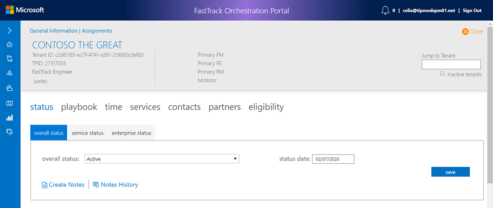

---
# required metadata
title: FTOP Partner User Guide
description: Detailed Tenant View
author: Celia Kennedy
ms.author: v-cekenn
manager: pagrim
ms.date: 2/22/2019
ms.topic: ftop-partner-user-guide
ms.prod: non-product-specific
ms.custom: ftop-partner-user-guide
ft.audience: partner
ft.owner: pagrim
---
# Detailed Tenant View

## Overview

To the left of the tenant name is a down-arrow that allows you to **select and view** detailed tenant information. A series of tabs below the tenant name allow you to record and view tenant information.

The Detailed Tenant View also displays tabs across the top of the page.

For more information, view an overview of each tab:

- [**Status Tab**](detailed-tenant-view-status-tab.md)

- [**Playbook Tab**](detailed-tenant-view-playbook-tab.md)

- [**Time Tab**](detailed-tenant-view-time-tab.md)

- [**Services Tab**](detailed-tenant-view-services-tab.md)

- [**Contacts Tab**](detailed-tenant-view-contacts-tab.md)

- [**Partners Tab**](detailed-tenant-view-partners-tab.md)

- [**Eligibility Tab**](detailed-tenant-view-eligibility-tab.md)

## Next steps

- To learn about the next tab, see the [Status Tab](detailed-tenant-view-status-tab.md).

[Home](http://partner-docs.microsoft.com)
